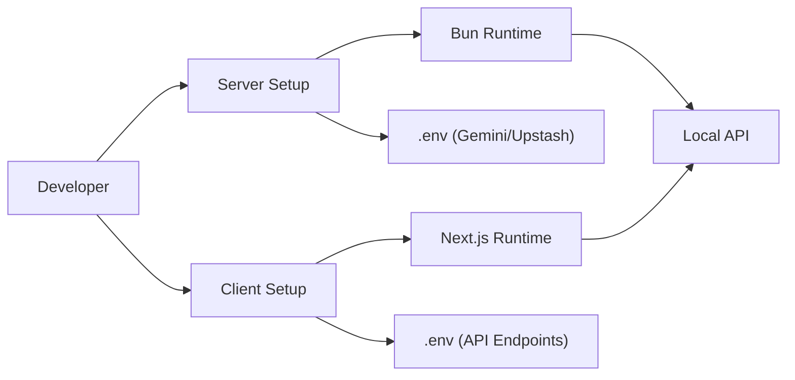
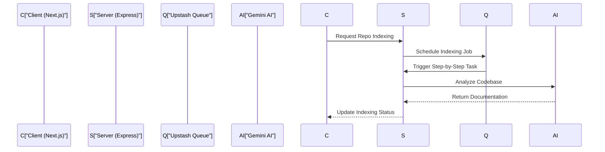

# Getting Started

The "Getting Started" phase of GitDex is designed to move you from a fresh clone to a fully operational local environment. Because GitDex is architected as a decoupled system—splitting the heavy AI orchestration from the documentation presentation—the setup process involves initializing two distinct packages: the **Server** and the **Client**.

In the broader architecture, the Server acts as the brain, managing the Gemini indexing pipeline and serverless queueing, while the Client serves as the interactive lens, rendering the generated documentation via Fumadocs and providing the AI chat interface.

## Prerequisites

Before initializing the project, ensure your environment has the following installed:

| Tool | Purpose | Version/Requirement |
| :--- | :--- | :--- |
| **Bun** | Server runtime and package manager | Latest (Recommended) |
| **Node.js** | Client runtime | v18+ (Next.js compatible) |
| **API Keys** | External Service Integration | Google Gemini, Upstash Redis/QStash, GitHub (Octokit) |

---

## Local Setup Workflow

The following diagram illustrates the initialization sequence and the dependencies required for a functional local loop.



### 1. Server Configuration
The server is a Node.js/Express application optimized for the Bun runtime. It handles the most resource-intensive tasks, including repository scanning and LLM interaction.

**Installation and Execution:**
Navigate to the `/server` directory and use Bun to manage dependencies and execution:

```bash
cd server
bun install
bun dev
```

The server uses the following primary scripts defined in its `package.json`:
- `bun dev`: Runs the server in watch mode for active development.
- `bun start`: Launches the production build of the index.

**Core Server Dependencies:**
The server leverages several critical libraries to bypass serverless timeouts and handle AI streams:
- `@google/genai` & `@ai-sdk/google`: For Gemini-powered code analysis.
- `@upstash/redis` & `@upstash/qstash`: For managing the asynchronous indexing queue.
- `@octokit/rest`: For programmatic access to GitHub repositories.

### 2. Client Configuration
The client is a Next.js application utilizing the App Router. It is responsible for the "Reader" experience, turning raw markdown into a searchable, interactive documentation site.

**Installation and Execution:**
Navigate to the `/client` directory:

```bash
cd client
npm install # or bun install
npm run dev
```

**Core Client Dependencies:**
The frontend is built on a modern stack focused on documentation and AI interaction:
- **Fumadocs**: The foundation for the MDX-based documentation site.
- **Assistant-UI**: Powers the interactive AI chat interface.
- **Tailwind CSS**: Handles the responsive, modern styling.

---

## Development Architecture

When running locally, the data flow follows a request-response pattern between the two packages, mediated by the Upstash queue for long-running tasks.



### Key Execution Details

#### Server Entry Point
The server is designed as a module (`"type": "module"`) with a streamlined entry point. The use of Bun allows for direct execution of TypeScript files without a separate compilation step:

```typescript
// Simplified conceptual server startup
// Defined in server/package.json scripts: "dev": "bun --watch index.ts"
import express from 'express';
import cors from 'cors';
import 'dotenv/config';

const app = express();
app.use(cors());
// Server manages the Gemini indexing pipeline and Redis queue
app.listen(3001, () => console.log('Server running on port 3001'));
```

#### Client Rendering
The client uses `fumadocs-mdx` and `mdx-mermaid` to ensure that the documentation generated by the server is not just text, but an interactive experience featuring architecture diagrams.

```json
// From client/package.json: Critical UI Integrations
"dependencies": {
  "fumadocs-ui": "^15.8.5",
  "mdx-mermaid": "^2.0.4",
  "@assistant-ui/react": "^0.11.58"
}
```

By running both the client and server concurrently, you establish a full-stack AI pipeline: the server processes the repository into markdown, and the client renders that markdown into a production-ready documentation portal.