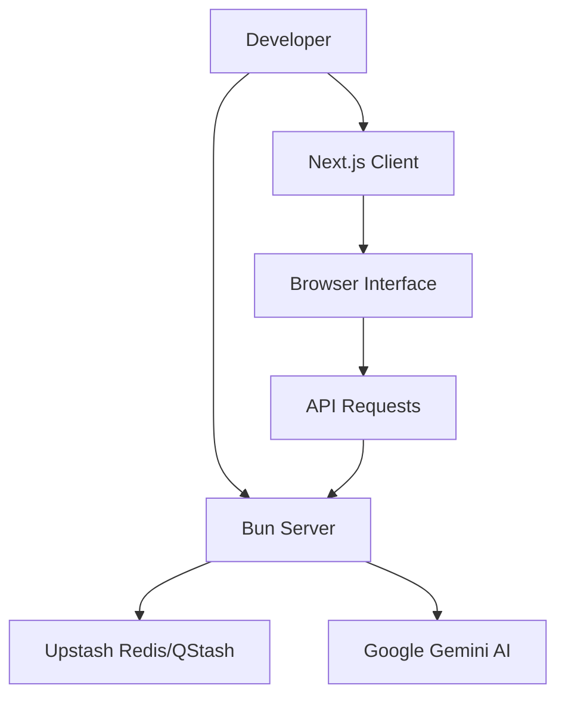

# Quick Start Guide

GitDex is structured as a full-stack monorepo consisting of a Next.js frontend and a Node.js/Express backend. Follow these steps to get your local development environment up and running.

## Prerequisites

Before beginning the installation, ensure you have the following installed on your machine:

| Requirement | Version/Tool | Purpose |
| :--- | :--- | :--- |
| **Node.js** | Latest LTS | Required for the Next.js client |
| **Bun** | Latest | Required for the Express server runtime |
| **Package Manager** | npm, yarn, or pnpm | To install client dependencies |

## Installation & Setup

Since GitDex is split into two main packages, you must install dependencies for both the client and the server separately.

### 1. Server Setup
The server handles the indexing pipeline, Gemini AI integration, and the Upstash queue.

```bash
# Navigate to the server directory
cd server

# Install dependencies using Bun
bun install
```

### 2. Client Setup
The client provides the documentation reader and the AI assistant interface.

```bash
# Navigate to the client directory
cd client

# Install dependencies using your preferred package manager
npm install
# or
yarn install
# or
pnpm install
```

## Running the Application

To run GitDex locally, you will need to start both the backend API and the frontend development server.

### Start the Backend
The server uses Bun for high-performance execution and hot-reloading during development.

```bash
cd server
# For development with watch mode
bun run dev
```

### Start the Frontend
The frontend uses Next.js with Turbopack for fast refresh.

```bash
cd client
# Start the development server
npm run dev
```

## Local Execution Workflow

The following diagram illustrates the relationship between the two components during a local development session.



## Project Scripts Reference

Use the following table to identify the available scripts for managing each part of the application.

| Package | Script | Command | Description |
| :--- | :--- | :--- | :--- |
| **Server** | `dev` | `bun --watch index.ts` | Starts server in watch mode |
| **Server** | `start` | `bun index.ts` | Starts server in production mode |
| **Client** | `dev` | `next dev --turbopack` | Starts Next.js dev server |
| **Client** | `build` | `next build --turbopack` | Builds the production frontend |
| **Client** | `start` | `next start` | Starts the built production client |
| **Client** | `lint` | `eslint` | Runs linting checks |

## Component Interaction Flow

When a user interacts with the documentation, the system follows this request-response cycle:

```mermaid
sequenceDiagram
    autonumber
    participant U as "User"
    participant C as "Next.js Client"
    participant S as "Express Server"
    participant AI as "Gemini AI"

    U->>C: Opens Documentation
    C->>S: Request Repo Data
    S-->>C: Return Indexed MDX
    U->>C: Asks AI Assistant
    C->>S: Send Query
    S->>AI: Process ReAct Loop
    AI-->>S: Return Answer
    S-->>C: Stream Response
    C-->>U: Display Answer