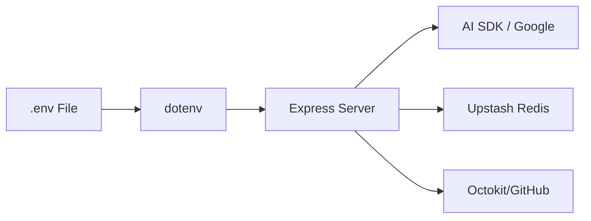
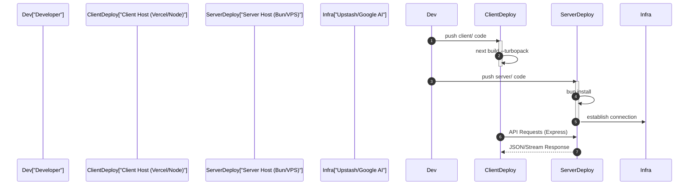

# Configuration and Deployment

This guide provides the technical specifications for configuring the GitDex environment and deploying both the client-side interface and the server-side processing engine.

## Environment Configuration

GitDex relies on a set of external services for AI processing, repository access, and state management. Configuration is managed via environment variables, with the server utilizing the `dotenv` package for local development.

### Required Service Integrations

Based on the project dependencies, the following integrations must be configured:

| Service | Dependency | Purpose |
| :--- | :--- | :--- |
| **Google AI** | `@ai-sdk/google`, `@google/genai` | LLM processing and repository analysis |
| **GitHub API** | `@octokit/rest` | Repository ingestion and data retrieval |
| **Upstash Redis** | `@upstash/redis`, `ioredis` | Caching and state persistence |
| **Upstash QStash** | `@upstash/qstash` | Asynchronous job queuing and pipeline triggers |

## Server Configuration

The server is built as a high-performance TypeScript service designed to run on the **Bun** runtime.

### Runtime and Execution
The server uses Bun for both development and production to leverage its native TypeScript execution and speed.

```json
// server/package.json scripts
"scripts": {
  "start": "bun index.ts",
  "dev": "bun --watch index.ts"
}
```

### TypeScript Setup
The server's TypeScript configuration is optimized for modern ESM (ES Modules) and the Bun bundler.

**Key `tsconfig.json` settings:**
- **Target/Lib:** `ESNext` for maximum modern JS feature support.
- **Module Resolution:** `bundler` to align with Bun's resolution logic.
- **Strictness:** `strict: true` and `noUncheckedIndexedAccess: true` to ensure type safety during AI data pipeline processing.
- **Module:** `Preserve` to maintain import structures.

### Server Dependency Stack
The server integrates `express` for API routing and `cors` for cross-origin resource sharing with the Next.js frontend.



## Client Configuration

The client is a Next.js application utilizing the App Router and Turbopack for optimized build performance.

### Framework Setup
The frontend is built with **Next.js 16.2.9** and **React 19**, employing a variety of specialized libraries for AI interaction and documentation rendering.

**Core Client Tooling:**
- **Build Tool:** Next.js Turbopack (`--turbopack`) for faster incremental builds.
- **UI Framework:** Tailwind CSS 4.3.1 and Radix UI.
- **AI Integration:** `@assistant-ui` for the chat interface and `@ai-sdk/react` for streaming.
- **Documentation:** `fumadocs` and `mdx-remote` for rendering repository-derived docs.

### Client-Side Build Scripts
The following scripts are used to manage the frontend lifecycle:

| Script | Command | Description |
| :--- | :--- | :--- |
| `dev` | `next dev --turbopack` | Starts development server with Turbopack |
| `build` | `next build --turbopack` | Produces production-ready optimized build |
| `start` | `next start` | Starts the production server |
| `lint` | `eslint` | Runs static analysis for code quality |

## Deployment Targets

GitDex is designed as a decoupled architecture, allowing the client and server to be deployed to different targets.

### Deployment Workflow



### Target Summary

1.  **Server Target:** A runtime supporting **Bun**. It requires `bun install` and is executed via `bun index.ts`.
2.  **Client Target:** A **Node.js** environment supporting Next.js. It requires `npm install` (or equivalent) and is executed via `next build` and `next start`.