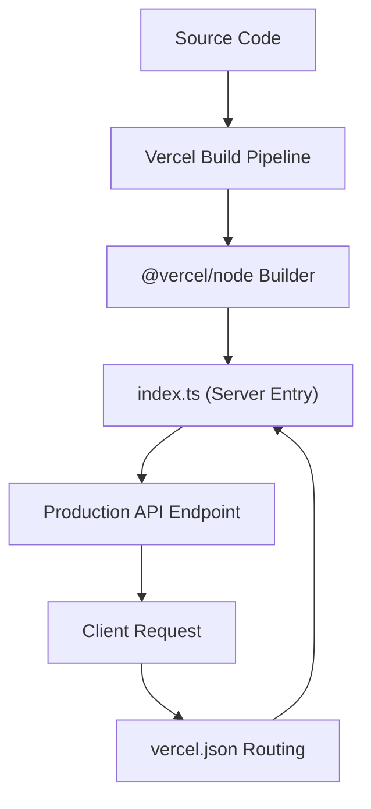

# Deployment & Configuration

GitDex utilizes a decoupled architecture consisting of a Next.js frontend (client) and a Node.js/Bun backend (server). This page details the configuration, dependencies, and deployment strategies for both environments.

## Server Configuration

The server is designed as a high-performance API handling AI orchestration and indexing jobs.

### Runtime and Execution
The server is developed and executed using the Bun runtime, which provides native TypeScript support and high-performance I/O [server/package.json:13-16](). 

| Script | Command | Description |
| :--- | :--- | :--- |
| `npm start` | `bun index.ts` | Starts the production server [server/package.json:14]() |
| `npm run dev` | `bun --watch index.ts` | Starts server in watch mode for development [server/package.json:15]() |

### Technical Stack & Dependencies
The server relies on a specialized set of libraries for AI processing and data persistence [server/package.json:18-27]():

- **AI Orchestration**: `@ai-sdk/google`, `@google/genai`, and the `ai` SDK [server/package.json:18-20]().
- **Infrastructure**: `@upstash/qstash` for queue management and `@upstash/redis` / `ioredis` for caching and state [server/package.json:21-22, 25]().
- **API Framework**: `express` (v5.2.1) [server/package.json:23]().
- **GitHub Integration**: `@octokit/rest` for repository data fetching [server/package.json:20]().

### TypeScript Configuration
The server uses a strict TypeScript configuration optimized for modern ESNext environments [server/tsconfig.json:3-16](). Key settings include:
- **Target/Lib**: `ESNext` [server/tsconfig.json:3-4]().
- **Module Resolution**: `bundler` with `Preserve` module type [server/tsconfig.json:5, 8]().
- **Strictness**: `strict: true` and `noUncheckedIndexedAccess: true` to ensure type safety [server/tsconfig.json:12, 15]().

## Client Configuration

The client is a Next.js application focused on providing a rich, interactive UI for AI-driven repository analysis.

### Framework and Build Process
The client uses Next.js (v16.2.9) and leverages Turbopack for optimized development and build cycles [client/package.json:7-8, 56]().

### Core Dependencies
The frontend is divided into several functional layers [client/package.json:12-65]():

#### AI and Chat Interface
The interface is powered by the `assistant-ui` ecosystem, providing a modular approach to chat threads and markdown rendering [client/package.json:13-16](). It integrates with the `ai` SDK for streaming responses [client/package.json:19]().

#### Documentation and Rendering
GitDex uses a sophisticated pipeline for rendering technical content:
- **MDX Processing**: `fumadocs` and `next-mdx-remote` for documentation [client/package.json:17-18, 32, 46]().
- **Mathematics & Diagrams**: `katex`, `rehype-katex`, and `mermaid` for rendering complex technical diagrams and formulas [client/package.json:35, 41, 48-49]().
- **Search**: `flexsearch` and `fuse.js` for client-side indexing and retrieval [client/package.json:29-30]().

#### UI and Visualization
- **Styling**: Tailwind CSS (v4.3.1) with `tailwindcss-animate` [client/package.json:67-68]().
- **Components**: Radix UI primitives and Shadcn UI [client/package.json:21-26, 27]().
- **3D/Interactive Elements**: `three.js`, `ogl`, and `panzoom` for the interactive repository constellation [client/package.json:54-55, 44-45]().

## Deployment Settings

### Vercel Integration
The server is configured for deployment on Vercel using a `vercel.json` configuration file [server/vercel.json:1-16]().

#### Build and Routing Configuration
The deployment is defined as follows:
- **Build**: The entry point `index.ts` is processed using the `@vercel/node` builder [server/vercel.json:3-6]().
- **Routing**: A catch-all route redirects all incoming traffic to `index.ts` [server/vercel.json:9-11]().
- **Caching**: Headers are explicitly set to `no-store, must-revalidate` to prevent the caching of dynamic AI responses [server/vercel.json:12-14]().

### Deployment Workflow

## Summary of Project Configuration

| Component | Runtime/Framework | Key Configuration File | Primary Goal |
| :--- | :--- | :--- | :--- |
| **Server** | Bun / Express | `server/package.json` | AI Logic & Indexing [server/package.json:1-27]() |
| **Client** | Next.js / React | `client/package.json` | User Interface & Docs [client/package.json:1-68]() |
| **Infrastructure** | Vercel | `server/vercel.json` | Serverless Deployment [server/vercel.json:1-16]() |
| **Types** | TypeScript | `server/tsconfig.json` | Type Safety [server/tsconfig.json:1-17]() |