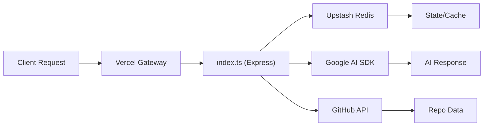

# Deployment & Configuration

This guide provides the technical specifications for deploying the GitDex server and configuring the client-side documentation engine.

## Server Deployment

The GitDex server is designed for serverless deployment on Vercel, utilizing a single-entry point architecture to handle all incoming API requests.

### Vercel Configuration

The deployment is managed via the `server/vercel.json` file, which maps all incoming traffic to the main server logic.

| Configuration Key | Value | Description |
| :--- | :--- | :--- |
| `builds[0].src` | `index.ts` | The entry point for the serverless function. |
| `builds[0].use` | `@vercel/node` | The Vercel runtime builder used for Node.js/TypeScript. |
| `routes[0].src` | `/(.*)` | A wildcard regex that captures all incoming request paths. |
| `routes[0].dest` | `index.ts` | Routes all captured paths to the main server handler. |

### Request Handling & Caching
To ensure that AI-generated responses and job status updates are always current, the server explicitly disables caching for all routes:
- **Header**: `Cache-Control: no-store, must-revalidate`

## Environment Configuration

Based on the server's dependency tree in `package.json`, the following external integrations must be configured via environment variables (managed via `dotenv` in development).

### Required Integration Keys

| Service | Dependency | Purpose | Expected Variable (Example) |
| :--- | :--- | :--- | :--- |
| **Google AI** | `@google/genai` | LLM processing and content generation | `GOOGLE_GENAI_API_KEY` |
| **GitHub** | `@octokit/rest` | Repository data fetching and analysis | `GITHUB_TOKEN` |
| **Upstash Redis** | `@upstash/redis` | Fast state storage and caching | `UPSTASH_REDIS_REST_URL` |
| **Upstash QStash** | `@upstash/qstash` | Asynchronous job scheduling | `QSTASH_TOKEN` |

### Deployment Workflow



## Client Documentation Configuration

The frontend utilizes `fumadocs-mdx` for rendering its technical documentation. The configuration is centralized in `client/source.config.ts`.

### MDX Plugin Integration
The documentation engine is configured to support complex technical diagrams through the `remarkMdxMermaid` plugin.

```typescript
// Extracted from client/source.config.ts
export default defineConfig({
  mdxOptions: {
    remarkPlugins: [remarkMdxMermaid],
  },
});
```

This configuration allows the documentation to render Mermaid.js diagrams directly from Markdown source files, enabling the visualization of the project's complex architectural flows.

## Runtime & Build System

The project leverages the **Bun** runtime for optimized performance and development speed.

### Execution Scripts
As defined in `server/package.json`, the following scripts are used for lifecycle management:

- `bun dev`: Starts the server in watch mode using `bun --watch index.ts`.
- `bun start`: Executes the production server using `bun index.ts`.

### Dependency Architecture
The server employs a modern asynchronous stack to handle high-latency AI and API calls:

```mermaid
sequenceDiagram
    autonumber
    participant C as "Client"
    participant S as "Express Server"
    participant Q as "QStash/Redis"
    participant AI as "Google GenAI"

    C ->>+ S: Request Analysis
    S ->>+ Q: Queue Job
    Q -->>- S: Job ID
    S -->>- C: 202 Accepted (JobID)
    
    Note over Q, AI: Background Processing
    Q ->>+ AI: Process Codebase
    AI -->>- Q: Indexed Result
    Q ->> Q: Store in Redis