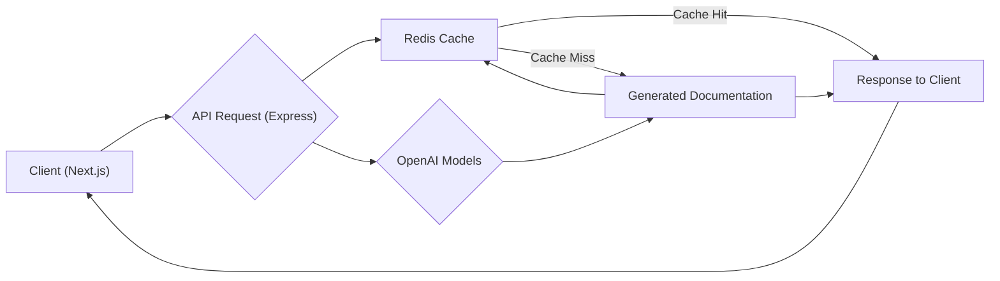
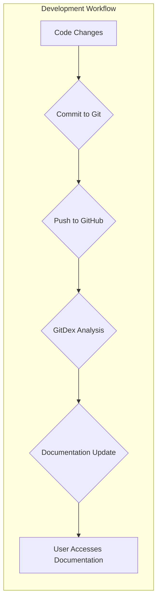

# Introduction to GitDex

GitDex is a comprehensive documentation AI project designed to analyze and understand code repositories, providing developers with insightful documentation and assistance. It comprises a client-side application built with Next.js and a server-side component powered by Bun, leveraging technologies like OpenAI's models and Redis for efficient operation. GitDex aims to streamline the process of understanding complex codebases and facilitates faster development cycles.

## Key Features

*   **Code Understanding:** GitDex utilizes advanced language models to analyze source code, extract relevant information, and provide a high-level understanding of the project's architecture and functionality.
*   **Documentation Generation:** It automatically generates documentation based on the code analysis, offering developers a quick and easy way to grasp the project's inner workings.
*   **Interactive Interface:** The Next.js-based client provides a user-friendly interface for exploring the codebase, viewing generated documentation, and interacting with the AI assistant.
*   **Real-time Assistance:** Developers can ask specific questions about the code, and GitDex will provide relevant answers and insights based on its understanding of the project.
*   **Efficient Caching:** Redis is used to cache the results of code analysis and documentation generation, ensuring fast response times and reducing the load on the language models.

## Intended Audience

GitDex is designed for:

*   **Software Developers:** Individuals working on large or complex codebases who need a quick and efficient way to understand the project's structure and functionality.
*   **Technical Writers:** Professionals responsible for creating and maintaining documentation for software projects. GitDex can automate much of the documentation process, freeing up technical writers to focus on higher-level tasks.
*   **Open-Source Contributors:** Developers looking to contribute to open-source projects can use GitDex to quickly understand the codebase and identify areas where they can contribute.
*   **Students and Educators:** GitDex can be used as a learning tool for understanding software architecture and design principles.

## Technology Stack

| Technology      | Description                                                                                                                               |
| :---------------- | :---------------------------------------------------------------------------------------------------------------------------------------- |
| Next.js         | React framework for building the client-side application.                                                                                 |
| Bun             | JavaScript runtime used for the server-side component.                                                                                   |
| OpenAI Models   | Language models used for code analysis and documentation generation.                                                                    |
| Redis           | In-memory data store used for caching results and improving performance.                                                                |
| Octokit         | Used to interact with the GitHub API.                                                                                                  |
| Tailwind CSS | Utility-first CSS framework for styling the client-side application. |

## Getting Started

### Client-Side (Next.js)

To get started with the client-side application, follow these steps:

1.  Navigate to the `client` directory:

    ```bash
    cd client
    ```

2.  Install the dependencies:

    ```bash
    npm install
    # or
    yarn install
    # or
    pnpm install
    # or
    bun install
    ```

3.  Run the development server:

    ```bash
    npm run dev
    # or
    yarn dev
    # or
    pnpm dev
    # or
    bun dev
    ```

4.  Open [http://localhost:3000](http://localhost:3000) in your browser to see the application.

```javascript
// client/app/page.tsx
export default function Home() {
  return (
    <main>
      <h1>Welcome to GitDex</h1>
      <p>Start exploring your codebase!</p>
    </main>
  );
}
```

[View on GitHub](https://github.com/shinymack/gitdex/blob/main/client/app/page.tsx)

### Server-Side (Bun)

To get started with the server-side component, follow these steps:

1.  Navigate to the `server` directory:

    ```bash
    cd server
    ```

2.  Install the dependencies:

    ```bash
    bun install
    ```

3.  Create a `.env` file and configure the necessary environment variables, such as the OpenAI API key and Redis connection details.

4.  Run the server:

    ```bash
    bun run index.ts
    ```

```javascript
// server/index.ts
import express from 'express';
const app = express();
const port = 3001;

app.get('/', (req, res) => {
  res.send('GitDex Server is running!');
});

app.listen(port, () => {
  console.log(`Server listening at http://localhost:${port}`);
});
```

[View on GitHub](https://github.com/shinymack/gitdex/blob/main/server/index.ts)

```plaintext
// server/.env (example)
OPENAI_API_KEY=YOUR_OPENAI_API_KEY
REDIS_HOST=localhost
REDIS_PORT=6379
```

[View on GitHub](https://github.com/shinymack/gitdex/blob/main/server/.env)

## Core Dependencies

The client-side leverages several key dependencies, including `@fumadocs/mdx-remote`, `@octokit/rest`, and various UI libraries like `@shadcn/ui` and `lucide-react`. These are essential for rendering MDX documentation, interacting with GitHub's API, and providing a visually appealing interface.

```json
// client/package.json (dependencies section)
"dependencies": {
    "@fumadocs/mdx-remote": "^1.4.2",
    "@octokit/rest": "^22.0.0",
    "@radix-ui/react-slot": "^1.2.3",
    "@shadcn/ui": "^0.0.4",
    "@types/mdx": "^2.0.13",
    "class-variance-authority": "^0.7.1",
    "clsx": "^2.1.1",
    "date-fns": "^4.1.0",
    "flexsearch": "^0.8.212",
    "fumadocs": "^0.0.0",
    "fumadocs-core": "^15.8.3",
    "fumadocs-mdx": "^12.0.2",
    "fumadocs-ui": "^15.8.3",
    "fuse.js": "^7.1.0",
    "gray-matter": "^4.0.3",
    "lucide-react": "^0.544.0",
    "mdx-mermaid": "^2.0.3",
    "mermaid": "^11.12.0",
    "next": "15.5.2",
    "next-mdx-remote": "^5.0.0",
    "next-themes": "^0.4.6",
    "ogl": "^1.0.11",
    "panzoom": "^9.4.3",
    "react": "19.1.0",
    "react-collapsible": "^2.10.0",
    "react-dom": "19.1.0",
    "react-mermaid": "^0.1.3",
    "react-svg-pan-zoom": "^3.13.1",
    "svg-pan-zoom": "^3.6.2",
    "svg-pan-zoom-container": "^0.6.1",
    "tailwind-merge": "^3.3.1",
    "tailwindcss-animate": "^1.0.7",
    "zod": "^4.1.7",
    "zustand": "^5.0.8"
  }
```

[View on GitHub](https://github.com/shinymack/gitdex/blob/main/client/package.json)

On the server, `@google/genai`, `@octokit/rest`, `cors`, `dotenv`, `express`, `ioredis`, and `mermaid` are crucial for interacting with OpenAI's Gemini API, the GitHub API, enabling Cross-Origin Resource Sharing, loading environment variables, creating the server, connecting to Redis, and rendering Mermaid diagrams server-side, respectively.

```json
// server/package.json (dependencies section)
"dependencies": {
    "@dqbd/tiktoken": "^1.0.22",
    "@google/genai": "^1.17.0",
    "@octokit/rest": "^22.0.0",
    "cors": "^2.8.5",
    "dotenv": "^17.2.3",
    "express": "^5.1.0",
    "ioredis": "^5.8.1",
    "mermaid": "^11.12.0"
  }
```

[View on GitHub](https://github.com/shinymack/gitdex/blob/main/server/package.json)

## Data Flow





## Key Integration Points

1.  **GitHub API Integration:** GitDex uses the Octokit library to interact with the GitHub API. This allows it to fetch repository metadata, access file contents, and retrieve commit history.

    ```typescript
    // Example of fetching repository information using Octokit
    import { Octokit } from "@octokit/rest";

    const octokit = new Octokit({
      auth: process.env.GITHUB_TOKEN,
    });

    async function getRepoInfo(owner: string, repo: string) {
      const { data } = await octokit.rest.repos.get({
        owner,
        repo,
      });
      return data;
    }
    ```

    [View on GitHub](https://github.com/shinymack/gitdex/blob/main/client/next.config.js) - (Example context)

2.  **OpenAI Model Integration:** GitDex leverages OpenAI's language models to analyze code and generate documentation. The specific models and prompts used will depend on the desired level of detail and the complexity of the codebase.

3.  **Redis Integration:** Redis is used to cache the results of code analysis and documentation generation. This significantly improves performance by reducing the number of requests to the OpenAI models.

```javascript
// server/index.ts (Redis setup - conceptual)
import Redis from 'ioredis';

const redis = new Redis({
  host: process.env.REDIS_HOST,
  port: parseInt(process.env.REDIS_PORT || '6379'),
});

// Example of caching data in Redis
async function getCachedData(key: string) {
  const data = await redis.get(key);
  return data ? JSON.parse(data) : null;
}

async function setCachedData(key: string, data: any, expiry: number = 3600) {
  await redis.set(key, JSON.stringify(data), 'EX', expiry);
}
```

[View on GitHub](https://github.com/shinymack/gitdex/blob/main/server/index.ts) - (Related to Redis usage)

## Best Practices

*   **API Key Management:** Store your OpenAI API key securely using environment variables and avoid committing it to your codebase.
*   **Caching Strategy:** Implement a robust caching strategy to minimize the load on the OpenAI models and ensure fast response times.
*   **Error Handling:** Implement proper error handling to gracefully handle exceptions and provide informative error messages to the user.
*   **Rate Limiting:** Be mindful of the API rate limits imposed by OpenAI and GitHub. Implement rate limiting in your code to avoid exceeding these limits.
*   **Modular Design:** Design your code in a modular and reusable way to facilitate future development and maintenance.





```