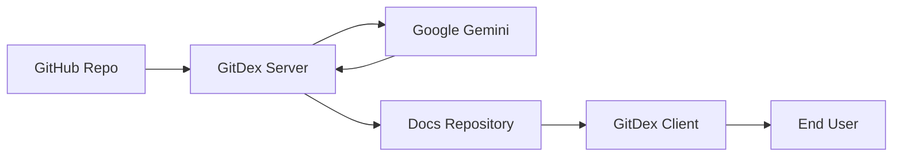

# Introduction

GitDex is a powerful repository analysis and AI-driven documentation tool designed to transform any GitHub repository into comprehensive, interactive, and search-ready documentation in seconds. By leveraging Large Language Models (LLMs) and a decoupled serverless processing pipeline, GitDex automates the tedious process of documenting codebases while providing an interactive AI assistant for real-time exploration.

## Core Purpose

The primary goal of GitDex is to bridge the gap between raw source code and maintainable documentation. Instead of manually writing guides, GitDex analyzes the codebase structure, plans a logical Table of Contents (TOC), and generates high-quality Markdown documentation. This output is then served through a modern web reader with an integrated AI chat interface, allowing users to query the repository using natural language.

## Key Features

*   **Multi-Step Indexing**: A high-performance pipeline that handles the scanning, planning, and writing phases of documentation generation.
*   **AI Code Assistant**: A sophisticated chat interface utilizing manual ReAct loops to provide accurate answers about the codebase.
*   **Interactive Diagrams**: Automatic generation of Mermaid diagrams to help users visualize complex codebase architectures.
*   **Serverless Queueing**: A custom-built asynchronous system using Upstash Redis and QStash to overcome serverless execution timeout limits.

## High-Level Workflow

GitDex operates by separating the heavy lifting of documentation generation from the delivery of the final content.



## System Components

GitDex is architected as a decoupled system consisting of a dedicated backend for processing and a frontend for consumption.

| Component | Responsibility | Primary Tech Stack |
| :--- | :--- | :--- |
| **GitDex Server** | Repository scanning, TOC planning, LLM orchestration, and queue management. | Node.js, Express, Upstash Redis, QStash, Gemini AI |
| **GitDex Client** | Rendering MDX documentation, search functionality, and AI chat interface. | Next.js, Tailwind CSS, Fumadocs, assistant-ui |

## Getting Started

To deploy GitDex locally, you must configure both the server and the client. Both packages utilize **Bun** as the runtime.

### 1. Server Setup

The server acts as the orchestrator for the indexing pipeline.

**Installation & Execution:**
```bash
# Navigate to server directory
bun install
bun run dev
```

**Required Environment Variables (`.env`):**
| Variable | Description |
| :--- | :--- |
| `PORT` | Server port (default: 3001) |
| `UPSTASH_REDIS_REST_URL` | Connection URL for Upstash Redis |
| `UPSTASH_REDIS_REST_TOKEN` | Auth token for Upstash Redis |
| `QSTASH_TOKEN` | Token for QStash message brokerage |
| `GITHUB_TOKEN` | Personal Access Token for GitHub API |
| `GOOGLE_GENERATIVE_AI_API_KEY` | API Key for Google Gemini |

### 2. Client Setup

The client provides the interactive viewer and chat interface.

**Installation & Execution:**
```bash
# Navigate to client directory
bun install
bun run dev
```

**Required Environment Variables (`.env`):**
| Variable | Description |
| :--- | :--- |
| `GITHUB_USERNAME` | Your GitHub username |
| `GITHUB_TOKEN` | Personal Access Token for GitHub API |
| `NEXT_PUBLIC_API_URL` | URL of the GitDex Server (e.g., http://localhost:3001) |
| `GOOGLE_GENERATIVE_AI_API_KEY` | API Key for Google Gemini |

Once both services are running, the client can be accessed at `http://localhost:3000`, and the server API at `http://localhost:3001`.