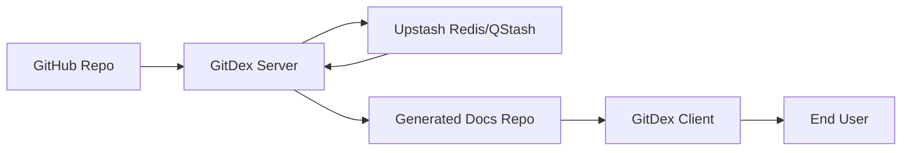

# Introduction

GitDex is a sophisticated tool designed to transform any GitHub repository into a high-quality, AI-powered interactive documentation site in a matter of seconds. By analyzing the structure of a codebase, GitDex automates the process of planning a table of contents and generating comprehensive Markdown documentation using Large Language Models (LLMs).

The resulting documentation is presented through a search-ready web reader, complemented by an interactive AI chat assistant that allows users to converse directly with the repository's content.

## Core Purpose

The primary objective of GitDex is to bridge the gap between raw source code and accessible documentation. Instead of requiring manual documentation efforts, GitDex leverages AI to index repositories, making the codebase understandable for both humans and AI agents.

### Key Capabilities
* **Automated Indexing**: A high-performance pipeline that scans the repository, plans a documentation structure, and writes the content.
* **AI-Powered Interaction**: An integrated chat interface that utilizes manual ReAct loops to answer specific questions about the indexed codebase.
* **Architectural Visualization**: Automatic generation of Mermaid diagrams to help users visualize the internal architecture of the project.
* **Serverless-Optimized Workflow**: A custom-built queueing system that utilizes Upstash Redis and QStash to overcome standard serverless execution timeout limits.

## High-Level Project Summary

GitDex is structured as a full-stack monorepo consisting of two primary components: a backend indexing server and a frontend documentation client.

### System Components

| Component | Role | Primary Responsibility |
| :--- | :--- | :--- |
| **Server** | Orchestrator | Handles repository scanning, TOC planning, Gemini-powered document generation, and GitHub commits. |
| **Client** | Interface | Renders the generated documentation via Fumadocs and provides the AI chat assistant interface. |

## Technical Stack

GitDex utilizes a modern stack optimized for speed, AI integration, and serverless deployment.

### Frontend Stack
* **Framework**: Next.js (utilizing App Router and dynamic generation)
* **Styling**: Tailwind CSS
* **Docs Engine**: Fumadocs UI (responsible for MDX rendering and page hierarchy)
* **Chat Interface**: `assistant-ui`
* **Runtime**: Bun

### Backend Stack
* **Engine**: Node.js with Express
* **AI Model**: Google Gemini (via Google AI SDK)
* **Infrastructure**: Upstash Redis (Database) and Upstash QStash (Message Broker)
* **GitHub Integration**: Octokit (GitHub REST API)
* **Runtime**: Bun

## Operational Workflow

To ensure reliability in serverless environments, GitDex decouples its indexing process. Rather than a single long-running request, the workflow is broken into step-by-step executions orchestrated by QStash. This allows the system to scan, plan, and write documentation across multiple discrete events, bypassing traditional timeout constraints.