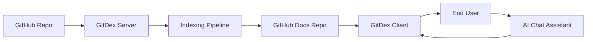

# Introduction

GitDex is a technical documentation engine designed to transform any GitHub repository into comprehensive, AI-powered interactive documentation within seconds. It automates the transition from raw source code to a structured, searchable web reader, reducing the manual effort required to maintain up-to-date project documentation. Sources: [README.md:3-6]()

## Purpose and Core Value

The primary goal of GitDex is to analyze the structure of a codebase and use Large Language Models (LLMs) to generate high-quality Markdown documentation. Instead of static files, it provides a dynamic experience where documentation is paired with an interactive AI assistant capable of answering repository-specific questions. Sources: [README.md:3-6]()

### Key Capabilities

*   **Automated Indexing**: A high-performance pipeline that scans the repository, plans a Table of Contents (TOC), and writes the actual documentation. Sources: [README.md:10-11]()
*   **AI-Powered Exploration**: An integrated chat interface that utilizes manual ReAct loops to provide accurate answers about the codebase. Sources: [README.md:12-13]()
*   **Visual Architecture**: Automatic generation of Mermaid diagrams to help users visualize the architecture of the indexed repository. Sources: [README.md:14-15]()
*   **Resilient Processing**: A custom serverless queueing system using Upstash Redis and QStash to handle long-running indexing jobs without hitting serverless execution timeouts. Sources: [README.md:16-17]()

## General User Experience

The user experience is divided into two primary phases: the **Indexing Phase** and the **Consumption Phase**.

### 1. The Indexing Phase (Backend Orchestration)
When a repository is processed, the GitDex Server acts as the orchestrator. It handles the scanning of the repository, the planning of the documentation structure, and the generation of content using Google Gemini. The final output is committed directly back to a designated GitHub documentation repository. Sources: [server/README.md:3-8]()

### 2. The Consumption Phase (Frontend Interface)
Users interact with the generated documentation through the GitDex Client. This interface provides:
*   **Search-Ready Reader**: A beautiful documentation site rendered via Fumadocs. Sources: [client/README.md:3-7]()
*   **Interactive Assistant**: A chatbot powered by `assistant-ui` that allows users to converse directly with the repository content. Sources: [client/README.md:3-7]()

## High-Level System Workflow

The following diagram illustrates the flow from a raw GitHub repository to the final interactive documentation experience.

## Technical Stack Summary

GitDex utilizes a modern full-stack architecture split between a Next.js frontend and a Node.js backend.

| Layer | Technology | Purpose | Source |
| :--- | :--- | :--- | :--- |
| **Frontend** | Next.js, Tailwind CSS | App framework and styling | [README.md:34-35]() |
| **Docs Engine** | Fumadocs | MDX rendering and page hierarchy | [client/README.md:10-14]() |
| **AI Model** | Google Gemini | Content generation and chat | [README.md:37-38]() |
| **Queue/State** | Upstash Redis & QStash | Managing background indexing jobs | [server/README.md:10-13]() |
| **GitHub API** | Octokit | Repository scanning and commits | [server/README.md:13-15]() |
| **Runtime** | Bun | Fast JavaScript runtime for both layers | [client/README.md:15](), [server/README.md:16]() |