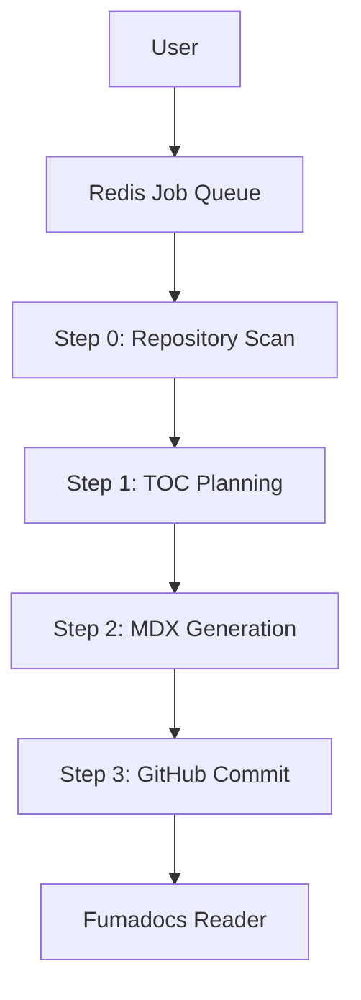

# Introduction

GitDex is an AI-powered documentation engine designed to transform any GitHub repository into a professional, interactive documentation site in seconds. Instead of manually writing docs that quickly become outdated, GitDex analyzes your codebase, structures a comprehensive table of contents, and generates high-quality MDX content using Large Language Models (LLMs).

The result is a search-ready web reader equipped with an interactive AI chat assistant that can answer specific questions about your code using ReAct reasoning loops.

## Core Capabilities

- **Automated Indexing**: A high-performance pipeline that scans your repository and autonomously plans the documentation hierarchy.
- **AI-Powered Knowledge Base**: Integrates Google Gemini to write detailed explanations of your code and provide an interactive chat interface for users.
- **Architectural Visualization**: Automatic generation of Mermaid diagrams to help developers visualize complex codebase structures.
- **Serverless-Optimized Workflow**: Utilizes a decoupled queue system via Upstash Redis and QStash to handle long-running indexing tasks without hitting serverless execution timeouts.

## How It Works

GitDex separates the documentation process into a managed pipeline to ensure reliability and scalability.



## Getting Started

To get GitDex up and running locally, you will need to configure both the server and the client.

### Prerequisites

- **Runtime**: [Bun](https://bun.sh)
- **API Keys**: 
  - GitHub Personal Access Token
  - Google Gemini API Key
  - Upstash Redis & QStash credentials

### Quick Start (Client)

1. **Install Dependencies**
   ```bash
   bun install
   ```

2. **Configure Environment**
   Create a `.env` file in the `client/` directory:
   ```env
   GITHUB_USERNAME=your_github_username
   GITHUB_TOKEN=your_github_personal_access_token
   NEXT_PUBLIC_API_URL=http://localhost:3001
   GOOGLE_GENERATIVE_AI_API_KEY=your_gemini_api_key
   ```

3. **Launch Development Server**
   ```bash
   bun run dev
   ```

Visit `http://localhost:3000` to access your interactive repository browser.

## Technology Stack

| Layer | Technology |
| :--- | :--- |
| **Frontend** | Next.js, Tailwind CSS, Fumadocs, assistant-ui |
| **Backend** | Node.js, Express, Upstash Redis, QStash |
| **AI Engine** | Google Gemini (via Google AI SDK) |
| **Integration** | Octokit (GitHub REST API) |