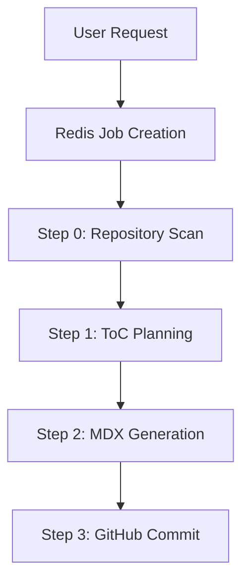

# Introduction

GitDex is a powerful tool designed to transform any GitHub repository into a comprehensive, AI-powered interactive documentation site in seconds. By analyzing codebase structures and leveraging Large Language Models (LLMs), GitDex automates the tedious process of writing documentation, providing developers with a search-ready web reader and an integrated AI chat assistant.

## What is GitDex?

Maintaining up-to-date documentation is one of the biggest challenges in software development. GitDex solves this by treating documentation as a pipeline. It doesn't just summarize code; it plans a logical Table of Contents, writes detailed MDX sections, and deploys them into a professional UI.

### Core Capabilities

* **Automated Indexing**: A high-performance pipeline that scans your repository and generates structured documentation.
* **AI-Powered Chat**: An interactive assistant utilizing ReAct loops to answer complex questions about the codebase.
* **Architecture Visualization**: Automatic generation of Mermaid diagrams to help users visualize the system flow.
* **Serverless Optimized**: A custom queueing system powered by Upstash Redis and QStash to handle long-running documentation tasks without hitting serverless timeouts.

## How it Works

GitDex employs a decoupled indexing workflow. Because analyzing and writing documentation for large repositories can exceed standard serverless execution limits, the process is orchestrated through a step-by-step queue.



## Project Architecture

The project is divided into two primary components to separate the concerns of content delivery and content generation:

### 🖥️ Client
The frontend is a Next.js application that serves as the documentation viewer. It utilizes **Fumadocs** for rendering MDX and managing page hierarchies, and **assistant-ui** to provide the chat interface.

### ⚙️ Server
The backend is an Express API that manages the heavy lifting. It handles the integration with the **GitHub REST API (Octokit)**, manages the **Upstash Redis** queue, and interfaces with **Google Gemini** to generate the actual documentation content.

## Quick Start Guide

To get GitDex running locally, you will need to configure both the client and the server.

1. **Clone the repository** and navigate to the `client` directory.
2. **Install dependencies** using Bun:
   ```bash
   bun install
   ```
3. **Configure Environment Variables**: Create a `.env` file with your `GITHUB_TOKEN`, `GOOGLE_GENERATIVE_AI_API_KEY`, and `NEXT_PUBLIC_API_URL`.
4. **Launch the development server**:
   ```bash
   bun run dev
   ```

Once the client is running, you can connect it to your backend server to begin transforming your repositories into interactive documentation.