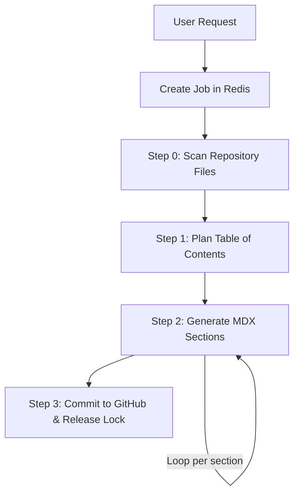

# Introduction

GitDex is an AI-powered repository analysis tool designed to bridge the gap between raw source code and comprehensive technical documentation. It automates the tedious process of documenting codebases by transforming any GitHub repository into a beautiful, interactive, and search-ready documentation site in seconds.

By leveraging Large Language Models (LLMs), GitDex doesn't just summarize files; it analyzes the architectural intent of your project, plans a logical structure, and generates detailed MDX content that includes interactive elements and architectural visualizations.

## Core Capabilities

GitDex provides a full-stack pipeline for codebase intelligence:

*   **Automated Indexing**: A sophisticated multi-step pipeline that scans repositories, generates a Table of Contents, and writes detailed documentation sections.
*   **AI Code Assistant**: An integrated chat interface powered by manual ReAct (Reasoning and Acting) loops, allowing users to ask complex questions about the codebase and receive grounded answers.
*   **Architectural Visualization**: Automatic generation of Mermaid.js diagrams to visualize project structure and logic flow, featuring interactive pan-and-zoom capabilities.
*   **Serverless-Optimized Workflow**: A custom queuing system built with Upstash Redis and QStash to handle long-running AI generation tasks without hitting serverless execution timeouts.

## How It Works

To ensure reliability across serverless environments, GitDex decouples the documentation process into a series of orchestrated steps:

## Project Structure

The project is organized into two primary packages to separate the documentation delivery from the analysis engine:

### 🖥️ Client (`/client`)
The frontend is a Next.js application that serves as the "Reader." It utilizes **Fumadocs** for the documentation framework and **assistant-ui** for the AI chat interface. It handles:
*   Repository search and discovery.
*   Rendering MDX content with Mermaid diagram support.
*   Real-time interaction with the AI assistant.

### ⚙️ Server (`/server`)
The backend is an Express-based API that manages the "Intelligence." It handles:
*   The Gemini AI pipeline for code analysis and writing.
*   GitHub integration via Octokit.
*   Queue management via Upstash Redis and QStash to orchestrate the indexing workflow.

## Technology Stack

| Layer | Technologies |
| :--- | :--- |
| **Frontend** | Next.js, Tailwind CSS, Fumadocs, assistant-ui |
| **Backend** | Node.js, Express, Upstash Redis, QStash |
| **AI Engine** | Google Gemini (via Google AI SDK) |
| **Integration** | Octokit (GitHub REST API) |
| **Visualization** | Mermaid.js |