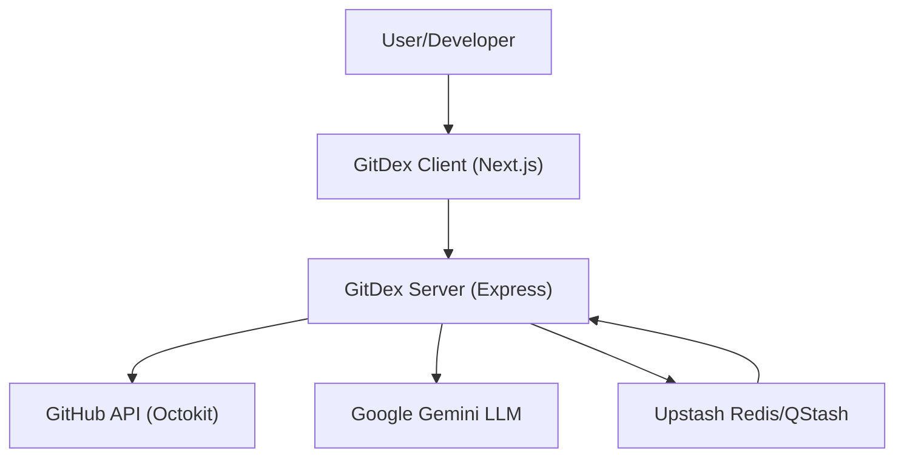

# Introduction

GitDex is a powerful documentation engine designed to bridge the gap between raw source code and comprehensive, user-friendly technical documentation. By leveraging Large Language Models (LLMs) and a decoupled serverless architecture, GitDex transforms any GitHub repository into a beautiful, search-ready documentation site complete with an interactive AI assistant.

Instead of relying on manual documentation updates that quickly become stale, GitDex automates the analysis of your codebase structure, plans a logical table of contents, and generates detailed Markdown files that accurately reflect the current state of your project.

## Core Value Proposition

GitDex solves the "documentation burden" by providing:

- **Automated Indexing**: A multi-step pipeline that scans your repository and writes comprehensive guides.
- **Interactive Exploration**: A search-optimized web reader powered by Fumadocs.
- **AI-Driven Insights**: A built-in chat assistant that uses ReAct loops to answer complex questions about the codebase in real-time.
- **Visual Architecture**: Automatic generation of Mermaid diagrams to help users visualize system flows and component hierarchies.

## High-Level Architecture

GitDex is split into two primary packages to separate the heavy lifting of AI indexing from the high-performance delivery of the documentation UI.

### 🖥️ The Client
The client is a Next.js application that serves as the primary interface for end-users. It is responsible for:
- **Rendering**: Using Fumadocs to transform generated MDX into a searchable, structured documentation site.
- **Interaction**: Providing a chat interface via `assistant-ui` that allows users to converse with the codebase.
- **Visualization**: Rendering Mermaid diagrams and mathematical notation (KaTeX) for technical clarity.

### ⚙️ The Server
The server acts as the orchestration layer and the "brain" of the operation. Its primary responsibilities include:
- **Pipeline Management**: Managing the indexing workflow (Scan $\rightarrow$ Plan $\rightarrow$ Write).
- **Queueing**: Utilizing Upstash Redis and QStash to handle long-running LLM tasks, ensuring that the process doesn't fail due to serverless execution timeouts.
- **AI Integration**: Interfacing with Google Gemini to analyze code and generate natural language documentation.

## Technical Stack

| Layer | Technology |
| :--- | :--- |
| **Frontend** | Next.js, Tailwind CSS, Fumadocs, assistant-ui |
| **Backend** | Node.js, Express |
| **Orchestration** | Upstash Redis, QStash |
| **Intelligence** | Google Gemini (via Google AI SDK) |
| **Data Source** | GitHub REST API (Octokit) |
| **Runtime** | Bun |