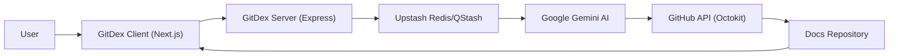

# Introduction

GitDex is an AI-powered repository analyst designed to transform any GitHub repository into comprehensive, beautiful, and interactive documentation in seconds. By analyzing codebase structures, planning a table of contents, and utilizing Large Language Models (LLMs), GitDex automates the creation of markdown documentation and presents it through a search-ready web reader equipped with an interactive AI chat assistant.

## Core Purpose

The primary goal of GitDex is to bridge the gap between complex source code and understandable documentation. It removes the manual burden of writing docs by:
1. **Scanning** the repository to understand its architecture.
2. **Planning** a logical documentation hierarchy.
3. **Generating** detailed markdown content using Google Gemini.
4. **Providing** a conversational interface for users to ask deep questions about the codebase.

## Key Features

*   **Multi-Step Indexing**: A high-performance pipeline that handles the scanning, planning, and writing phases of documentation.
*   **AI Code Assistant**: A chat interface powered by manual ReAct loops, allowing users to interactively query the repository's logic and structure.
*   **Interactive Diagrams**: Automatic generation of Mermaid diagrams to visualize complex codebase architectures.
*   **Serverless Queueing**: A specialized orchestration system using Upstash Redis and QStash to bypass execution timeout limits typical in serverless environments.

## System Overview

GitDex operates via a decoupled architecture consisting of a frontend viewer and a backend orchestration server.


```mermaid
graph LR
    User["User"] --> Client["GitDex Client (Next.js)"]
    Client --> Server["GitDex Server (Express)"]
    Server --> Queue["Upstash Redis/QStash"]
    Queue --> AI["Google Gemini AI"]
    AI --> GH["GitHub API (Octokit)"]
    GH --> Repo["Docs Repository"]
    Repo --> Client
```

## Technical Stack

The project is built using a modern TypeScript stack optimized for performance and AI integration.

| Layer | Technology | Purpose |
| :--- | :--- | :--- |
| **Frontend Framework** | Next.js (App Router) | Core application structure and routing |
| **Documentation UI** | Fumadocs | MDX rendering and page hierarchy |
| **Chat Interface** | assistant-ui | Conversational AI componentry |
| **Styling** | Tailwind CSS | Responsive and modern UI styling |
| **Backend Runtime** | Node.js / Bun | Server-side logic and execution |
| **Backend API** | Express | REST API management |
| **AI Model** | Google Gemini | Code analysis and content generation |
| **Infrastructure** | Upstash (Redis & QStash) | Distributed queueing and state |
| **GitHub Integration** | Octokit | Repository scanning and file commits |

## Getting Started

GitDex requires **Bun** as the primary runtime for both the client and server packages.

### 1. Server Setup
The server handles the indexing pipeline and API requests.

```bash
# Navigate to server directory
cd server
bun install
```

**Environment Configuration (`server/.env`):**
| Variable | Description |
| :--- | :--- |
| `UPSTASH_REDIS_REST_URL` | Redis connection URL |
| `UPSTASH_REDIS_REST_TOKEN` | Redis authentication token |
| `QSTASH_TOKEN` | Token for QStash message brokerage |
| `GITHUB_TOKEN` | Personal Access Token for repository access |
| `GOOGLE_GENERATIVE_AI_API_KEY` | Gemini API key |

**Execution:**
```bash
bun run dev
```

### 2. Client Setup
The client provides the documentation viewer and the AI assistant interface.

```bash
# Navigate to client directory
cd client
bun install
```

**Environment Configuration (`client/.env`):**
| Variable | Description |
| :--- | :--- |
| `NEXT_PUBLIC_API_URL` | URL of the running GitDex server |
| `GITHUB_TOKEN` | Personal Access Token |
| `GOOGLE_GENERATIVE_AI_API_KEY` | Gemini API key |

**Execution:**
```bash
bun run dev
```

## Repository Architecture

The project is split into two distinct packages to separate the concerns of document presentation and document generation:

*   **`/client`**: A Next.js application that renders documentation via Fumadocs and provides the AI assistant interface.
*   **`/server`**: An Express API that manages the Upstash Redis queue and handles the Gemini indexing pipeline, committing results directly back to GitHub.