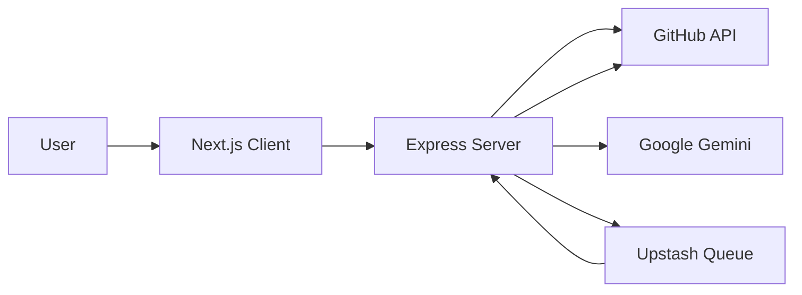

# Overview

GitDex is an AI-powered engine designed to transform raw GitHub repositories into comprehensive, interactive, and searchable technical documentation. Instead of relying on manually maintained wikis that quickly become obsolete, GitDex analyzes the actual codebase structure and leverages Large Language Models (LLMs) to architect and write documentation automatically.

At its core, GitDex bridges the gap between source code and developer onboarding by automating the synthesis of a repository's intent, architecture, and implementation details into a production-ready documentation site.

## The Core Value Proposition

GitDex moves beyond simple "chat-with-your-code" interfaces by providing a structured, permanent documentation layer. Its primary objective is to automate the entire documentation lifecycle:

*   **Automated Discovery**: Scanning the repository to understand the project footprint.
*   **Architectural Planning**: Generating a logical Table of Contents (TOC) that mirrors the project's conceptual hierarchy.
*   **Content Generation**: Using Google Gemini to write detailed Markdown files based on the analyzed code.
*   **Interactive Exploration**: Providing a web-based reader with an integrated AI assistant for real-time deep dives.

## High-Level System Architecture

GitDex is implemented as a decoupled full-stack application consisting of a Next.js frontend and a Node.js backend. This separation is critical to handle the long-running nature of AI indexing within serverless environments.



### Technical Stack Summary

| Layer | Technology | Purpose |
| :--- | :--- | :--- |
| **Frontend** | Next.js, Fumadocs | MDX rendering, dynamic routing, and UI layout. |
| **AI Interface** | assistant-ui | Interactive chat interface and ReAct loop handling. |
| **Backend** | Node.js, Express | Orchestration of indexing and API management. |
| **Orchestration**| Upstash Redis & QStash | Managing asynchronous jobs to prevent serverless timeouts. |
| **LLM** | Google Gemini | Code analysis, TOC planning, and doc generation. |
| **Integration** | Octokit | Programmatic access to GitHub repositories. |

## The Indexing Pipeline

The most critical component of GitDex is its **Multi-Step Indexing Pipeline**. Generating documentation for a large repository is too computationally expensive for a single HTTP request. GitDex solves this by decoupling the process into a series of orchestrated events handled by a serverless queue.

### Workflow Transition

1.  **Scan**: The server uses Octokit to analyze the repository's file structure.
2.  **Plan**: Gemini analyzes the file tree to create a comprehensive Table of Contents.
3.  **Write**: The pipeline iterates through the TOC, generating specific Markdown content for each section.
4.  **Commit**: The final documentation is committed back to a dedicated GitHub documentation repository.

This asynchronous flow is managed by **Upstash Redis** (for state tracking) and **QStash** (for message brokering), ensuring that the process can recover from failures and bypass execution limits.

## Configuration Blueprint

To initialize the GitDex environment, the system requires a specific set of integrations. The following environment configuration illustrates the dependencies required for the server to orchestrate the pipeline:

```env
# AI & GitHub Integration
GOOGLE_GENERATIVE_AI_API_KEY=your_gemini_api_key
GITHUB_TOKEN=your_github_personal_access_token
DOCS_REPO_NAME=gitdex-docs

# Serverless Queue Management
UPSTASH_REDIS_REST_URL=your_upstash_redis_url
QSTASH_TOKEN=your_qstash_token
```

By combining the structured rendering of **Fumadocs** with the reasoning capabilities of **Gemini**, GitDex ensures that the resulting documentation is not just a collection of AI-generated text, but a navigable, search-ready knowledge base that evolves alongside the codebase.