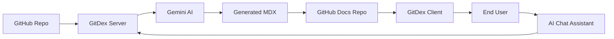

# Overview

GitDex is an AI-powered technical documentation engine designed to transform any GitHub repository into a comprehensive, interactive, and search-ready documentation site in seconds. By leveraging Large Language Models (LLMs) and a decoupled indexing pipeline, GitDex automates the tedious process of codebase analysis, structure planning, and documentation authoring.

The primary goal of GitDex is to bridge the gap between raw source code and human-readable documentation, providing developers with an immediate understanding of a project's architecture without requiring manual onboarding or outdated README files.

## Core Value Proposition

GitDex provides a high-velocity alternative to traditional documentation by automating the entire lifecycle of technical writing:

*   **Automated Analysis**: Eliminates manual auditing of files and folders by using AI to map the repository structure.
*   **Dynamic Content Generation**: Uses LLMs to write detailed Markdown documentation based on actual code implementation rather than assumptions.
*   **Interactive Exploration**: Moves beyond static pages by providing a chat-based AI assistant capable of answering specific questions about the codebase using ReAct loops.
*   **Visual Architecture**: Automatically generates Mermaid diagrams to visualize complex relationships within the code.

## Key Features

### 1. Multi-Step Indexing Pipeline
Unlike simple "chat-with-your-pdf" tools, GitDex employs a sophisticated pipeline that:
1.  **Scans**: Analyzes the repository using the GitHub API.
2.  **Plans**: Creates a logical Table of Contents (TOC) for the documentation.
3.  **Writes**: Generates comprehensive MDX files using Google Gemini.

### 2. AI Code Assistant
The integrated chat interface allows users to query the repository. It utilizes manual ReAct (Reasoning and Acting) loops to ensure the AI can look up specific code segments and provide grounded, accurate answers.

### 3. Serverless-Optimized Queueing
To overcome the execution time limits inherent in serverless environments (like Vercel), GitDex implements a custom asynchronous orchestration layer.

### 4. Production-Ready Reader
The output is rendered via a professional documentation UI, featuring full-text search, hierarchical navigation, and responsive design.

## System High-Level Flow

The following diagram illustrates the transformation process from a raw GitHub repository to the final interactive documentation.

## Technical Stack Summary

GitDex is built as a full-stack application split between a high-performance backend orchestrator and a dynamic frontend reader.

| Layer | Technology | Role |
| :--- | :--- | :--- |
| **Frontend Framework** | Next.js (App Router) | Application routing and page generation |
| **Docs Engine** | Fumadocs | MDX rendering, search, and page hierarchy |
| **Chat UI** | assistant-ui | Interactive AI chat interface |
| **Backend Runtime** | Node.js / Express / Bun | API management and pipeline orchestration |
| **AI Model** | Google Gemini | Code analysis and content generation |
| **Queue/State** | Upstash Redis & QStash | Async job management and serverless timeout bypass |
| **GitHub Integration** | Octokit | Programmatic access to repository data |

## Invariants & Failure Modes

To ensure production stability, GitDex is designed around several critical architectural constraints and trade-offs:

### Serverless Timeout Mitigation
Standard serverless functions often timeout after 10–30 seconds, which is insufficient for full-repository indexing. 
*   **Invariant**: No single indexing step is performed synchronously in a request-response cycle.
*   **Solution**: The system uses **QStash** to decouple the workflow into discrete, triggered events, ensuring each step completes within the environment's timeout window.

### AI Hallucination Control
Generating documentation automatically carries the risk of the LLM inventing features or misinterpreting logic.
*   **Mitigation**: The use of **ReAct loops** in the chat assistant forces the AI to retrieve actual code snippets before answering, grounding the responses in the current state of the repository.

### Rate Limiting and API Quotas
The system depends on three external APIs: GitHub, Google Gemini, and Upstash.
*   **Failure Mode**: High-volume indexing requests can trigger GitHub API rate limits or Gemini quota exhaustion.
*   **Handling**: The queue system provides a natural buffer, allowing the server to process jobs asynchronously rather than failing immediately upon API saturation.

### State Consistency
Since the backend is stateless (serverless), tracking the progress of a multi-step indexing job is challenging.
*   **Invariant**: **Upstash Redis** serves as the single source of truth for job status, ensuring that the client can poll for progress and the server knows exactly which step of the pipeline to execute next.