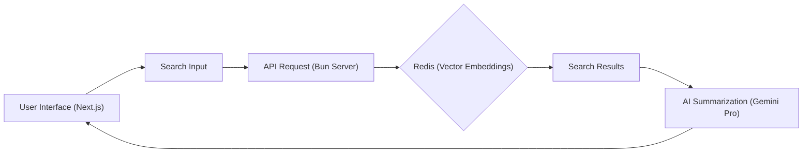
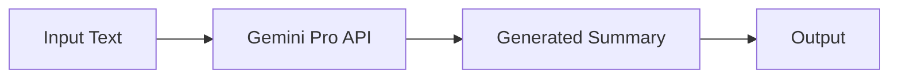

# Project Overview

GitDex is a documentation search and AI summarization tool built with Next.js on the frontend and a Bun-based server on the backend. It leverages vector embeddings and large language models (LLMs) to provide intelligent search and summarization capabilities for code repositories. The project aims to streamline the process of understanding and navigating complex codebases, allowing developers to quickly find relevant information and gain insights into project architecture and functionality.

## Core Features

*   **Documentation Search:** Allows users to search through project documentation using keywords and natural language queries.
*   **AI Summarization:** Utilizes LLMs to generate concise summaries of code files, documentation, and search results.
*   **Vector Embeddings:** Creates vector representations of code and documentation to enable semantic search and similarity matching.
*   **Real-time Updates:** Automatically updates the index when changes are made to the codebase.
*   **Interactive Visualization:** Includes interactive visualizations of the codebase structure and dependencies (future enhancement).

## Technology Stack

| Category      | Technology          | Purpose                                              |
| ------------- | ------------------- | ---------------------------------------------------- |
| Frontend      | Next.js             | User interface and application logic                 |
| Backend       | Bun               | Server-side logic and API endpoints                 |
| Vector DB     | Redis (with Vector)         | Storage and retrieval of vector embeddings        |
| LLM           | Google Gemini Pro | Text summarization and question answering          |
| UI Components | Shadcn UI           | Pre-built, customizable UI components                |
| Search        | Fuse.js, Flexsearch           | Client-side search functionality        |
| Other         | Octokit, Mermaid, MDX    | GitHub API interaction, diagrams, documentation |

## Client-Side (Next.js)

The client-side application is built using Next.js, a React framework for building performant and scalable web applications.  It handles user interaction, search queries, and displaying results.

To start the client-side development server:

```bash
npm run dev
# or
yarn dev
# or
pnpm dev
# or
bun dev
```

[View on GitHub](https://github.com/shinymack/gitdex/blob/main/client/README.md)

The `package.json` file in the `client` directory defines the dependencies and scripts for the frontend application.

```json
{
  "name": "client",
  "version": "0.1.0",
  "private": true,
  "scripts": {
    "dev": "next dev --turbopack",
    "build": "next build --turbopack",
    "start": "next start",
    "lint": "eslint"
  },
  "dependencies": {
    "@fumadocs/mdx-remote": "^1.4.2",
    "@octokit/rest": "^22.0.0",
    "@radix-ui/react-slot": "^1.2.3",
    "@shadcn/ui": "^0.0.4",
    "@types/mdx": "^2.0.13",
    "class-variance-authority": "^0.7.1",
    "clsx": "^2.1.1",
    "date-fns": "^4.1.0",
    "flexsearch": "^0.8.212",
    "fumadocs": "^0.0.0",
    "fumadocs-core": "^15.8.3",
    "fumadocs-mdx": "^12.0.2",
    "fumadocs-ui": "^15.8.3",
    "fuse.js": "^7.1.0",
    "gray-matter": "^4.0.3",
    "lucide-react": "^0.544.0",
    "mdx-mermaid": "^2.0.3",
    "mermaid": "^11.12.0",
    "next": "15.5.2",
    "next-mdx-remote": "^5.0.0",
    "next-themes": "^0.4.6",
    "ogl": "^1.0.11",
    "panzoom": "^9.4.3",
    "react": "19.1.0",
    "react-collapsible": "^2.10.0",
    "react-dom": "19.1.0",
    "react-mermaid": "^0.1.3",
    "react-svg-pan-zoom": "^3.13.1",
    "svg-pan-zoom": "^3.6.2",
    "svg-pan-zoom-container": "^0.6.1",
    "tailwind-merge": "^3.3.1",
    "tailwindcss-animate": "^1.0.7",
    "zod": "^4.1.7",
    "zustand": "^5.0.8"
  },
  "devDependencies": {
    "@eslint/eslintrc": "^3",
    "@tailwindcss/postcss": "^4",
    "@types/node": "^24.3.1",
    "@types/react": "^19.1.12",
    "@types/react-dom": "^19",
    "eslint": "^9",
    "eslint-config-next": "15.5.2",
    "tailwindcss": "^4",
    "tw-animate-css": "^1.3.8",
    "typescript": "^5"
  }
}
```

[View on GitHub](https://github.com/shinymack/gitdex/blob/main/client/package.json)





## Server-Side (Bun)

The server-side application is built using Bun, a fast JavaScript runtime. It handles API requests, interacts with the vector database (Redis), and performs AI summarization using Google's Gemini Pro model.

To start the server-side application:

```bash
bun run index.ts
```

[View on GitHub](https://github.com/shinymack/gitdex/blob/main/server/README.md)

The `package.json` file in the `server` directory defines the dependencies and scripts for the backend application.

```json
{
  "name": "server",
  "module": "index.ts",
  "type": "module",
  "private": true,
  "devDependencies": {
    "@types/bun": "latest"
  },
  "scripts": {
    "start": "bun index.js",
    "dev" : "bun --watch index.js"
  },
  "peerDependencies": {
    "typescript": "^5"
  },
  "dependencies": {
    "@dqbd/tiktoken": "^1.0.22",
    "@google/genai": "^1.17.0",
    "@octokit/rest": "^22.0.0",
    "cors": "^2.8.5",
    "dotenv": "^17.2.3",
    "express": "^5.1.0",
    "ioredis": "^5.8.1",
    "mermaid": "^11.12.0"
  }
}
```

[View on GitHub](https://github.com/shinymack/gitdex/blob/main/server/package.json)

## Vector Embedding and Search

The core of GitDex's intelligent search lies in its use of vector embeddings. The server-side application uses an LLM to generate vector representations of code files and documentation. These embeddings are stored in a vector database (Redis). When a user submits a search query, the query is also converted into a vector embedding, and the system searches the vector database for the most similar embeddings.

This approach allows GitDex to perform semantic search, meaning that it can find results that are related to the user's query even if they don't contain the exact keywords.

Here's a simplified example of how vector embeddings might be generated (illustrative):

```typescript
// Example using hypothetical embedding generation library
async function generateEmbedding(text: string): Promise<number[]> {
  // Replace with actual LLM embedding generation logic
  const embedding = await someLLM.embed(text);
  return embedding;
}
```

This example uses a placeholder `someLLM.embed(text)` function. In practice, this function would use a real LLM to generate the vector embedding.

## AI Summarization with Gemini Pro

GitDex uses Google's Gemini Pro model to generate summaries of code files and search results. This allows users to quickly understand the content of a file or a set of search results without having to read through the entire text.

Here's a conceptual snippet showing how Gemini Pro might be used:

```typescript
// Conceptual example of using Gemini Pro for summarization
async function summarizeText(text: string): Promise<string> {
  const genAI = new GoogleGenerativeAI(process.env.GOOGLE_API_KEY);
  const model = genAI.getGenerativeModel({ model: "gemini-pro" });

  const result = await model.generateContent(`Summarize the following text:\n${text}`);
  const summary = result.response.text();
  return summary;
}
```

[View on GitHub](https://github.com/shinymack/gitdex/blob/main/server/index.ts)

This snippet shows a high-level example of using the `gemini-pro` model to generate a summary of a given text.  In a real implementation, the input text would be carefully prepared to stay within the model's token limits and to optimize the quality of the summary.  Error handling and retry logic would also be added for robustness.





## Key Integration Points

The integration between the Next.js frontend and the Bun backend is crucial for the overall functionality of GitDex. The frontend sends API requests to the backend to perform search queries, retrieve summaries, and access other data. The backend handles these requests, interacts with the vector database and LLM, and returns the results to the frontend.

*   **API Endpoints:** The backend exposes API endpoints for search, summarization, and data retrieval.
*   **Data Format:** The frontend and backend communicate using JSON format for data exchange.
*   **Authentication:** (Future enhancement) Implement authentication to protect API endpoints and user data.
*   **Error Handling:** Implement robust error handling to gracefully handle unexpected errors and provide informative error messages to the user.

A sample express route looks like this in `/server/index.ts`:

```typescript
app.get('/api/search', async (req, res) => {
  try {
    const query = req.query.q as string;
    // ... logic to search the vector database and LLM
    res.json({ results: [] }); // Replace with actual search results
  } catch (error) {
    console.error(error);
    res.status(500).json({ error: 'An error occurred' });
  }
});
```

[View on GitHub](https://github.com/shinymack/gitdex/blob/main/server/index.ts)

## Best Practices

*   **Code Organization:** Follow a modular code structure to improve maintainability and readability.
*   **Documentation:** Write clear and concise documentation for all code components.
*   **Testing:** Implement unit tests and integration tests to ensure code quality and prevent regressions.
*   **Performance Optimization:** Optimize code for performance to ensure a smooth user experience.
*   **Security:** Implement security best practices to protect against vulnerabilities and data breaches.
```