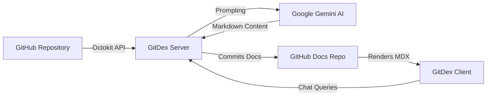
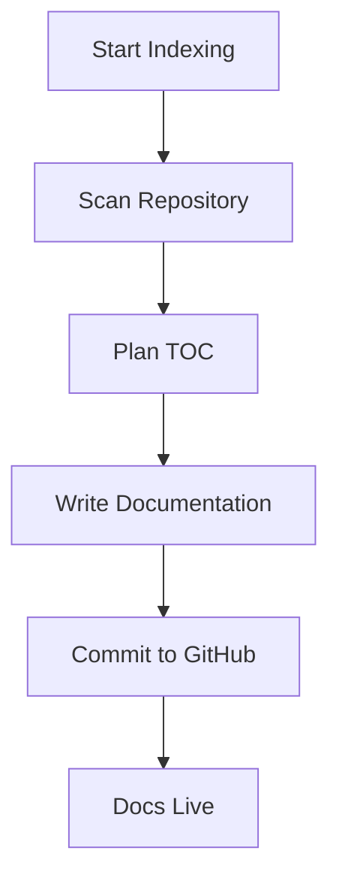

# Project Overview

GitDex is an AI-powered repository analyzer designed to transform any GitHub repository into high-quality, interactive documentation in seconds. By leveraging Large Language Models (LLMs) and a decoupled processing pipeline, GitDex automates the tedious process of codebase documentation, providing developers with a search-ready web reader and an intelligent AI assistant to navigate complex codebases.

## Core Purpose and Goals

The primary goal of GitDex is to bridge the gap between raw source code and comprehensive documentation. Instead of relying on manually maintained wikis or outdated READMEs, GitDex dynamically analyzes the codebase structure to produce structured markdown documentation.

### Primary Objectives
* **Automated Documentation**: Analyze codebase structures and generate comprehensive Table of Contents (TOC) and markdown files using LLMs.
* **Context-Aware Assistance**: Provide an AI chat interface that utilizes ReAct loops to answer specific questions about the repository's logic and architecture.
* **Visual Codebase Analysis**: Automatically generate Mermaid diagrams to help users visualize the architecture of the analyzed project.
* **Serverless Scalability**: Implement a robust indexing pipeline that bypasses serverless execution timeouts using an asynchronous queue system.

## High-Level System Workflow

GitDex operates through a decoupled architecture consisting of a background indexing server and a frontend documentation viewer. To handle the heavy lifting of repository analysis without hitting serverless timeout limits, the system employs a multi-step orchestration process.

```mermaid
graph LR
    A["GitHub Repository"] -- "Octokit API" --> B["GitDex Server"]
    B -- "Prompting" --> C["Google Gemini AI"]
    C -- "Markdown Content" --> B
    B -- "Commits Docs" --> D["GitHub Docs Repo"]
    D -- "Renders MDX" --> E["GitDex Client"]
    E -- "Chat Queries" --> B
```

## Technical Stack

GitDex is built as a monorepo utilizing a modern TypeScript-based stack for both the client and server.

| Layer | Technology | Purpose |
| :--- | :--- | :--- |
| **Frontend** | Next.js, Tailwind CSS | Application framework and styling |
| **Docs Engine** | Fumadocs | MDX rendering and page hierarchy |
| **Chat UI** | assistant-ui | Modular interactive AI interface |
| **Backend** | Node.js, Express | API server and pipeline orchestration |
| **AI Model** | Google Gemini | Code analysis and content generation |
| **Queue/Cache** | Upstash Redis & QStash | Asynchronous job management |
| **Integration** | Octokit | GitHub REST API interaction |
| **Runtime** | Bun | Fast JavaScript runtime and package manager |

## Indexing Pipeline Process

The "Multi-Step Indexing" feature is the core of GitDex's value proposition. It ensures that documentation is not just a summary, but a structured guide planned according to the actual project layout.

```mermaid
graph TD
    Start["Start Indexing"] --> Scan["Scan Repository"]
    Scan --> Plan["Plan TOC"]
    Plan --> Write["Write Documentation"]
    Write --> Commit["Commit to GitHub"]
    Commit --> End["Docs Live"]
```

1. **Scanning**: The server uses Octokit to analyze the repository's file structure.
2. **Planning**: Google Gemini analyzes the structure to create a logical Table of Contents.
3. **Writing**: The system iterates through the planned TOC, generating detailed markdown documentation for each section.
4. **Delivery**: The generated documentation is committed directly to a designated GitHub documentation repository, which is then rendered by the GitDex Client.