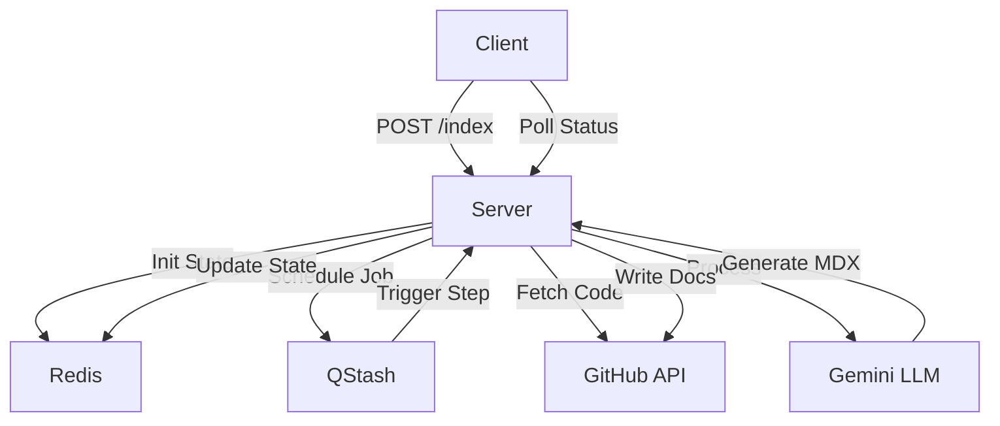

# System Architecture

GitDex is engineered as a decoupled, event-driven system designed to transform raw GitHub repositories into structured, AI-generated documentation. The architecture solves the primary constraint of serverless execution environments—strict request timeouts—by implementing an asynchronous orchestration layer powered by Upstash Redis and QStash.

## System Role & Architectural Position

The ecosystem is bifurcated into a presentation layer (Client) and an orchestration layer (Server). The Client manages the user's interaction with the generated documentation and the AI chat interface, while the Server handles the computationally expensive and time-intensive process of repository analysis and LLM-driven content generation.

### Technical Stack Mapping

| Layer | Component | Technology | Primary Responsibility |
| :--- | :--- | :--- | :--- |
| **Frontend** | UI Framework | Next.js 16 (App Router) | Server-side rendering (SSR) of MDX and routing. |
| **Frontend** | Doc Engine | Fumadocs | MDX processing, search indexing, and layout. |
| **Frontend** | AI Interface | `assistant-ui` + AI SDK | Managed chat modality and streaming LLM responses. |
| **Backend** | API Runtime | Node.js / Express | REST endpoint management and job triggering. |
| **Backend** | Orchestration | Upstash QStash | Asynchronous task scheduling and timeout bypass. |
| **Backend** | State Store | Upstash Redis | Job status tracking, concurrency locks, and caching. |
| **Backend** | LLM Engine | Google Gemini | Codebase analysis and Markdown generation. |
| **Integration** | Git Access | Octokit | Programmatic interaction with GitHub REST API. |

## Core Execution & Data Flow Mechanics

The GitDex pipeline utilizes a **Distributed Step-Execution** pattern. Instead of a single long-running process, the indexing workflow is decomposed into discrete, idempotent stages.

### Request Lifecycle Diagram



### Pipeline Execution Sequence

1.  **Initialization**: The Client sends a repository identifier to the Server. The Server initializes a job record in Redis and schedules the first execution pulse via QStash.
2.  **Analysis Phase**: The server retrieves the repository tree via Octokit. The LLM analyzes the structure to generate a comprehensive Table of Contents (ToC).
3.  **Generation Phase**: The system iterates through the planned ToC, performing targeted code reads and generating MDX files for each section.
4.  **Persistence**: Generated documentation is pushed back to the repository or a designated storage layer, ensuring the Client can render them via Fumadocs.
5.  **State Synchronization**: Every step updates a Redis key (e.g., `job:{id}:status`) to allow the Client to provide real-time progress updates via polling.

## Implementation Deep Dive

### Server Entry & Middleware
The server must handle raw request bodies to validate QStash signatures, ensuring that indexing triggers originate only from the trusted orchestrator.

```typescript title="server/index.ts"
import express, { Request, Response, NextFunction } from "express";
import { Redis } from '@upstash/redis';
import jobsRoutes from "./src/routes/jobsRoutes.js";

const app = express();
const redis = new Redis({ url: process.env.UPSTASH_REDIS_REST_URL, token: process.env.UPSTASH_REDIS_REST_TOKEN });

// CRITICAL: Capture the raw body BEFORE parsing JSON, so QStash signature verification works
app.use((req, res, next) => {
  let data = '';
  req.setEncoding('binary');
  req.on('data', (chunk) => { data += chunk; });
  req.on('end', () => {
    req.rawBody = data; 
    next();
  });
});

app.use(express.json());
app.use("/api/jobs", jobsRoutes);
```
**Mechanics**:
- **`req.rawBody`**: Preserves the exact byte sequence of the incoming request, which is mandatory for HMAC signature verification used by QStash.
- **Middleware Ordering**: The raw body capture occurs before `express.json()`, preventing the body stream from being consumed by the JSON parser.

### Client AI Integration
The client leverages the Vercel AI SDK and `assistant-ui` to bridge the gap between the static documentation and the dynamic AI assistant.

```typescript title="client/package.json"
"dependencies": {
    "@ai-sdk/google": "^3.0.83",
    "@assistant-ui/react": "^0.11.58",
    "@assistant-ui/react-ai-sdk": "^1.3.37",
    "ai": "^6.0.208",
    "fumadocs-ui": "^15.8.5"
}
```
**Mechanics**:
- **`@ai-sdk/google`**: Provides the provider-specific implementation for Gemini, enabling streaming responses to the UI.
- **`assistant-ui`**: Decouples the chat UI components from the AI logic, allowing for a custom-themed, context-aware assistant integrated into the Fumadocs layout.

## Method / State Reference & Error Recovery

### Redis State Schema

The system maintains an ephemeral state in Redis to coordinate asynchronous tasks across serverless instances.

| Key Pattern | Data Type | Purpose | Expiry (TTL) |
| :--- | :--- | :--- | :--- |
| `job:{jobId}:status` | `string` | Current phase (`PLANNING`, `WRITING`, `COMPLETED`). | 24 Hours |
| `job:{jobId}:progress` | `number` | Percentage of documentation completed. | 24 Hours |
| `lock:{repoPath}` | `string` | Mutex to prevent concurrent indexing of the same repo. | 1 Hour |
| `cooldown:{repoPath}` | `string` | Rate-limiting flag to prevent rapid re-indexing loops. | 15 Mins |

### Failure Modes & Recovery

| Failure Scenario | Detection Mechanism | Recovery Strategy |
| :--- | :--- | :--- |
| **LLM Timeout** | QStash Delivery Failure | Exponential backoff retry managed by QStash. |
| **GitHub Rate Limit** | Octokit `403 Forbidden` | Job is paused; state is saved to Redis; retry scheduled after reset window. |
| **Partial Indexing** | Redis status $\neq$ `COMPLETED` | Client allows "Resume" operation, picking up from the last successful ToC entry. |
| **Zombied Locks** | TTL Expiration | Redis key expiration automatically releases the `lock:{repoPath}`, allowing new indexing requests. |