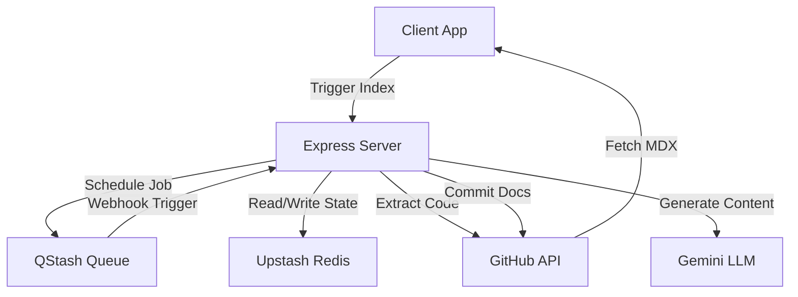

# System Architecture

GitDex is engineered as a decoupled, asynchronous pipeline designed to transform raw GitHub repository structures into structured, AI-generated documentation. The architecture specifically addresses the constraints of serverless execution environments—namely, the strict request timeout limits—by implementing a distributed task orchestration layer using Upstash QStash and Redis.

### System Role & Architectural Position

The system is bifurcated into a high-performance rendering client and a stateless orchestration server. The server does not maintain long-lived connections for document generation; instead, it delegates execution to a message-driven pipeline.

#### Technical Specifications Matrix

| Component | Technology Stack | Primary Responsibility | Execution Context |
| :--- | :--- | :--- | :--- |
| **Client** | Next.js, Fumadocs, Tailwind | MDX rendering, AI Chat UI, Dynamic Routing | Vercel Edge/Serverless |
| **Server** | Node.js, Express, Bun | Job orchestration, LLM integration, GitHub API | Vercel Serverless |
| **Queue** | Upstash QStash | Distributed scheduling, timeout bypass, retries | External SaaS |
| **State Store** | Upstash Redis | Job tracking, token caching, indexing state | External SaaS |
| **AI Engine** | Google Gemini | Repository analysis, TOC planning, content generation | External API |
| **VCS Bridge** | Octokit | Source code extraction, Documentation commits | GitHub REST API |

---

### Core Execution & Data Flow Mechanics

To circumvent serverless timeout limits (typically 10-60s), GitDex employs a "Step-by-Step Execution" pattern. Rather than a single monolithic request, the documentation process is fragmented into discrete, idempotent tasks orchestrated by QStash.

#### High-Level Orchestration Flow



#### Pipeline Execution Sequence

1.  **Initiation**: Client sends a request to the Server API with the target `owner/repo`.
2.  **Job Scheduling**: Server initializes a job ID in Redis and schedules the first "Scan" task via QStash.
3.  **Repository Indexing**: The server extracts the file tree and relevant source code using Octokit, storing the compressed codebase mapping in Redis.
4.  **TOC Planning**: Gemini analyzes the codebase map to generate a structured Table of Contents (TOC).
5.  **Incremental Generation**: The server iterates through the TOC, triggering individual QStash tasks for each page. Each task prompts Gemini to write a specific MDX file.
6.  **Persistence**: Generated MDX files are committed directly to the designated GitHub documentation repository.
7.  **Hydration**: The Client fetches the generated files from GitHub and renders them via Fumadocs.

---

### Implementation Deep Dive

#### Environment Configuration Schema

The system relies on a strict set of environment variables to maintain connectivity between the serverless functions and the external state/queue providers.

```typescript title="server/env.schema.ts"
interface ServerEnv {
  PORT: number; // Internal server port (3001)
  CLIENT_URLS: string; // Allowed CORS origins
  UPSTASH_REDIS_REST_URL: string; // Connection string for state store
  UPSTASH_REDIS_REST_TOKEN: string; // Authentication token for Redis
  QSTASH_TOKEN: string; // Authentication for message broker
  BASE_URL: string; // Public tunnel URL for QStash webhooks
  GITHUB_TOKEN: string; // PAT for repository access
  GOOGLE_GENERATIVE_AI_API_KEY: string; // API Key for Gemini Pro
}
```
*   `BASE_URL` is critical; it defines the endpoint where QStash sends HTTP POST requests to trigger the next step in the pipeline.
*   `UPSTASH_REDIS_REST_URL` ensures state persistence across different serverless execution contexts.

#### Serverless Routing Configuration

The server is deployed as a single-entry Express application on Vercel, requiring specific routing to ensure all requests are handled by the `index.ts` handler.

```json title="server/vercel.json"
{
  "version": 2,
  "builds": [
    {
      "src": "index.ts",
      "use": "@vercel/node"
    }
  ],
  "routes": [
    {
      "src": "/(.*)",
      "dest": "index.ts",
      "headers": {
        "Cache-Control": "no-store, must-revalidate"
      }
    }
  ]
}
```
*   `src: "/(.*)"`: Maps all incoming traffic to the Express app.
*   `Cache-Control: no-store`: Prevents Vercel's Edge Network from caching API responses, ensuring the client always sees the latest job status from Redis.

---

### Method / State Reference & Error Recovery

#### Redis State Architecture

The system utilizes Redis as a distributed state machine to track the progress of documentation jobs.

| Key Pattern | Data Type | Purpose | TTL |
| :--- | :--- | :--- | :--- |
| `job:{id}:status` | String | Current pipeline phase (`indexing`, `planning`, `writing`, `completed`) | 24h |
| `job:{id}:toc` | JSON | The generated Table of Contents structure | 24h |
| `job:{id}:progress` | Integer | Percentage of TOC pages completed | 24h |
| `repo:{owner}:{repo}:map` | String | Compressed representation of the codebase for LLM context | 7d |

#### Failure Modes & Recovery Logic

| Failure Scenario | Detection Mechanism | Recovery Strategy |
| :--- | :--- | :--- |
| **LLM Rate Limit** | HTTP 429 from Gemini API | QStash exponential backoff retry policy. |
| **GitHub API Throttling** | Octokit `RateLimitError` | Job suspension; reschedule next step with delay. |
| **Serverless Timeout** | Execution termination | QStash identifies missing ACK and redelivers the payload. |
| **Invalid Repo Path** | Octokit HTTP 404 | Terminal state update in Redis (`status: failed`). |