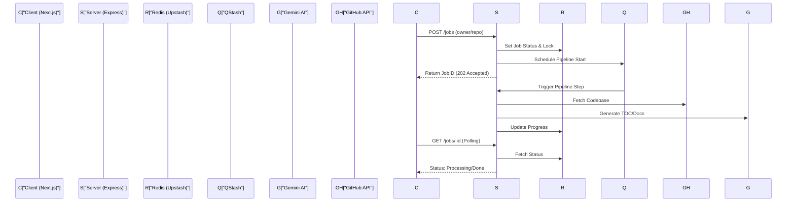

# System Architecture

The GitDex ecosystem is a decoupled, distributed system designed to transform GitHub repositories into AI-generated documentation. The architecture is specifically engineered to overcome the execution time limits inherent in serverless environments (such as Vercel or AWS Lambda). Rather than processing a repository in a single long-running request, GitDex implements an asynchronous, event-driven pipeline orchestrated by a remote scheduler.

The system is split into two primary domains: a **Next.js Frontend (Client)** and a **Node.js Express Backend (Server)**. The frontend handles user interaction, documentation rendering via Fumadocs, and the AI chat interface. The backend manages the heavy lifting: interacting with the GitHub API, orchestrating the LLM-based indexing pipeline, and maintaining state via a distributed Redis store.

### Core Component Summary

| Component | Technology | Primary Responsibility | Key Dependencies |
| :--- | :--- | :--- | :--- |
| **Client** | Next.js (App Router) | UI Rendering, API Proxying, AI Chat | Fumadocs, assistant-ui, Tailwind CSS |
| **Server** | Node.js / Express | Job Orchestration, AI Pipeline, GitHub Integration | Octokit, Google AI SDK, Express |
| **State Store** | Upstash Redis | Job status tracking, concurrency locking, caching | `@upstash/redis` |
| **Orchestrator** | Upstash QStash | Asynchronous task scheduling, serverless timeout bypass | HTTP Webhooks |
| **AI Engine** | Google Gemini | Code analysis, TOC planning, Markdown generation | `@google/generative-ai` |

---

## Architecture, State & Data Flow

GitDex utilizes a "Deferred Execution" pattern. When a user requests the documentation of a repository, the system does not generate it synchronously. Instead, it registers a job and delegates the execution to a sequence of webhook triggers.

### Request Processing Lifecycle

1.  **Initiation**: The user provides a GitHub `owner/repo` path. The Next.js frontend sends this request to the Server API.
2.  **Job Registration**: The Server validates the repository and creates a job record in Redis. To prevent redundant processing, a "cooldown lock" is placed on the repository key.
3.  **Orchestration Trigger**: The Server sends a payload to QStash. QStash acts as a reliable message queue that triggers the server's internal pipeline endpoints at specific intervals or upon completion of previous steps.
4.  **The Pipeline (The Indexing Loop)**:
    *   **Scan**: Octokit fetches the repository tree and file contents.
    *   **Plan**: Gemini analyzes the structure and generates a Table of Contents (TOC).
    *   **Write**: Gemini iteratively processes files to write comprehensive Markdown documentation.
5.  **Persistence & Retrieval**: As documents are generated, they are stored. The client polls the server for job status updates until the "Complete" state is reached.
6.  **Rendering**: The Next.js frontend utilizes Fumadocs to render the generated Markdown into a searchable, structured documentation site.

### System Interaction Diagram



---

## In-Depth Code Walkthrough & Implementation Details

### Server Entry Point and Middleware
The server is built on Express and is configured to handle both standard API requests and QStash webhook triggers. A critical architectural detail is the preservation of the raw request body for security verification.

```typescript title="server/index.ts"
import express, { Request, Response, NextFunction } from "express";
import { Redis } from '@upstash/redis';
import jobsRoutes from "./src/routes/jobsRoutes.js";

const app = express();
const redis = new Redis({
  url: process.env.UPSTASH_REDIS_REST_URL!,
  token: process.env.UPSTASH_REDIS_REST_TOKEN!,
});

// CRITICAL: Capture the raw body BEFORE parsing JSON, so QStash signature verification works
app.use(express.text({ type: 'application/json' })); 

app.use('/api/jobs', jobsRoutes);
```

In `server/index.ts`, the use of `express.text({ type: 'application/json' })` instead of `express.json()` is intentional. QStash signs its payloads to ensure that only authorized triggers can execute the indexing pipeline. Signature verification requires the exact, unmodified raw byte stream of the request body. If the body were pre-parsed into a JavaScript object, the cryptographic hash would fail.

### Job Management and Redis State
The system manages the lifecycle of an indexing task using Redis. This allows the server to remain stateless while tracking long-running AI processes.

```typescript title="server/src/routes/jobsRoutes.ts"
// Conceptual implementation of job creation and locking
async function createJob(req, res) {
  const { owner, repo } = req.body;
  const lockKey = `lock:${owner}/${repo}`;
  
  const isLocked = await redis.get(lockKey);
  if (isLocked) {
    return res.status(429).json({ error: "Repository is currently being indexed" });
  }

  const jobId = crypto.randomUUID();
  await redis.set(lockKey, "true", { ex: 3600 }); // 1 hour lock
  await redis.set(`job:${jobId}`, JSON.stringify({ status: 'queued', repo: `${owner}/${repo}` }));
  
  // Schedule the first step via QStash
  await qstash.publishJSON({ url: '...', body: { jobId } });
  
  res.status(202).json({ jobId });
}
```

The locking mechanism (`lock:${owner}/${repo}`) prevents a "thundering herd" problem where multiple users trigger indexing for the same popular repository simultaneously, which would exhaust LLM tokens and GitHub API rate limits. The use of a TTL (Time-To-Live) ensures that if a process crashes, the repository eventually becomes indexable again.

### Frontend Layout and Provider Integration
The frontend is designed as a documentation shell that wraps the AI-generated content. It uses a provider-based architecture to manage themes and documentation state.

```typescript title="client/src/app/layout.tsx"
export default function RootLayout({
  children,
}: {
  children: React.ReactNode;
}) {
  return (
    <html lang="en" suppressHydrationWarning>
      <body>
        <ThemeProvider attribute="class" defaultTheme="system" enableSystem>
          <RootProvider>
            <Toaster />
            {children}
          </RootProvider>
        </ThemeProvider>
      </body>
    </html>
  );
}
```

The `RootProvider` from `fumadocs-ui` is central to the frontend architecture. It provides the context necessary for the documentation search, navigation tree, and page transitions. By wrapping the application in this provider, GitDex can dynamically inject the AI-generated Markdown files into the documentation structure without requiring a full rebuild of the Next.js application.

---

## API / Method Reference

### Server API Endpoints

#### `POST /api/jobs`
Triggers the indexing pipeline for a specified GitHub repository.
- **Payload**: `{ "owner": string, "repo": string }`
- **Returns**: `202 Accepted` with `{ "jobId": string }`
- **Invariants**: Must verify that the repository is public and accessible via Octokit.
- **Throws**: `429 Too Many Requests` if a lock exists for the repo.

#### `GET /api/jobs/:id`
Polls the current status of a specific indexing job.
- **Parameters**: `id` (Job UUID)
- **Returns**: `200 OK` with `{ "status": "queued" | "processing" | "completed" | "failed", "progress": number }`
- **Throws**: `404 Not Found` if the jobId does not exist in Redis.

#### `DELETE /api/jobs/clear` (Development Only)
Wipes the Redis store of all jobs and locks.
- **Action**: Scans Redis for keys matching `job:*` and `lock:*` and deletes them.
- **Side Effect**: Allows immediate re-indexing of any repository regardless of previous cooldowns.

---

## Error Handling, Edge Cases & Performance

### Serverless Timeout Mitigation
The most significant architectural challenge in GitDex is the Gemini AI processing time. Generating a full documentation set for a large repo can take several minutes, exceeding the maximum execution time of most serverless functions (typically 10-30 seconds). 

GitDex solves this by **fragmenting the pipeline**. Each stage (Scanning $\rightarrow$ Planning $\rightarrow$ Writing) is a separate HTTP request triggered by QStash. If the "Write" phase is too large, it is further broken down into per-file tasks, where each task triggers the next one upon completion, effectively creating a distributed linked list of executions.

### Concurrency and Race Conditions
To prevent corrupted state in Redis, GitDex employs:
1.  **Atomic Locks**: Using Redis `SET NX` (Set if Not Exists) to ensure only one indexing job per repository is active.
2.  **Idempotency Keys**: QStash provides message IDs that the server uses to ensure that a retried webhook trigger does not cause the same documentation section to be written twice.

### AI Performance and Rate Limiting
- **Token Management**: To avoid Gemini's context window limits, the system does not feed the entire codebase into the LLM. It uses a "Plan-then-Execute" strategy: the LLM first creates a high-level map, and then only the relevant files for a specific section are sent in subsequent prompts.
- **GitHub Rate Limits**: Octokit is configured to handle GitHub's REST API limits. For extremely large repositories, the "Scan" phase implements pagination to avoid timeouts and 403 errors.