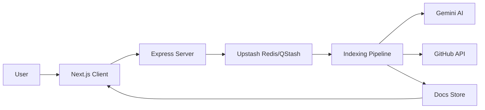
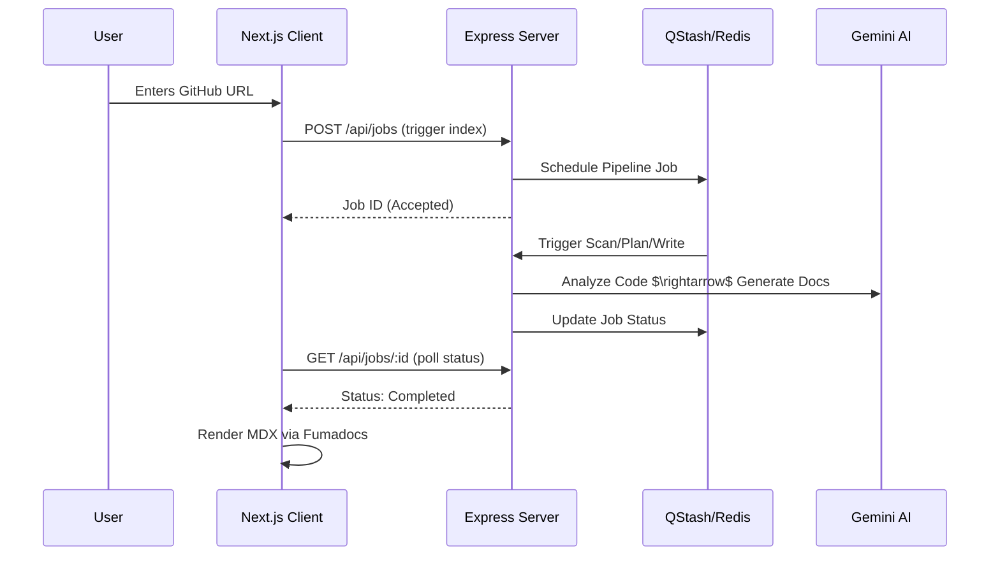

# System Overview

GitDex is an automated documentation engine that transforms GitHub repositories into AI-generated, interactive documentation sites. The system is split into two primary decoupled components: a **Next.js Documentation Client** and an **Express Indexing Server**.

To operate within serverless execution limits (e.g., Vercel timeouts), GitDex employs an asynchronous, event-driven indexing pipeline orchestrated by Upstash Redis and QStash.

## High-Level Architecture

The architecture follows a producer-consumer pattern where the client triggers a documentation request, and the server manages a multi-stage pipeline to process the codebase.



### Core Component Responsibilities

| Component | Technology | Primary Responsibility |
| :--- | :--- | :--- |
| **Documentation Client** | Next.js, Fumadocs | Renders MDX content, manages AI chat interface, and handles dynamic routing for `/:owner/:repo`. |
| **Indexing Server** | Node.js, Express | Manages job orchestration, validates GitHub URLs, and interfaces with the LLM pipeline. |
| **Job Queue** | Upstash Redis & QStash | Decouples heavy indexing tasks into smaller, timed chunks to prevent serverless timeouts. |
| **AI Engine** | Google Gemini | Analyzes codebase structure, generates Table of Contents (ToC), and writes documentation. |
| **GitHub Integration** | Octokit | Fetches repository trees, file contents, and metadata via REST API. |

## The Indexing Pipeline

The system does not index repositories in a single request. Instead, it uses a decoupled workflow to handle the computational intensity of LLM generation and API rate limits.

### Execution Flow

1.  **Trigger**: The client sends a repository URL to the server.
2.  **Initialization**: The server creates a job entry in Redis and schedules the first stage via QStash.
3.  **Scan Stage**: The system uses Octokit to map the repository structure and identify critical files.
4.  **Plan Stage**: Gemini analyzes the map to create a hierarchical Table of Contents (ToC).
5.  **Write Stage**: The system iterates through the ToC, fetching relevant code snippets and generating comprehensive Markdown for each section.
6.  **Finalization**: The generated documentation is stored and made available for the client to render.

```typescript title="server/index.ts"
import express from "express";
import { Redis } from '@upstash/redis';
import jobsRoutes from "./src/routes/jobsRoutes.js";

const app = express();
const redis = new Redis({
  url: process.env.UPSTASH_REDIS_REST_URL,
  token: process.env.UPSTASH_REDIS_REST_TOKEN,
});

// Routes for managing the indexing lifecycle
app.use("/api/jobs", jobsRoutes);
```

The `jobsRoutes` handler manages the transition between the "Scan", "Plan", and "Write" states by pushing new messages to QStash, effectively creating a distributed state machine.

## Client-Server Interaction

The client interacts with the server primarily through two channels: **Index Triggering** and **Documentation Consumption**.

### Sequence Diagram: Documentation Generation



### Dynamic Rendering
The client uses dynamic routing to render documentation based on the repository owner and name. When a user navigates to `/shinymack/gitdex`, the client fetches the corresponding generated MDX files from the storage layer and renders them using Fumadocs, providing a native documentation feel with integrated search and an AI chat assistant.