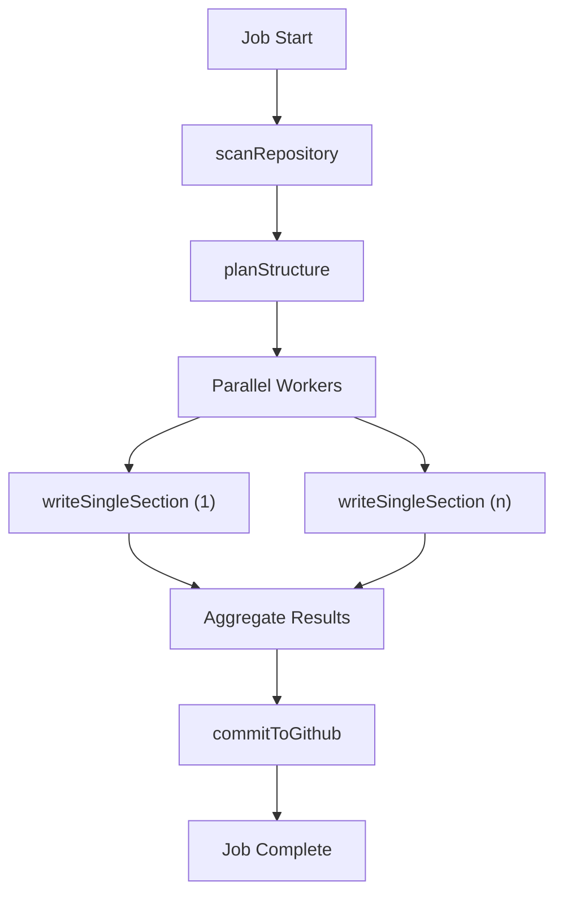

# AI Processing Pipeline

The AI Processing Pipeline is the core analytical engine of GitDex. Its primary purpose is to transform a raw GitHub repository into a structured, AI-generated technical documentation site. This module orchestrates a multi-stage sequential and parallel workflow that involves repository scanning, structural planning, content generation, and final deployment via GitHub commits.

Architecturally, the pipeline is designed as a distributed state machine. Because AI generation is time-intensive and subject to strict rate limits, the pipeline does not run in a single request-response cycle. Instead, it leverages a job queue (managed via Redis and QStash) to execute discrete steps asynchronously. This ensures that the system can recover from timeouts, handle AI provider outages, and scale the generation of large repositories through parallel worker patterns.

### Core Components and Dependencies

| Export/Module | Role | Primary Dependencies |
| :--- | :--- | :--- |
| `generateWithRetry` | Resilient wrapper for LLM calls with throttling and exponential backoff. | `@ai-sdk/google`, `ai` |
| `executeNextStep` | The main orchestrator that determines the current pipeline stage and routes to the handler. | `queue`, `redis`, `QStash` |
| `scanRepository` | Analyzes the file tree and samples relevant code using `repomix`. | `@octokit/rest`, `repomix` |
| `planStructure` | Generates a Table of Contents (TOC) to guide the documentation layout. | `generateWithRetry` |
| `writeSingleSection` | Generates detailed content for a specific documentation section. | `generateWithRetry` |
| `commitToGithub` | Persists the final generated documentation back to the target repository. | `@octokit/rest` |

## Architecture, State & Data Flow

The pipeline operates as a linear sequence of stages, with one stage utilizing a fan-out pattern to achieve parallelism. State is persisted across these stages in Redis, allowing the pipeline to be stateless between QStash triggers.

### Execution Workflow

1.  **Initiation**: A job is created in the queue. `executeNextStep` is called for the first time.
2.  **Scanning**: The `scanRepository` function retrieves the file tree and identifies key files. It uses a round-robin sampling method to ensure a representative slice of the codebase is captured without exceeding LLM context limits.
3.  **Planning**: The `planStructure` function sends the sampled code to the AI to generate a `TocEntry[]` array. This serves as the blueprint for all subsequent documentation pages.
4.  **Generation (Fan-out)**: The pipeline triggers multiple parallel workers (defined by `PIPELINE_CONCURRENCY`). Each worker is responsible for one `TocEntry`, calling `writeSingleSection` to generate the markdown content.
5.  **Aggregation**: As workers complete, the results are merged into the `PipelineData` object in Redis.
6.  **Finalization**: Once all sections are written, `commitToGithub` synchronizes the generated files with the repository's documentation path, deleting stale files and committing new ones.

### Pipeline State Transition Diagram



## In-Depth Code Walkthrough & Implementation Details

### Resilient AI Generation

The `ai.ts` module implements a sophisticated wrapper around the Google Gemini SDK to handle the volatile nature of LLM APIs, specifically focusing on Rate Limit (429) errors.

```typescript title="server/src/ai.ts"
export async function generateWithRetry({
  systemPrompt,
  prompt,
  maxRetries = 3
}: GenerateOptions): Promise<string> {
  for (let attempt = 0; attempt <= maxRetries; attempt++) {
    try {
      // Dynamic Throttle Logic
      await throttle(); 
      
      const { text } = await generateText({
        model: google("gemini-1.5-pro"),
        system: systemPrompt,
        prompt: prompt,
      });
      return text;
    } catch (error: any) {
      if (error.status === 429 && attempt < maxRetries) {
        const waitTime = Math.pow(2, attempt) * 1000 + Math.random() * 1000;
        await new Promise(res => setTimeout(res, waitTime));
        continue;
      }
      if (error.status === 429) {
        await new Promise(res => setTimeout(res, 10000)); // Hard wait on final 429
      }
      throw error;
    }
  }
  throw new Error("Max retries reached");
}
```

The `generateWithRetry` function implements an exponential backoff strategy. The `throttle()` call ensures that requests are spaced out according to the `AI_THROTTLE_MS` environment variable. If a `429 Too Many Requests` error occurs, the system calculates a wait time that grows exponentially per attempt, adding jitter to prevent "thundering herd" issues. If all retries fail, a final hard sleep of 10 seconds is attempted before throwing the error to the pipeline orchestrator.

### Pipeline Orchestration Logic

The `executeNextStep` function acts as the central dispatcher. It utilizes a switch-case mechanism to determine which stage of the pipeline to execute based on the current state of the job.

```typescript title="server/src/pipeline.ts"
export async function executeNextStep(jobId: string, sectionIndex?: number) {
  const job = await queue.getJob(jobId);
  const data = await redis.get<PipelineData>(`pipeline:data:${jobId}`) || { 
    files: [], toc: [], generatedFiles: [], sectionsWritten: 0 
  };

  try {
    if (!data.toc.length) {
      await scanRepository(job, data);
      await planStructure(job, data);
      // Trigger parallel workers
      for (let i = 0; i < data.toc.length; i++) {
        await triggerNextStep(jobId, i, i * 500); 
      }
      return;
    }

    if (sectionIndex !== undefined) {
      await writeSingleSection(job, data, sectionIndex);
      // Check if all sections are done
      if (data.sectionsWritten === data.toc.length) {
        await commitToGithub(job, data);
      }
      return;
    }
  } catch (error: any) {
    nextJobId = await queue.failJob(jobId, error.message);
    // Isolated try/catch to ensure queue continuity
    await triggerNextStep(nextJobId).catch(console.error);
  }
}
```

This implementation separates the "Planning" phase from the "Generation" phase. Once `planStructure` populates `data.toc`, the function enters a fan-out mode. It calls `triggerNextStep` for every entry in the TOC, with a staggered delay (`i * 500`) to prevent overwhelming the AI provider's concurrent request limit. The `sectionsWritten` counter acts as a synchronization barrier; only when it matches the TOC length does the pipeline proceed to `commitToGithub`.

### Repository Scanning and Compression

To avoid exceeding LLM context windows, GitDex does not send every file in a repository. Instead, it uses a sampling strategy combined with `repomix`.

```typescript title="server/src/pipeline.ts"
async function scanRepository(job: JobData, data: PipelineData) {
  const octokit = new Octokit({ auth: process.env.GITHUB_TOKEN });
  const { data: tree } = await octokit.git.getTree({
    owner: job.owner,
    repo: job.repo,
    tree_sha: 'main',
    recursive: 'true'
  });

  // Group files by top-level directory for round-robin sampling
  const groups = new Map<string, RepoItem[]>();
  tree.forEach(item => {
    const topDir = item.path.split('/')[0];
    if (!groups.has(topDir)) groups.set(topDir, []);
    groups.get(topDir)!.push(item);
  });

  // Sampling logic to fit into context window...
  const sampledFiles = // ... logic to pick representative files
  
  const compressed = await compressCodeWithRepomix(path, content);
  data.compressedCode = compressed;
}
```

The `scanRepository` function implements a "top-level directory grouping" strategy. By categorizing files by their root folder, the pipeline ensures that it doesn't accidentally sample 50 files from one utility folder while ignoring the core business logic in another. The `compressCodeWithRepomix` helper then packs these files into a single, AI-optimized format, reducing token overhead by stripping unnecessary whitespace and adding clear delimiters.

## API / Method Reference

### `generateWithRetry(options: GenerateOptions): Promise<string>`
Resilient LLM invocation wrapper.
- **Parameters**:
    - `systemPrompt`: The behavioral instruction for the AI.
    - `prompt`: The specific request/data to process.
    - `maxRetries`: Maximum number of 429 retry attempts (default: 3).
- **Returns**: The generated text string.
- **Throws**: Error if max retries are exceeded or a non-429 API error occurs.

### `executeNextStep(jobId: string, sectionIndex?: number): Promise<void>`
The primary pipeline driver.
- **Parameters**:
    - `jobId`: The unique identifier for the processing job in Redis.
    - `sectionIndex`: Optional. If provided, the function executes the specific documentation section generator for that index.
- **Side Effects**: Mutates Redis state (`PipelineData`), triggers QStash jobs, and performs GitHub API writes.

### `scanRepository(job: JobData, data: PipelineData): Promise<void>`
Analyzes repository structure and samples code.
- **Invariants**: Must be called before `planStructure`.
- **Output**: Updates `data.files` and `data.compressedCode`.

### `planStructure(job: JobData, data: PipelineData): Promise<void>`
Determines the documentation layout.
- **Output**: Populates `data.toc` with `TocEntry` objects containing titles, descriptions, and relevant filenames.

### `writeSingleSection(job: JobData, data: PipelineData, index: number): Promise<void>`
Generates content for a single TOC entry.
- **Output**: Appends to `data.generatedFiles` and increments `data.sectionsWritten`.

### `commitToGithub(job: JobData, data: PipelineData): Promise<void>`
Synchronizes the AI output with the GitHub repository.
- **Logic**: Performs a diff between existing files in the `docsPath` and the `generatedFiles` array, deleting removed sections and creating/updating existing ones.

## Error Handling, Edge Cases & Performance

### Rate Limit Mitigation
The pipeline employs a three-tier defense against AI rate limits:
1.  **Synchronous Throttling**: `AI_THROTTLE_MS` enforces a minimum gap between requests.
2.  **Staggered Dispatch**: When triggering parallel workers, a delay of 500ms is added per worker to avoid spiking the API.
3.  **Exponential Backoff**: The `generateWithRetry` logic handles `429` responses with increasing wait times.

### Fault Tolerance & Recovery
Since the pipeline is distributed across QStash jobs, it is susceptible to partial failures.
- **Job Failure**: If a specific `writeSingleSection` worker fails, the `executeNextStep` catch block calls `queue.failJob`. This updates the job status and allows for administrative retry.
- **Orchestration Safety**: The call to `triggerNextStep` inside the error handler is wrapped in its own isolated try/catch. This prevents a failure in the "failure notification" logic from crashing the entire worker process.
- **State Cleanup**: `planStructure` explicitly cleans up stale section keys from previous failed runs to ensure that a re-indexed repository doesn't contain "ghost" documentation from a previous version.

### Performance Optimizations
- **Token Management**: Use of `js-tiktoken` allows the pipeline to calculate the exact token count of the sampled code, ensuring it stays within the Gemini 1.5 Pro context window.
- **Concurrency Control**: The `PIPELINE_CONCURRENCY` environment variable allows operators to tune the number of simultaneous AI requests based on their API tier.
- **Round-Robin Sampling**: By sampling across directories rather than alphabetically, the AI receives a holistic view of the architecture, improving the quality of the generated Table of Contents.