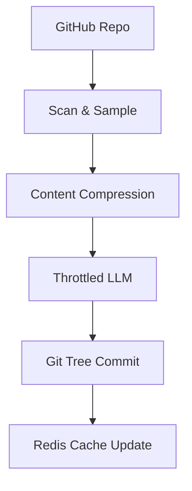

# AI Processing Pipeline

The AI Processing Pipeline is the core data transformation engine of GitDex. It implements a deterministic sequence of repository scanning, content sampling, token optimization, and LLM-driven synthesis to convert raw source code into structured documentation. The pipeline operates as a series of asynchronous steps coordinated by the Backend Core Engine and persisted via the GitHub Git Data API.

## System Role & Architectural Position

The pipeline serves as the intermediary between the external GitHub API and the internal LLM services. It is designed to handle the "context window problem" by implementing a sophisticated sampling and compression strategy, ensuring that the most representative parts of a codebase are sent to the LLM without exceeding token limits or triggering aggressive rate limits.

### Pipeline Specifications & Dependencies

| Component | Responsibility | Dependency | Key Configuration |
| :--- | :--- | :--- | :--- |
| `githubService` | Data extraction, tree traversal, and Git persistence | `@octokit/rest` | `DOCS_REPO_NAME`, `DOCS_REPO_OWNER` |
| `compressionService` | Token reduction and content normalization | `repomix` | `output.compress: true` |
| `aiService` | LLM orchestration and rate-limit management | `@ai-sdk/google` | `DOCS_MODELS`, `AI_THROTTLE_MS` |
| `redis` | State caching and idempotency checks | `ioredis` | `repo_exists:*`, `last_indexed:*` |

## Core Execution & Data Flow Mechanics

The pipeline follows a linear execution path with internal retry loops for the AI generation phase. The process is designed to be resumable and state-aware via the `JobData` interface.



### Execution Sequence

1.  **Repository Scanning & Sampling**: 
    *   The system performs a recursive tree fetch of the default branch.
    *   **Filtering**: Files are excluded based on size (>1MB), path patterns (e.g., `node_modules`, `dist`, `components/ui`), and non-code extensions.
    *   **Balanced Sampling**: To avoid bias toward a single directory, the pipeline uses a round-robin sampling algorithm across directory groups, capping the total file count at 50.
2.  **Token Compression**:
    *   Raw file contents are passed through `repomix` with `compress: true`. This reduces whitespace and removes redundant characters to maximize the effective context window of the LLM.
3.  **Throttled LLM Generation**:
    *   The pipeline iterates through a prioritized list of Google Gemini models (`DOCS_MODELS`).
    *   A global timestamp `lastApiCallTimestamp` ensures a minimum interval (`AI_THROTTLE_MS`) between requests.
    *   **Retry Logic**: Implements exponential backoff for general errors and a hard 10-second wait for HTTP 429 (Too Many Requests) responses.
4.  **Atomic Persistence**:
    *   The system avoids high-level "commit" abstractions and instead manipulates the Git tree directly.
    *   It calculates the diff between the current `main` branch tree and the new documentation set, creating a new tree and updating the `heads/main` reference.

## Implementation Deep Dive

### Balanced Repository Sampling
The `scanRepository` function implements a directory-aware sampling mechanism to ensure a representative slice of the codebase is extracted.

```typescript title="server/src/services/githubService.ts"
const groups: { [key: string]: RepoItem[] } = {};
for (const file of relevantFiles) {
  if (!file.path) continue;
  const parts = file.path.split('/');
  const dir = (parts.length > 1 ? parts[0] : '.') || '.';
  if (!groups[dir]) groups[dir] = [];
  groups[dir].push(file);
}

const sampledFiles: RepoItem[] = [];
const dirs = Object.keys(groups);
let index = 0;
while (sampledFiles.length < 50 && dirs.length > 0) {
  const currentDir = dirs[index % dirs.length];
  if (!currentDir) {
    dirs.splice(index % dirs.length, 1);
    continue;
  }
  const file = (groups[currentDir] || []).shift();
  if (file) {
    sampledFiles.push(file);
  } else {
    dirs.splice(index % dirs.length, 1);
    continue;
  }
  index++;
}
```
**Mechanics:**
- **Grouping**: Files are categorized by their top-level directory to prevent a single large directory (e.g., `src/utils`) from dominating the sample.
- **Round-Robin Selection**: The `while` loop iterates through directory keys using modulo arithmetic (`index % dirs.length`), popping one file per directory until the 50-file limit is reached.
- **Concurrency**: Once sampled, files are fetched using a worker pool (default concurrency: 10) to minimize I/O blocking.

### Resilient LLM Orchestration
The `generateWithRetry` function handles the volatility of LLM APIs through a multi-model fallback and throttling system.

```typescript title="server/src/services/aiService.ts"
for (const modelId of docsModels) {
  for (let attempt = 0; attempt < maxRetries; attempt++) {
    try {
      const now = Date.now();
      const targetTime = Math.max(now, lastApiCallTimestamp + MIN_INTERVAL_MS);
      lastApiCallTimestamp = targetTime;

      if (targetTime > now) {
        const waitTime = targetTime - now;
        const { promise, resolve } = Promise.withResolvers<void>();
        setTimeout(resolve, waitTime);
        await promise;
      }

      const result = await generateText({
        model: google(modelId),
        system: systemPrompt,
        prompt: prompt,
      });
      return result.text;
    } catch (error: unknown) {
      // ... error handling and backoff logic
    }
  }
}
```
**Mechanics:**
- **Temporal Throttling**: Uses `Promise.withResolvers` to create a non-blocking wait period, ensuring the system never exceeds the `MIN_INTERVAL_MS` threshold.
- **Model Fallback**: If the primary model (e.g., `gemma-4-31b-it`) fails after `maxRetries`, the loop moves to the next available model in the `DOCS_MODELS` array.
- **Error Classification**: Specifically detects `429` status codes to trigger a longer, fixed-duration cooldown (10s) compared to the exponential backoff used for other errors.

### Low-Level Git Tree Persistence
To ensure atomic updates to the documentation repository, GitDex manipulates the Git object database directly via the GitHub API.

```typescript title="server/src/services/githubService.ts"
const { data: newTree } = await octokit.rest.git.createTree({
  owner: docsRepoOwner,
  repo: docsRepo,
  base_tree: commitData.tree.sha,
  tree: [...deletions, ...newBlobs]
});

const { data: newCommit } = await octokit.rest.git.createCommit({
  owner: docsRepoOwner,
  repo: docsRepo,
  message: `GitDex Index: ${job.owner}/${job.repo}`,
  tree: newTree.sha,
  parents: [refData.object.sha]
});

await octokit.rest.git.updateRef({
  owner: docsRepoOwner,
  repo: docsRepo,
  ref: 'heads/main',
  sha: newCommit.sha
});
```
**Mechanics:**
- **Tree-Based Updates**: Instead of multiple commits, it calculates all `deletions` (files no longer present in the scan) and `newBlobs` (generated documentation) and applies them in a single `createTree` call.
- **Reference Update**: The final `updateRef` call moves the `main` branch pointer to the new commit SHA, ensuring the update is atomic.

## Method / State Reference & Error Recovery

### Redis State Schema

| Key Pattern | Value Type | TTL | Purpose |
| :--- | :--- | :--- | :--- |
| `repo_exists:{owner}/{repo}` | `string` ("0"\|"1") | 300s - 3600s | Caches GitHub API repository existence checks to reduce API consumption. |
| `last_indexed:{owner}/{repo}` | `string` (Timestamp) | $\infty$ | Tracks the last successful pipeline completion for a specific repository. |

### Environment Configuration

| Variable | Default | Description |
| :--- | :--- | :--- |
| `DOCS_MODELS` | `gemma-4-31b-it,...` | Comma-separated list of Google AI models for fallback. |
| `AI_THROTTLE_MS` | `2000` | Minimum milliseconds between consecutive LLM requests. |
| `DOCS_REPO_NAME` | `gitdex-docs` | The target GitHub repository where docs are persisted. |
| `DOCS_REPO_OWNER` | `env.GITHUB_USERNAME` | The account owner of the documentation repository. |

### Failure Modes & Recovery

| Failure Scenario | Detection | Recovery Mechanism |
| :--- | :--- | :--- |
| **LLM Rate Limit** | HTTP 429 / "429" in message | 10-second static wait $\rightarrow$ Retry loop. |
| **Model Timeout** | `generateText` exception | Exponential backoff $\rightarrow$ Fallback to next model in `DOCS_MODELS`. |
| **Compression Fail** | `repomix` try-catch block | Fallback to raw file content to prevent pipeline blockage. |
| **Git Conflict** | `updateRef` failure | Pipeline fails; job state remains at `currentStep: 3`, allowing for manual or automatic retry. |