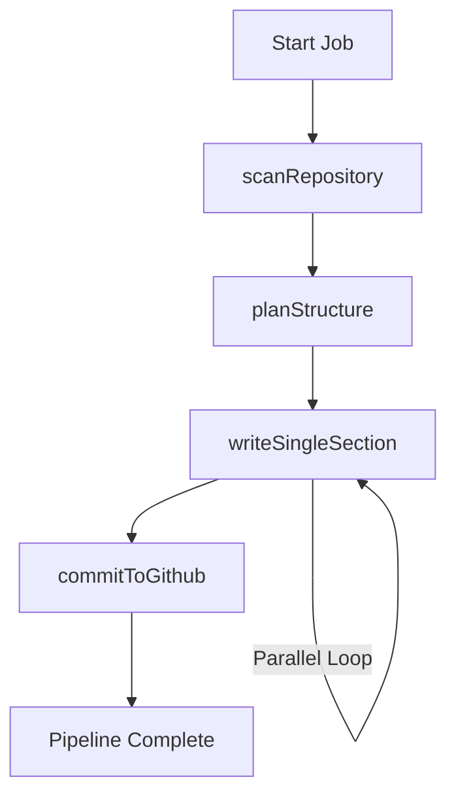

# AI Processing Pipeline

## System Role & Architectural Position

The AI Processing Pipeline serves as the orchestration engine for transforming raw GitHub repository source code into a structured, LLM-generated documentation site. It operates as a distributed asynchronous workflow, leveraging a state machine persisted in Redis and triggered via QStash to bypass execution timeouts inherent in serverless environments.

The pipeline implements a "Map-Reduce" inspired approach to documentation: it first maps the repository structure, reduces the context into a structural plan (TOC), maps the generation of individual sections in parallel, and finally reduces the generated artifacts into a single GitHub commit.

### Core Pipeline Specifications

| Component | Technology | Responsibility |
| :--- | :--- | :--- |
| **LLM Provider** | `@ai-sdk/google` | High-context window generation and structural planning. |
| **Context Compression** | `repomix` | Packing multiple source files into a single, LLM-optimized prompt. |
| **Token Counting** | `js-tiktoken` | Precise prompt size calculation to prevent context window overflow. |
| **Orchestration** | `Upstash QStash` | Reliable asynchronous job triggering and staggered delays. |
| **State Store** | `Redis` | Persistence of `PipelineData` across distributed worker executions. |
| **VCS Integration** | `@octokit/rest` | Repository scanning and final documentation commit. |

## Core Execution & Data Flow Mechanics

The pipeline follows a strict sequential state transition model. Each step is encapsulated in a job that, upon completion, triggers the subsequent phase via `triggerNextStep`.



### Execution Sequence

1.  **Repository Scanning (`scanRepository`)**:
    *   Fetches the repository tree via Octokit.
    *   Implements a round-robin sampling strategy: files are grouped by top-level directory, and a representative subset is selected to ensure broad coverage while staying within token limits.
    *   Persists the file list to the `PipelineData` state in Redis.

2.  **Structural Planning (`planStructure`)**:
    *   Passes the sampled file tree to the LLM.
    *   Generates a `TocEntry[]` array, defining the documentation hierarchy, target filenames, and the specific `relevant_files` required for each section.
    *   Cleans up stale documentation files from previous indexing runs.

3.  **Parallel Section Generation (`writeSingleSection`)**:
    *   The pipeline spawns $N$ parallel workers (defined by `PIPELINE_CONCURRENCY`).
    *   Each worker retrieves its assigned `TocEntry`, fetches the specific `relevant_files` content, and uses `repomix` to compress the code.
    *   The LLM generates the MDX content for that specific section.
    *   Results are stored in the `generatedFiles` map in Redis.

4.  **VCS Commit (`commitToGithub`)**:
    *   Aggregates all `generatedFiles`.
    *   Performs a diff against the current `docsPath` in the repository.
    *   Commits the final documentation set to the target branch in a single atomic operation.

## Implementation Deep Dive

### Reliable LLM Interaction
The pipeline abstracts LLM calls through a retry wrapper to handle the volatile nature of API rate limits (429s) and transient network failures.

```typescript title="server/src/ai.ts"
export async function generateWithRetry({
  systemPrompt,
  prompt,
  maxRetries = 3
}: GenerateOptions): Promise<string> {
  for (let attempt = 0; attempt < maxRetries; attempt++) {
    try {
      // Synchronous throttle reservation based on AI_THROTTLE_MS
      await throttle(); 
      const { text } = await generateText({
        model: google('gemini-1.5-pro'),
        system: systemPrompt,
        prompt: prompt,
      });
      return text;
    } catch (error: any) {
      if (error.status === 429) {
        // Hard wait for rate limit reset
        await new Promise(resolve => setTimeout(resolve, 10000));
      }
      if (attempt === maxRetries - 1) throw error;
    }
  }
  throw new Error("Max retries exceeded");
}
```
**Mechanics:**
*   **`throttle()`**: A module-level lock that ensures requests are spaced by `AI_THROTTLE_MS` (default 2000ms), effectively capping the request rate to 30 RPM.
*   **Exponential Backoff/Hard Wait**: Specifically catches HTTP 429 errors to trigger a 10-second cooling period.

### Pipeline State Schema
The pipeline's state is passed between asynchronous jobs via a `PipelineData` interface, serialized in Redis.

```typescript title="server/src/pipeline.ts"
interface TocEntry {
    prefix: string;
    title: string;
    filename: string;
    description: string;
    relevant_files: string[];
}

interface PipelineData {
    files: { path: string; content: string }[];
    toc: TocEntry[];
    generatedFiles: { filename: string; content: string }[];
    sectionsWritten: number;
    defaultBranch?: string;
}
```
**Mechanics:**
*   **`relevant_files`**: A critical optimization that prevents the LLM from receiving the entire codebase for every section, instead providing only the files identified during the `planStructure` phase.
*   **`sectionsWritten`**: An atomic counter used to determine when the parallel "Map" phase is complete and the pipeline can proceed to the "Reduce" (Commit) phase.

### Orchestration Logic
The `executeNextStep` function acts as the central dispatcher, determining which logic to run based on the current job state.

```typescript title="server/src/pipeline.ts"
export async function executeNextStep(jobId: string, sectionIndex?: number) {
  const job = await queue.getJob(jobId);
  const data = await queue.getData(jobId);

  try {
    if (!data.toc) {
      await scanRepository(job, data);
      await planStructure(job, data);
    } else if (sectionIndex !== undefined) {
      await writeSingleSection(job, data, sectionIndex);
    } else if (data.sectionsWritten === data.toc.length) {
      await commitToGithub(job, data);
    }
    
    await triggerNextStep(job.id);
  } catch (error: any) {
    nextJobId = await queue.failJob(jobId, error.message);
    // Isolation block to ensure the queue doesn't stall
    await safelyTriggerNextJob(nextJobId);
  }
}
```
**Mechanics:**
*   **Conditional Branching**: Checks for the existence of `data.toc` to decide between initial scanning or section generation.
*   **State Completion**: The transition to `commitToGithub` is gated by the equality check `data.sectionsWritten === data.toc.length`.
*   **Fault Tolerance**: The `failJob` mechanism ensures that a crash in one worker does not kill the entire pipeline, allowing for potential manual or automatic retries.

## Method / State Reference & Error Recovery

### Environment Configuration

| Variable | Default | Impact |
| :--- | :--- | :--- |
| `AI_THROTTLE_MS` | `2000` | Milliseconds between LLM requests to prevent 429s. |
| `PIPELINE_CONCURRENCY` | `4` | Number of parallel `writeSingleSection` workers triggered via QStash. |

### Failure Modes & Recovery

| Failure Scenario | Detection | Recovery Mechanism |
| :--- | :--- | :--- |
| **LLM Rate Limit** | HTTP 429 | `generateWithRetry` implements a 10s wait and retry loop. |
| **Token Overflow** | `js-tiktoken` limit | `scanRepository` uses round-robin sampling to truncate input size. |
| **Worker Timeout** | QStash Timeout | `triggerNextStep` is called at the end of every execution to ensure continuity. |
| **QStash Downtime** | Request failure | The `safelyTriggerNextJob` block attempts to re-queue the job in Redis to prevent state loss. |
| **GitHub API Limit** | Octokit 403 | Pipeline fails the job and marks it for retry via `queue.failJob`. |