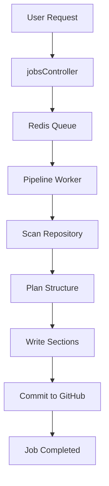
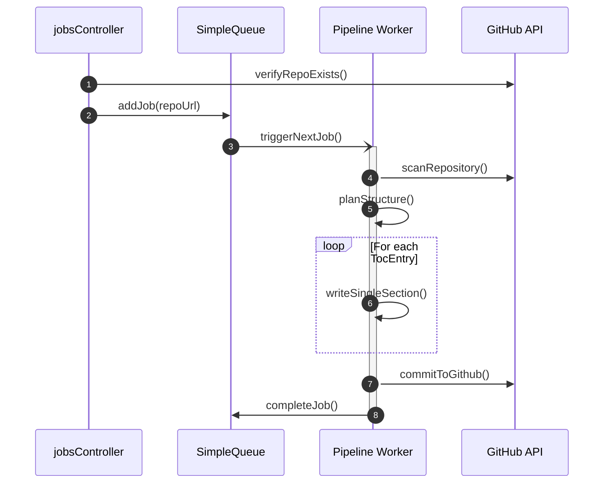

# Backend Processing Pipeline

The Backend Processing Pipeline is the core engine of GitDex, responsible for transforming a raw GitHub repository into a structured, AI-indexed knowledge base. The pipeline operates as an asynchronous distributed system, leveraging a Redis-backed queue to handle long-running ingestion tasks without blocking the main API thread.

## Pipeline Overview

The process follows a linear progression from ingestion to commit. The pipeline is designed to be idempotent and resumable, utilizing locks and state tracking to ensure that interrupted jobs can be recovered via the self-healing mechanism.

## Ingestion and Queue Management

The pipeline begins when a repository URL is submitted. The `jobsController` handles the initial validation and hand-off to the queue.

### Job Initialization
When `createJob` is called, the system performs the following sequence:
1. **URL Parsing**: Extracts the owner and repository name from the provided URL using `parseOwnerRepo`.
2. **Verification**: Uses `@octokit/rest` to verify that the repository exists and is accessible.
3. **Queue Entry**: The `SimpleQueue` class adds a `JobData` object to Redis. If a job for the same repository already exists, it can be forced to restart or ignored based on the `force` flag.

### Job State Definition
Jobs are tracked using a specific state machine to manage the lifecycle of the indexing process.

| State | Description |
| :--- | :--- |
| `queued` | Job is added to Redis and awaiting a worker. |
| `processing` | The pipeline worker is actively executing a step. |
| `completed` | Documentation has been successfully generated and committed. |
| `failed` | An unrecoverable error occurred during processing. |

## The Processing Pipeline

The processing logic is encapsulated in `pipeline.ts` and executed by a worker loop. The pipeline maintains a `PipelineData` object that persists the state of the current run.

### Processing Steps

#### 1. Repository Scanning (`scanRepository`)
The pipeline utilizes the GitHub API to traverse the repository. It identifies relevant files and retrieves their content to build a local representation of the codebase. This data is stored in the `files` array of the `PipelineData` interface.

#### 2. Structural Planning (`planStructure`)
Once the files are scanned, the pipeline uses an AI model to analyze the codebase and generate a Table of Contents (TOC). This results in a series of `TocEntry` objects:
- **Prefix**: The section identifier.
- **Title**: The human-readable heading.
- **Filename**: The target output file.
- **Relevant Files**: A list of source files the AI should reference when writing this specific section.

#### 3. Iterative Section Generation (`writeSingleSection`)
To avoid LLM context window limits and ensure high quality, the pipeline writes documentation one section at a time. 
- It uses `encodingForModel` from `js-tiktoken` to manage token counts.
- It tracks progress via `sectionsWritten` to determine the next section to process.
- Each section is generated using `generateWithRetry` to handle transient AI API failures.

#### 4. Finalization (`commitToGithub`)
After all sections defined in the TOC are completed, the `generatedFiles` are bundled and committed back to the target GitHub repository.

## Workflow Sequence

The following sequence diagram illustrates the interaction between the API layer, the queue, and the execution pipeline.

## Reliability and Recovery

Because repository processing can be time-consuming and prone to timeouts, GitDex implements several reliability patterns:

### Distributed Locking
To prevent race conditions where multiple workers might process the same section, the system uses `acquireStepLock` and `releaseStepLock`. This ensures that a specific `jobId` and `sectionIndex` combination is only handled by one process at a time.

### Self-Healing Mechanism
The `cronHeal` endpoint triggers `healStuckJobs()` within the `SimpleQueue` class. This process:
1. Identifies jobs that have been in the `processing` state for an excessive amount of time.
2. Calls `requeueJob()` to reset the state and allow a worker to pick up the task from the last successful step.

### Error Handling
If a step fails repeatedly, `failJob()` is invoked, which updates the `JobState` to `failed` and stores the error message in the `JobData.error` field for debugging and user notification.