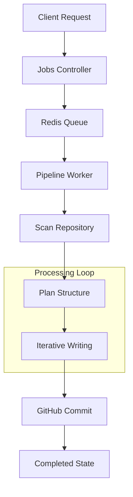
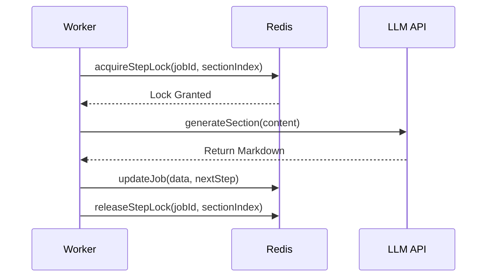

# Data Flow & Pipeline

The Data Flow & Pipeline module is the engine of GitDex. It is responsible for transforming a raw GitHub repository into a structured, AI-analyzed knowledge base. Rather than simply indexing files, GitDex employs a multi-stage pipeline that scans code, plans a documentation structure via LLMs, and iteratively generates detailed technical insights that are committed back to the repository.

This process is designed to be asynchronous and resilient, utilizing a distributed queue to handle the long-running nature of AI generation and API rate limits.

## Architectural Overview

The pipeline operates as a state machine managed by a Redis-backed queue. This ensures that if a worker crashes or an API call fails, the system can resume from the last successful step without restarting the entire indexing process.

### Core Components

| Component | Responsibility | Technology |
| :--- | :--- | :--- |
| **Jobs Controller** | Validates repository URLs and initializes indexing requests. | Node.js, Octokit |
| **SimpleQueue** | Manages job states, concurrency locks, and persistence. | Upstash Redis |
| **Pipeline Worker** | Orchestrates the transition between scanning, planning, and writing. | Node.js, QStash |
| **AI Engine** | Generates the Table of Contents and technical section content. | LLM (via `generateWithRetry`) |

## The Data Lifecycle

The flow of data moves from an external GitHub repository through a series of refinement stages before being stored and committed.



### 1. Ingestion & Validation
When a user submits a repository URL, the `jobsController` parses the owner and repository name. It uses the GitHub Octokit API to verify the repository's existence before creating a job entry in Redis.

### 2. The Queueing Mechanism
To prevent duplicate processing and handle race conditions, GitDex implements a locking mechanism. The `SimpleQueue` ensures that only one worker can process a specific section of a job at a time.

```typescript
export interface JobData {
    id: string;
    state: JobState; // 'queued' | 'processing' | 'completed' | 'failed'
    repoUrl: string;
    owner: string;
    repo: string;
    currentStep: number;
    data?: string | null; // Persisted PipelineData
}
```

The `acquireStepLock` method prevents multiple workers from attempting to write the same documentation section simultaneously, which is critical when using distributed triggers like QStash.

### 3. The Processing Pipeline
The pipeline is broken down into four distinct phases:

#### Phase A: Scanning (`scanRepository`)
The worker fetches the repository's file tree and reads the content of relevant files. This raw data is aggregated into the `PipelineData` object, providing the AI with the necessary context for the subsequent steps.

#### Phase B: Planning (`planStructure`)
Instead of guessing what to document, GitDex asks the LLM to analyze the scanned file tree and generate a Table of Contents (TOC).

```typescript
interface TocEntry {
    prefix: string;
    title: string;
    filename: string;
    description: string;
    relevant_files: string[];
}
```

#### Phase C: Iterative Generation (`writeSingleSection`)
To avoid LLM context window limits and timeouts, the pipeline does not generate the entire documentation in one call. Instead, it iterates through the `TocEntry` list, generating one section at a time. Each section is written based on the `relevant_files` identified during the planning phase.

#### Phase D: Finalization (`commitToGithub`)
Once all sections are written, the pipeline bundles the generated content and commits it back to the GitHub repository, completing the loop from raw code to documented knowledge.

## Reliability & Error Handling

Because AI generation is non-deterministic and external APIs can fail, the pipeline implements several layers of resilience:

1.  **Retry Logic**: The `generateWithRetry` wrapper handles transient LLM API failures.
2.  **State Persistence**: The `PipelineData` is serialized and stored in Redis after every successful step.
3.  **Self-Healing**: A `cronHeal` endpoint allows the system to identify "stuck" jobs (jobs marked as `processing` but with no recent activity) and requeue them.



## Summary of Data Flow

| Stage | Input | Process | Output |
| :--- | :--- | :--- | :--- |
| **Trigger** | Repo URL | Validation $\rightarrow$ Queueing | `JobData` (queued) |
| **Scan** | GitHub API | File tree traversal $\rightarrow$ Content read | `PipelineData.files` |
| **Plan** | File List | AI Analysis $\rightarrow$ Structural Mapping | `PipelineData.toc` |
| **Write** | TOC Entry | Contextual Generation $\rightarrow$ Sectioning | `PipelineData.generatedFiles` |
| **Store** | Generated MD | Git Commit $\rightarrow$ Push | GitHub Repository Files |