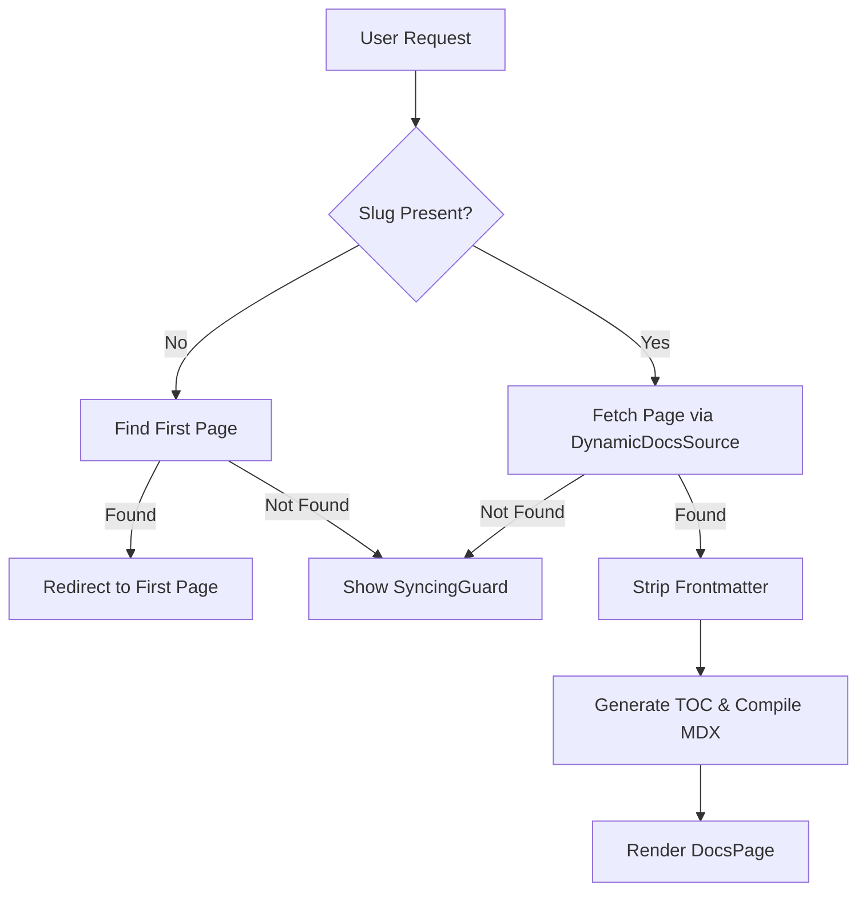

# Dynamic Route Handling

GitDex utilizes Next.js App Router dynamic segments to provide a scalable way to render documentation for any GitHub repository on the fly. By leveraging catch-all segments, the application transforms GitHub repository structures into a navigable documentation site without requiring a build-step for every individual repository.

## Route Structure

The core of the dynamic routing system is defined by the following directory structure:
`app/[owner]/[repo]/[[...slug]]/page.tsx`

- **`[owner]`**: The GitHub username or organization name.
- **`[repo]`**: The specific repository name.
- **`[[...slug]]`**: An optional catch-all segment that captures the file path within the repository (e.g., `/docs/installation` becomes `['docs', 'installation']`).

## Request Lifecycle

When a request hits a dynamic route, GitDex follows a strict resolution pipeline to ensure the correct content is served or the user is guided to the correct state.



## Core Logic Implementation

### 1. Dynamic Content Resolution
The `Page` component uses `DynamicDocsSource` to abstract the fetching logic. Because GitHub repositories are fluid, the route is configured with `force-dynamic` and `revalidate = 0` to ensure users always see the most recent commit of the documentation.

### 2. Root Redirection
To prevent empty states at the repository root (`/[owner]/[repo]`), GitDex automatically detects the "first page" of the documentation source. If a first page is identified, the user is redirected to that specific slug to maintain a consistent documentation experience.

### 3. Frontmatter Sanitization
Since LLMs or manual contributors may provide MDX with inconsistent YAML frontmatter (including double-blocks), GitDex employs a recursive stripping mechanism:

```typescript
function stripFrontmatter(content: string): string {
  let text = content.trim();
  while (text.startsWith('---')) {
    const closeIndex = text.indexOf('---', 3);
    if (closeIndex === -1) break;
    text = text.slice(closeIndex + 3).trim();
  }
  return text;
}
```
This ensures that the `mdx-compiler` receives clean MDX body content, preventing JSX parser crashes caused by raw YAML strings.

## Rendering Pipeline

Once the raw content is retrieved and cleaned, it passes through the following transformation layers:

1. **TOC Generation**: `getTableOfContents` scans the stripped MDX to build the navigation sidebar.
2. **Compilation**: The `compiler.compile` method transforms the raw string into a renderable React component.
3. **Component Injection**: `getMDXComponents({})` is passed to the compiled body to ensure consistent styling and interactive elements across all dynamic repositories.

## Loading States
To prevent layout shift during the asynchronous data fetching and compilation process, the route uses a dedicated `loading.tsx` file that renders a `DocsSkeleton`, providing immediate visual feedback to the user while the `DynamicDocsSource` initializes.