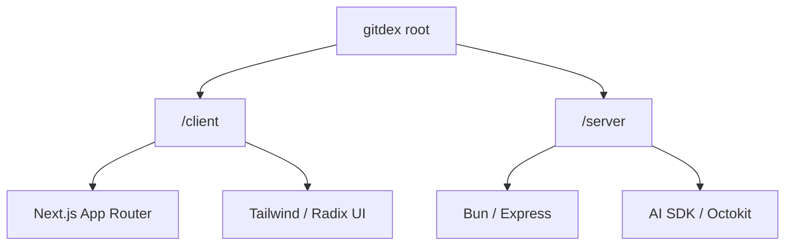
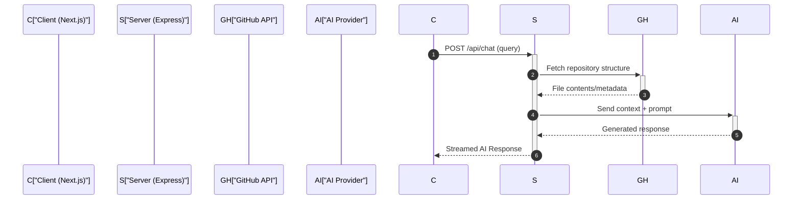

# Full-Stack Design

GitDex utilizes a monorepo architecture that strictly separates the presentation layer from the processing engine. This design ensures that the compute-intensive tasks associated with repository indexing and AI analysis do not block the user interface, while allowing both the client and server to be deployed and scaled independently on Vercel.

## Monorepo Structure

The project is organized into two primary directories: `client` and `server`. This separation maintains a clean boundary between the frontend framework and the backend runtime.



### Directory Responsibilities

| Component | Primary Responsibility | Runtime/Framework | Key Focus |
| :--- | :--- | :--- | :--- |
| **Client** | User Interface & State | Next.js / React 19 | Rendering, AI Chat UI, Visualizations |
| **Server** | Business Logic & Integration | Bun / Express | API Handling, GitHub Indexing, LLM Orchestration |

## Client-Server Boundary

The boundary between the client and server is defined by a RESTful API interface. The client acts as a thin layer that manages the user session and renders the AI's responses, while the server handles all "heavy lifting" involving external APIs and large-scale data processing.

### Technology Stack Comparison

#### Client Stack
The client is optimized for high-interactivity and rich content rendering.

| Category | Technology | Purpose |
| :--- | :--- | :--- |
| **Framework** | Next.js 16 | Routing and Server Components |
| **AI Integration** | AI SDK / Assistant-UI | Streaming AI responses and chat components |
| **State Management** | Zustand | Client-side application state |
| **Visualization** | Three.js / Mermaid | Codebase 3D views and diagrams |
| **Styling** | Tailwind CSS | Utility-first responsive design |

#### Server Stack
The server is optimized for asynchronous task execution and high-throughput API communication.

| Category | Technology | Purpose |
| :--- | :--- | :--- |
| **Runtime** | Bun | Fast execution and TypeScript native support |
| **Web Framework** | Express 5 | Request routing and middleware |
| **AI Logic** | Google GenAI / AI SDK | LLM prompt orchestration |
| **Data/Queue** | Upstash Redis & Qstash | Asynchronous job queuing for indexing |
| **Git Integration** | Octokit | GitHub API interaction |

## Interaction Flow

The following sequence illustrates a typical request lifecycle where the client requests an AI analysis of a repository.



## Deployment Configuration

Both components are designed for Vercel deployment. The server utilizes a specific `vercel.json` configuration to route all incoming traffic to a single entry point, effectively treating the Express application as a set of Serverless Functions.

```json
// Simplified server/vercel.json routing
{
  "routes": [
    {
      "src": "/(.*)",
      "dest": "index.ts"
    }
  ]
}
```

## Invariants & Failure Modes

### Architectural Invariants
- **Stateless Backend**: The server does not maintain local session state; it relies on Upstash Redis for persistence and job tracking to ensure compatibility with serverless environments.
- **Asynchronous Indexing**: Large repository indexing is never performed synchronously during an API request. It is offloaded to a queue (Qstash) to prevent request timeouts.

### Failure Modes & Handling
- **API Rate Limiting**: Both GitHub (Octokit) and AI providers have strict rate limits. The server implementation must handle `429 Too Many Requests` errors, potentially utilizing the queue to retry failed indexing jobs.
- **Cold Starts**: As the server is deployed on Vercel as a Node.js/Bun function, users may experience occasional "cold start" latency on the first request after a period of inactivity.
- **Payload Limits**: Large repository structures may exceed the maximum request body size of serverless functions. The design mitigates this by fetching data directly from GitHub on the server rather than passing large files from the client.