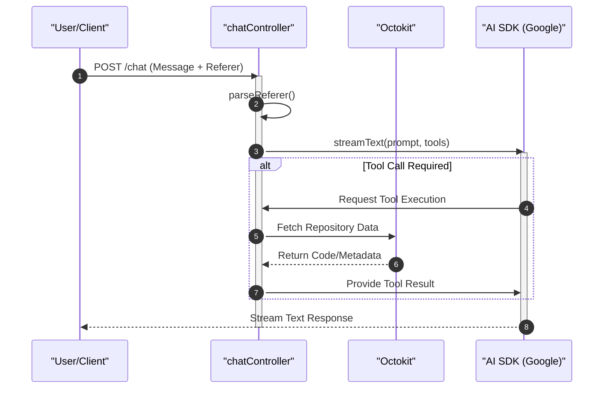

# AI Integration Layer

The AI Integration Layer serves as the bridge between GitDex's repository analysis capabilities and Large Language Models (LLMs). It leverages the Vercel AI SDK and Google's Generative AI models to provide a streaming, tool-augmented chat experience that is contextually aware of the targeted GitHub repository.

## Architecture Overview

The integration is designed around a modular approach where the AI logic is decoupled from the request handling. The system uses a combination of stateless utility functions for simple text generation and a complex controller for interactive, stateful chat sessions.

### Interaction Flow

The following sequence diagram illustrates the lifecycle of a chat request, from the initial user input to the streamed AI response.



## Core Components

### LLM Configuration and Resilience
The system utilizes `@ai-sdk/google` as the primary model provider. To ensure stability against transient API failures, the system implements a retry mechanism within the `server/src/ai.ts` module.

The `generateWithRetry` function wraps the standard generation logic to provide fault tolerance.

**Generation Options Interface:**
```typescript
interface GenerateOptions {
  systemPrompt?: string;
  prompt: string;
  maxRetries?: number;
}
```

### Chat Controller Logic
The `chatController.ts` manages the high-level orchestration of the AI interaction. It handles the conversion of user messages into a format compatible with the LLM and manages the streaming lifecycle.

Key functions and utilities used include:
- `streamText`: Enables real-time delivery of the LLM response to the frontend.
- `convertToModelMessages`: Transforms raw request data into the structured format required by the AI SDK.
- `parseReferer`: Extracts ownership and repository metadata from the request headers to establish codebase context.

## Tool Integration and Contextual Awareness

GitDex achieves "context-awareness" by providing the LLM with specialized tools. These tools allow the model to actively query the repository rather than relying solely on its training data.

### Tool Definition
Tools are defined using `zod` schemas, which provide the LLM with a strict contract of what arguments are required to execute a specific action (e.g., reading a file or listing directory contents).

| Component | Responsibility | Technology |
| :--- | :--- | :--- |
| **Schema Validation** | Defines input types for AI tools | `zod` |
| **Repo Access** | Interfaces with GitHub API | `Octokit` |
| **Message Formatting** | Prepares conversation history | `convertToModelMessages` |
| **Execution** | Processes tool calls and returns results | `handleChat` |

### Data Flow for Tool Execution
When the LLM determines that it needs specific information from the codebase to answer a query, the following process occurs:
1. The model emits a tool call request based on the `zod` definition.
2. The `handleChat` controller intercepts this call.
3. The controller uses an `Octokit` instance to perform the actual GitHub API request.
4. The retrieved repository data is fed back into the `streamText` loop as a tool result.
5. The LLM synthesizes the final answer using the retrieved context.

## Implementation Details

### Retry Mechanism Logic
The implementation of `generateWithRetry` ensures that the system can recover from rate limits or temporary network interruptions:

```typescript
export async function generateWithRetry({
  systemPrompt,
  prompt,
  maxRetries = 3
}: GenerateOptions): Promise<string>
```

### Request Handling
The `handleChat` endpoint acts as the primary entry point for the AI integration, coordinating the `Request` and `Response` objects from Express to maintain a streaming connection with the client.