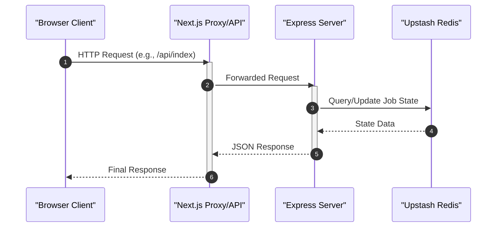
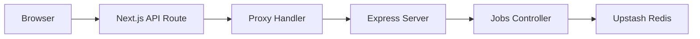

# Data Flow and API Communication

GitDex employs a decoupled architecture where a Next.js frontend communicates with a Node.js/Express backend. To manage cross-origin constraints and provide a unified interface, the system utilizes a proxy layer within the Next.js application to route requests to the backend processing engine.

## Communication Architecture

The data flow follows a tiered approach: the client browser interacts with Next.js API routes, which then act as a gateway (proxy) to the standalone Express server. This server manages the heavy lifting, including repository indexing and AI integration, utilizing Redis for state and job tracking.

### Request Lifecycle Diagram



## Client-Side Routing & Proxying

The client does not communicate with the backend directly to avoid CORS issues and to abstract the backend infrastructure.

### Next.js Proxy Layer
The `client/proxy.ts` utility serves as a generic handler to redirect incoming requests from the Next.js server environment to the backend API.

```typescript
// client/proxy.ts
export function proxy(request: NextRequest) {
    // Logic to forward NextRequest to the Express backend
    // ensuring headers and body are preserved.
}
```

### API Route Handlers
Specific application logic is encapsulated in API routes. For example, the indexing trigger is handled via a dedicated route:

```typescript
// client/src/app/api/index/route.ts
export async function POST(request: Request) {
    // Processes the indexing request and communicates with the backend
}
```

## Backend API Implementation

The backend is built with Express and provides a RESTful interface for managing the repository analysis pipeline.

### Server Configuration
The server integrates `cors` for secure cross-origin resource sharing and `@upstash/redis` for distributed state management.

```typescript
// server/index.ts
import express from "express";
import cors from "cors";
import { Redis } from '@upstash/redis';
import jobsRoutes from "./src/routes/jobsRoutes.js";

const app = express();
app.use(cors());
app.use("/jobs", jobsRoutes);
```

### Endpoint Summary

| Method | Endpoint Path | Source | Description |
| :--- | :--- | :--- | :--- |
| `POST` | `/api/index` | `client/api/index/route.ts` | Initiates the repository indexing process. |
| `ALL` | `/proxy/*` | `client/proxy.ts` | Generic proxy gateway to backend services. |
| `GET/POST`| `/jobs` | `server/src/routes/jobsRoutes.js` | Manages and queries the status of indexing jobs. |

## Data Flow Logic



## Invariants & Failure Modes

### Security & Network Invariants
- **CORS Isolation**: The Express server utilizes the `cors` middleware, but the primary communication path is routed through the Next.js server-side proxy, ensuring that backend environment variables (like the backend URL) are not exposed to the client browser.
- **Stateless API**: The Express server remains largely stateless, delegating persistence and job tracking to Upstash Redis.

### Potential Failure Modes
- **Proxy Latency**: Introducing a proxy layer adds an additional network hop between the client and the backend, which may increase TTFB (Time to First Byte).
- **Redis Connectivity**: If the connection to Upstash Redis fails, the `jobsRoutes` will be unable to retrieve or update the status of indexing tasks, leading to `500 Internal Server Error` responses for job queries.
- **Request Timeout**: Long-running indexing requests triggered via `POST /api/index` may hit Next.js serverless function timeout limits if the backend does not respond asynchronously.