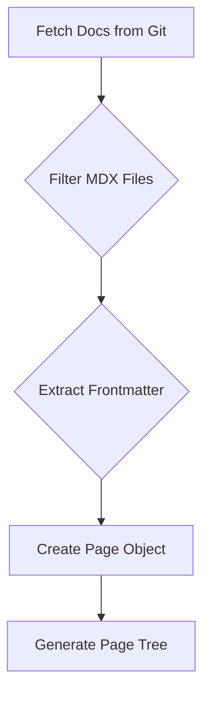
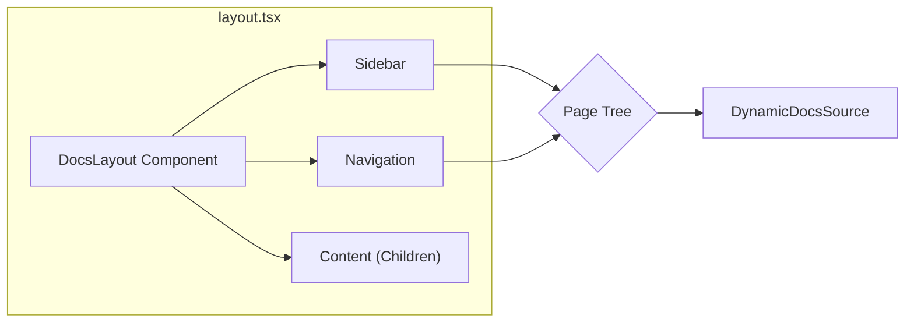

# Dynamic Documentation Rendering

This document explains how GitDex dynamically fetches, compiles, and displays documentation in the frontend, providing a flexible and up-to-date user experience. The key components involved are:

- `client/lib/dynamic-source.ts`: Fetches and processes documentation files from a Git repository.
- `client/lib/mdx-compiler.ts`: Compiles MDX content into React components.
- `client/src/app/docs/[owner]/[repo]/[[...slug]]/page.tsx`: Renders the documentation page based on the provided slug.
- `client/src/app/docs/[owner]/[repo]/[[...slug]]/layout.tsx`: Provides the overall layout for the documentation pages, including the sidebar and navigation.

## Fetching Documentation Dynamically (`client/lib/dynamic-source.ts`)

The `DynamicDocsSource` class is responsible for fetching documentation files from a Git repository and converting them into a structured format suitable for rendering. It uses the `useDocsStore` to retrieve the documentation, parses the files, and generates a hierarchical page tree.

```typescript filename="client/lib/dynamic-source.ts"
import { useDocsStore } from './docs-store';

export class DynamicDocsSource {
  constructor(owner: string, repo: string) {
    this.owner = owner;
    this.repo = repo;
    this.pageTree = {
      name: 'root',
      children: []
    };
  }

  async initialize() {
    console.log(`Initializing DynamicDocsSource for ${this.owner}/${this.repo}`);
    const { getDocs } = useDocsStore.getState();
    const docs = await getDocs(this.owner, this.repo);
    console.log(`Got docs structure with ${docs.files.length} files`);

    this.pages = docs.files
      .filter(file => file.path.endsWith('.mdx') && !file.path.includes('meta.json'))
      .map(file => {
        const filename = file.path.replace(/^docs\/[^\/]+\//, '').replace('.mdx', '');
        const slugs = [filename];
        const urlPath = filename;
        const frontmatter = this.extractFrontmatter(file.content);
        const sidebar_position = frontmatter.sidebar_position ? 
          parseFloat(frontmatter.sidebar_position) : 999;

        const page = {
          url: `/${urlPath}`,
          name: filename,
          title: frontmatter.title || this.formatTitleFromFilename(filename),
          description: frontmatter.description,
          content: file.content,
          frontmatter,
          slugs,
          sidebar_position
        };
        return page;
      });

    this.pages.sort((a, b) => a.sidebar_position - b.sidebar_position);
    this.pageTree = this.generateHierarchicalPageTree();
    console.log(`Generated hierarchical page tree`);
  }
}
```

[View on GitHub](https://github.com/shinymack/gitdex/blob/main/client/lib/dynamic-source.ts)

This snippet shows the initialization of the `DynamicDocsSource` class, where the documentation files are fetched and processed. It filters for `.mdx` files, extracts frontmatter, and constructs a page object with relevant metadata.





## MDX Compilation (`client/lib/mdx-compiler.ts`)

The `mdx-compiler.ts` file uses `@fumadocs/mdx-remote` to create a compiler that transforms MDX content into React components. This allows for dynamic rendering of documentation with support for Markdown, JSX, and other features.

```typescript filename="client/lib/mdx-compiler.ts"
import { createCompiler } from '@fumadocs/mdx-remote';
import { remarkMdxMermaid } from 'fumadocs-core/mdx-plugins';

export const compiler = createCompiler({
    remarkPlugins : [
        remarkMdxMermaid
    ]
});
```

[View on GitHub](https://github.com/shinymack/gitdex/blob/main/client/lib/mdx-compiler.ts)

The `createCompiler` function configures the MDX compiler with plugins like `remarkMdxMermaid` to support Mermaid diagrams within the documentation.

## Documentation Page Rendering (`client/src/app/docs/[owner]/[repo]/[[...slug]]/page.tsx`)

The `page.tsx` file is responsible for rendering the documentation page. It fetches the appropriate page based on the URL slug, compiles the MDX content, and renders it using the `DocsPage` and `DocsBody` components from `fumadocs-ui`.

```typescript filename="client/src/app/docs/[owner]/[repo]/[[...slug]]/page.tsx"
import { DocsPage, DocsBody } from 'fumadocs-ui/page';
import { notFound, redirect } from 'next/navigation';
import { compiler } from '@/lib/mdx-compiler';
import { getMDXComponents } from '@/mdx-components';
import { DynamicDocsSource } from '@/lib/dynamic-source';
import { getTableOfContents } from 'fumadocs-core/content/toc';
import 'mermaid';

interface PageProps {
  params: Promise<{
    owner: string;
    repo: string;
    slug?: string[];
  }>;
}

export default async function Page({ params }: PageProps) {
  const { owner, repo, slug = [] } = await params;

  if (slug.length === 0) {
    const source = new DynamicDocsSource(owner, repo);
    await source.initialize();
    
    const firstPage = source.getFirstPage();
    
    if (firstPage) {
      redirect(`/docs/${owner}/${repo}${firstPage.url}`);
    } else {
      notFound();
    }
  }
  
  const source = new DynamicDocsSource(owner, repo);
  await source.initialize();
  
  const page = source.getPage(slug);
  
  if (!page) {
    notFound();
  }

  const mdxContent = page.content.replace(/^---\s*\n([\s\S]*?)\n---/, '').trim();
  const toc = getTableOfContents(mdxContent.replace(/^---\s*\n([\s\S]*?)\n---/, ''));

  const compiled = await compiler.compile({
    source: mdxContent.trim(),
  });
  
  const MdxContent = compiled.body;
  
  return (
    <DocsPage full={page.url === '/'}
    toc={toc}>
      <DocsBody>
        <MdxContent components={getMDXComponents({})} />
      </DocsBody>
    </DocsPage>
  );
}
```

[View on GitHub](https://github.com/shinymack/gitdex/blob/main/client/src/app/docs/[owner]/[repo]/[[...slug]]/page.tsx)

This component first checks if a slug is provided. If not, it redirects to the first available page. Otherwise, it fetches the page content, extracts the table of contents, compiles the MDX, and renders the documentation.

## Documentation Layout (`client/src/app/docs/[owner]/[repo]/[[...slug]]/layout.tsx`)

The `layout.tsx` file provides the overall layout for the documentation pages, including the sidebar and navigation. It uses the `DocsLayout` component from `fumadocs-ui` and configures it with the page tree generated by `DynamicDocsSource`.

```typescript filename="client/src/app/docs/[owner]/[repo]/[[...slug]]/layout.tsx"
import { DocsLayout } from 'fumadocs-ui/layouts/docs';
import type { ReactNode } from 'react';
import { DynamicDocsSource } from '@/lib/dynamic-source';
import { baseOptions } from '@/lib/layout.shared';

interface LayoutProps {
  children: ReactNode;
  params: Promise<{
    owner: string;
    repo: string;
  }>;
};

export default async function Layout({ children, params }: LayoutProps) {
  const { owner, repo } = await params;
  
  const source = new DynamicDocsSource(owner, repo);
  await source.initialize();
  const base = baseOptions();
  const pageTree = source.getPageTree();
  
  return (
    <DocsLayout
      tree={pageTree}
      sidebar={{
        banner: (
          <div className="p-4 text-sm text-muted-foreground border-b border-border">
            Documentation for <strong className="text-foreground">{owner}/{repo}</strong>
          </div>
        ),
        defaultOpenLevel: 10,
        collapsible: false
        
      }}
      nav={{
        ...base.nav,
        enabled: true,
      }}
      links={base.links}
    >
      {children}
    </DocsLayout>
  );
}
```

[View on GitHub](https://github.com/shinymack/gitdex/blob/main/client/src/app/docs/[owner]/[repo]/[[...slug]]/layout.tsx)

This layout component initializes the `DynamicDocsSource` and retrieves the page tree. It then configures the `DocsLayout` component with the page tree, sidebar settings, and navigation options.





## Extracting Frontmatter

The `extractFrontmatter` method in `DynamicDocsSource` parses the frontmatter from the MDX files.

```typescript filename="client/lib/dynamic-source.ts"
private extractFrontmatter(content: string): Frontmatter {
    const frontmatterMatch = content.match(/^---\s*\n([\s\S]*?)\n---/);
    if (!frontmatterMatch) return {};
    
    try {
      const frontmatter: Frontmatter = {};
      const lines = frontmatterMatch[1].split('\n');
      
      for (const line of lines) {
        const [key, ...rest] = line.split(':');
        if (key && rest.length > 0) {
          const value = rest.join(':').trim();
          frontmatter[key.trim()] = value.replace(/^["']|["']$/g, '');
        }
      }
      
      return frontmatter;
    } catch {
      return {};
    }
  }
```

[View on GitHub](https://github.com/shinymack/gitdex/blob/main/client/lib/dynamic-source.ts)

## Key Integration Points

- **Dynamic Content Fetching:** The `DynamicDocsSource` class fetches documentation content dynamically from a Git repository, ensuring that the documentation is always up-to-date.
- **MDX Compilation:** The MDX compiler transforms MDX content into React components, allowing for rich and interactive documentation.
- **Hierarchical Page Tree:** The hierarchical page tree generated by `DynamicDocsSource` provides a structured navigation experience for users.

By combining these components, GitDex provides a flexible and dynamic documentation rendering system that can adapt to changing content and user needs.
```