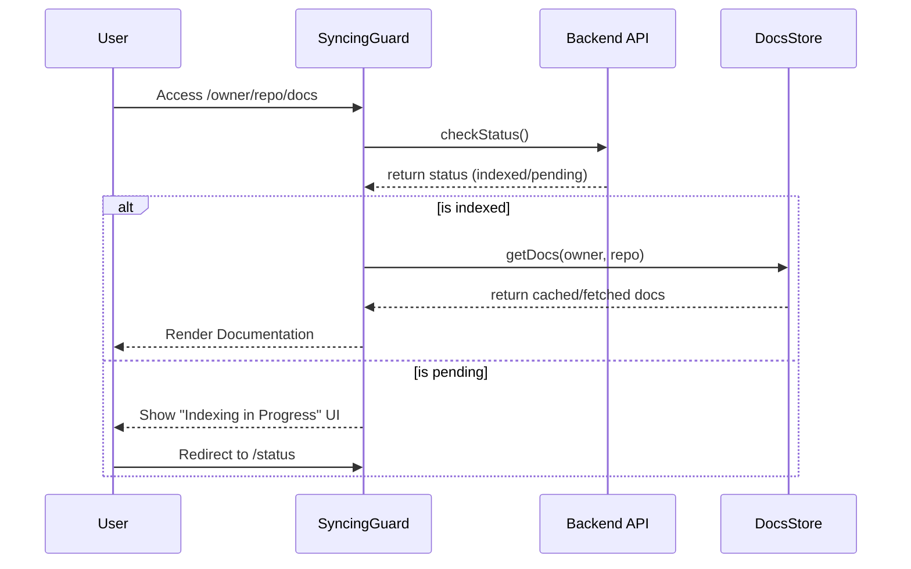

# State Management

State management in GitDex is designed to handle two distinct types of client-side data: transient operational status (indexing progress) and persistent repository structures (document caching). The application employs a hybrid strategy, utilizing local React state for real-time polling and a global Zustand store for caching repository metadata.

This architecture ensures that users receive immediate feedback during the heavy lifting of repository indexing while avoiding redundant network requests when navigating between different sections of the same repository.

### Architectural Role

The state management layer acts as the intermediary between the backend indexing pipeline and the UI. Its primary responsibilities include:

| Component | State Type | Purpose | Tooling |
| :--- | :--- | :--- | :--- |
| **Docs Store** | Global/Cached | Stores repository document trees to prevent re-fetching. | `zustand` |
| **Syncing Guard** | Conditional | Intercepts route access to ensure a repository is fully indexed. | React State |
| **Status Page** | Transient | Tracks the real-time progress of a specific indexing job. | React `useState` |

---

### Component Interaction & Data Flow

The application implements a "Guard" pattern to manage the transition between a repository being "unindexed" and "ready." When a user attempts to access repository documentation, the `SyncingGuard` verifies the status before allowing the application to pull data from the `DocsStore`.

#### Documentation Access Workflow



---

### Document Caching with Zustand

To optimize performance, GitDex uses a global store to cache the `DocsStructure`. This prevents the client from re-downloading the entire repository map every time a user switches files or returns to the main documentation view.

The store uses a key-value map where the key is a unique repository identifier and the value contains both the document data and a timestamp for cache invalidation.

```typescript
interface DocsCache {
  [key: string]: {
    data: DocsStructure;
    timestamp: number;
  };
}

interface DocsStore {
  cache: DocsCache;
  getDocs: (owner: string, repo: string) => Promise<DocsStructure>;
  clearCache: () => void;
  clearCacheFor: (owner: string, repo: string) => void;
}
```

**Key Design Decisions:**
- **Timestamping:** By storing a `timestamp` alongside the data, the system can implement cache expiration logic to ensure AI-generated indexes remain current.
- **Granular Clearing:** The `clearCacheFor` method allows the application to refresh a specific repository's state without wiping the entire global cache.

---

### Indexing Lifecycle & Status Tracking

While document structures are cached globally, the **Indexing Status** is handled as transient state. This is primarily managed within the `status/page.tsx` and the `SyncingGuard` component.

#### The Polling Mechanism
When a repository is being indexed, the client initiates a polling loop. This prevents the need for complex WebSocket implementations while providing the user with near real-time progress updates.

```tsx
const initPoll = async () => {
  // Implementation tracks the current status of the indexing job
  // and updates the local component state to trigger UI re-renders
  // of the Progress bar and status indicators.
};
```

#### The Syncing Guard
The `SyncingGuard` serves as a higher-order protection layer. It encapsulates the logic required to determine if the UI should render the actual content or a loading skeleton.

```tsx
export function SyncingGuard({ owner, repo }: SyncingGuardProps) {
  const [status, setStatus] = useState<'loading' | 'ready' | 'error'>('loading');

  const checkStatus = async () => {
    // Logic to verify if the repository has been indexed by the server
    // If ready, updates status to 'ready' and triggers DocsStore retrieval
  };

  useEffect(() => {
    checkStatus();
  }, [owner, repo]);

  if (status === 'loading') return <DocsSkeleton />;
  // ... further conditional rendering
}
```

This pattern ensures a seamless user experience:
1. **Skeleton State:** Users see a `DocsSkeleton` while the initial status check is performed.
2. **Interception:** If the backend reports the repository is not yet indexed, the guard prevents access and directs the user to the Status page.
3. **Hydration:** Once the status is `ready`, the guard allows the child components to hydrate using the `useDocsStore` hook.