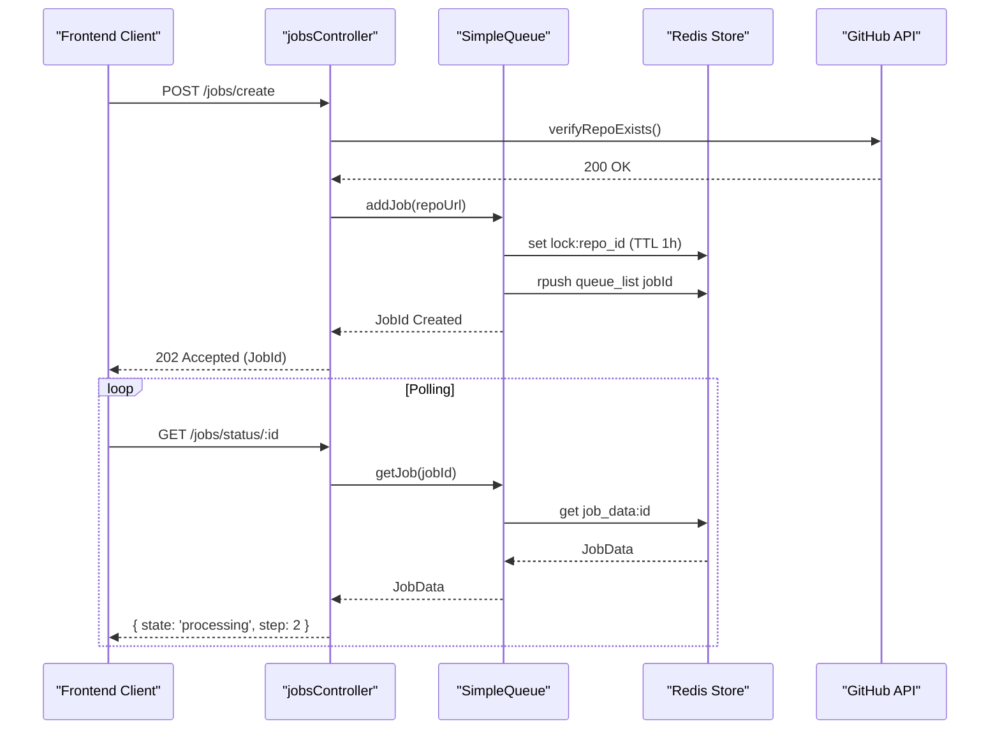

# Task Queue Orchestration

The Task Queue Orchestration module in GitDex manages the asynchronous lifecycle of repository indexing. Because indexing a code repository involves high-latency operations—including GitHub API calls, file system traversal, and multiple LLM processing stages—these tasks cannot be handled within a standard synchronous HTTP request-response cycle. 

This system provides a robust mechanism for job submission, strict serialization of processing tasks to prevent server overload, and a self-healing state machine that recovers from crashes or timeouts. It utilizes Upstash Redis for distributed state management and locking, ensuring that only one indexing job is active at a time across the backend infrastructure.

### Core Module Components

| Component | Responsibility | Primary Dependencies |
| :--- | :--- | :--- |
| `SimpleQueue` | Manages job state, Redis locks, queue ordering, and self-healing logic. | `@upstash/redis` |
| `jobsController` | Exposes REST endpoints for job creation, status polling, and maintenance. | `@octokit/rest`, `@upstash/qstash` |
| `JobData` | TypeScript interface defining the schema for job tracking and metadata. | N/A |
| `JobState` | Type union defining the lifecycle stages: `queued`, `processing`, `completed`, `failed`. | N/A |

---

## Architecture, State & Data Flow

The orchestration system operates as a state-driven queue. When a user requests to index a repository, the system does not start the process immediately but instead registers a "job" in Redis and manages its transition through various states.

### Job Lifecycle Flow

1.  **Submission**: `jobsController.createJob` validates the repository's existence via GitHub's API. If valid, it calls `queue.addJob()`.
2.  **Enqueueing**: `SimpleQueue` checks for existing locks. If no job is currently processing, it attempts to start the job immediately. Otherwise, it pushes the job ID into a Redis list (the queue).
3.  **Execution**: The system ensures **Strict Serialization**. Only one job can be in the `processing` state. When a job completes or fails, `triggerNextJob()` pops the next ID from the Redis list and marks it as `processing`.
4.  **Step-Level Locking**: During the AI Processing Pipeline, the system uses `acquireStepLock` to prevent concurrent execution of the same pipeline step, providing a secondary layer of safety.
5.  **Monitoring**: The frontend polls `getJobStatus` or `getStatusByName`, which reads the current `JobState` and `currentStep` from Redis.

### System Interaction Diagram



---

## In-Depth Code Walkthrough & Implementation Details

### Job Enqueueing and Lock Management

The `addJob` method implements a multi-layered check to prevent duplicate indexing and handle "stuck" jobs.

```typescript title="server/src/queue.ts"
async addJob(repoUrl: string, force = false): Promise<string> {
    const { owner, repo } = parseOwnerRepo(repoUrl);
    const jobId = this.getJobId(owner, repo);
    const lockKey = this.getLockKey(owner, repo);

    // Global check for stuck jobs before checking locks or state
    await this.healStuckJobs();

    if (!force) {
        // Layer 1: Redis lock key (set at job creation, 1h TTL)
        const lock = await redis.get(lockKey);
        if (lock) {
            // Layer 2: Job updatedAt timestamp (fallback if lock key was deleted)
            const existingJob = await this.getJob(jobId, true);
            if (existingJob && (Date.now() - existingJob.updatedAt < COOLDOWN_MS)) {
                return jobId; // Return existing job if within cooldown
            }
        }
    }

    const job: JobData = {
        id: jobId,
        state: 'queued',
        repoUrl,
        owner,
        repo,
        createdAt: Date.now(),
        updatedAt: Date.now(),
        currentStep: 0,
    };

    await this.updateJob(jobId, job);
    await redis.set(lockKey, 'locked', { ex: 3600 });
    await redis.rpush('gitdex_queue', jobId);

    // STRICT SERIALIZATION: Check if any job is currently processing using NX
    const activeJob = await redis.set('gitdex_active_job', jobId, { nx: true });
    if (activeJob) {
        await this.triggerNextJob();
    }

    return jobId;
}
```

**Technical Analysis:**
- **Cooldown Mechanism**: `COOLDOWN_MS` (1 hour) prevents users from spamming the index button and restarting expensive AI pipelines.
- **Distributed Locking**: The `lockKey` prevents the same repository from being queued multiple times simultaneously.
- **Serialization Logic**: The use of `redis.set(..., { nx: true })` creates an atomic lock on the global `gitdex_active_job` key. If the key doesn't exist, the current request becomes the "orchestrator" that triggers the next job.
- **Persistence**: All job metadata is stored as a JSON-serialized object in Redis, ensuring state persists across server restarts.

### The Trigger and Transition Logic

The `triggerNextJob` method is the engine that moves the queue forward.

```typescript title="server/src/queue.ts"
private async triggerNextJob(): Promise<string | null> {
    const jobId = await redis.lpop('gitdex_queue');
    if (!jobId) {
        // Queue is empty, clear the active job lock
        await redis.del('gitdex_active_job');
        return null;
    }

    await this.updateJob(jobId, { 
        state: 'processing', 
        updatedAt: Date.now() 
    });
    
    await redis.set('gitdex_active_job', jobId);
    // Here, the system would typically trigger the external pipeline process
    return jobId;
}
```

**Technical Analysis:**
- **LPOP Operation**: The use of `lpop` ensures that jobs are processed in First-In-First-Out (FIFO) order.
- **State Mutation**: Transitioning the state to `processing` is critical for the frontend polling logic; it signals that the system is actively working on the repository.
- **Lock Renewal**: Re-setting `gitdex_active_job` ensures that as long as the queue has items, the "active" slot is filled.

### Job Status and Validation Controller

The `jobsController` acts as the gateway, ensuring only valid GitHub repositories enter the queue.

```typescript title="server/src/controllers/jobsController.ts"
export const createJob = async (req: any, res: any) => {
    const { repoUrl } = req.body;
    const { owner, repo } = parseOwnerRepo(repoUrl);

    try {
        // Ensure the repo actually exists and is accessible
        await verifyRepoExists(owner, repo);
        const jobId = await queue.addJob(repoUrl);
        return res.status(202).json({ jobId, message: "Job queued" });
    } catch (error: any) {
        return res.status(400).json({ error: error.message });
    }
};

export const getStatusByName = async (req: any, res: any) => {
    const { owner, repo } = req.params;
    const job = await queue.getJobByRepo(owner, repo);

    if (job && job.state === 'processing') {
        return res.json({ indexed: false, status: 'processing', step: job.currentStep });
    }

    // Check if indexed files actually exist in storage
    const isIndexed = await verifyIndexExists(owner, repo);
    return res.json({ indexed: isIndexed });
};
```

**Technical Analysis:**
- **Pre-flight Validation**: `verifyRepoExists` prevents the queue from being clogged with invalid URLs or private repositories that the system cannot access.
- **Active Job Priority**: In `getStatusByName`, the `processing` state takes priority over the file-existence check. This ensures the UI keeps polling while the pipeline is running, even if some files have already been written to disk.
- **Storage Verification**: `verifyIndexExists` acts as the ultimate source of truth, checking the actual index files on disk to determine if a repository is "indexed."

---

## API / Method Reference

### `SimpleQueue` Class Methods

| Method | Parameters | Return Type | Description |
| :--- | :--- | :--- | :--- |
| `addJob` | `repoUrl: string, force?: boolean` | `Promise<string>` | Validates lock, adds job to Redis list, and attempts to trigger execution. |
| `getJob` | `jobId: string, bypassSelfHealing?: boolean` | `Promise<JobData \| null>` | Retrieves job data. If `bypassSelfHealing` is false, it checks if the job is stuck. |
| `updateJob` | `jobId: string, updates: Partial<JobData>` | `Promise<void>` | Performs a partial update on the job metadata in Redis. |
| `triggerNextJob`| `none` | `Promise<string \| null>` | Pops the next job from the FIFO queue and sets it to `processing`. |
| `failJob` | `jobId: string, error: string` | `Promise<string \| null>` | Marks job as `failed`, records the error, and triggers the next queued job. |
| `completeJob` | `jobId: string` | `Promise<string \| null>` | Marks job as `completed` and triggers the next queued job. |
| `acquireStepLock`| `jobId: string, sectionIndex?: number` | `Promise<boolean>` | Sets a 60s TTL lock on a specific pipeline step to prevent concurrent execution. |
| `releaseStepLock`| `jobId: string, sectionIndex?: number` | `Promise<void>` | Removes the step-level lock. |
| `requeueJob` | `jobId: string` | `Promise<void>` | Resets state to `queued` and pushes the job to the front of the queue. |
| `healStuckJobs` | `none` | `Promise<void>` | Scans for jobs in `processing` state that haven't been updated within the cooldown period. |

### `jobsController` Endpoints

| Endpoint | Method | Payload | Response | Description |
| :--- | :--- | :--- | :--- | :--- |
| `/jobs/create` | `POST` | `{ repoUrl }` | `202 { jobId }` | Initiates the indexing process. |
| `/jobs/status/:id` | `GET` | `N/A` | `200 { JobData }` | Returns the full state of a specific job. |
| `/jobs/status/:owner/:repo`| `GET` | `N/A` | `200 { indexed: bool }` | Checks if a repository is indexed or currently processing. |
| `/jobs/heal` | `POST` | `N/A` | `200 { message }` | Manually triggers the stuck-job recovery logic (Cron). |

---

## Error Handling, Edge Cases & Performance

### Self-Healing Mechanisms
The most critical failure mode in a distributed queue is the "Zombie Job"—a job marked as `processing` whose worker crashed before it could call `completeJob` or `failJob`. GitDex handles this via:
1.  **Global Healing**: `healStuckJobs()` is called during every `addJob` request and via a cron job. It identifies jobs where `updatedAt` is older than `COOLDOWN_MS`.
2.  **State Reset**: Stuck jobs are automatically transitioned back to `queued` and pushed to the front of the line to ensure they are retried.

### Concurrency and Locking
To maintain system stability, GitDex employs three layers of locking:
- **Repository Lock**: `lockKey` (1h TTL) prevents the same repo from being queued multiple times.
- **Global Execution Lock**: `gitdex_active_job` ensures only one repository is being processed by the AI pipeline at any given time.
- **Step Lock**: `acquireStepLock` (60s TTL) protects individual pipeline stages. If a server crashes mid-step, the lock expires quickly, allowing a retried job to proceed without manual intervention.

### Performance Considerations
- **Complexity**: All Redis operations (`LPOP`, `RPUSH`, `GET`, `SET`) are $O(1)$, ensuring the orchestration overhead is negligible compared to the AI processing time.
- **Polling Efficiency**: The `getStatusByName` endpoint optimizes for the common case (already indexed) by checking file existence, avoiding expensive job lookups for repositories that are already completed.
- **Memory Footprint**: Job data is kept minimal (metadata only), with the actual indexed content stored in the file system or a vector database, preventing Redis memory exhaustion.