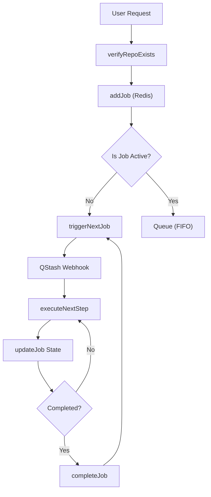

# Task Queue Orchestration

## System Role & Architectural Position

The Task Queue Orchestration layer serves as the asynchronous execution backbone of GitDex. Its primary responsibility is to manage the lifecycle of repository indexing jobs, ensuring that LLM-intensive processing pipelines do not overwhelm system resources or exceed API rate limits. 

The system employs a **Strict Serialization** model, where only one active indexing job is processed globally at any given time, while subsequent requests are queued in a FIFO (First-In-First-Out) manner. This is achieved through a combination of Upstash Redis for state persistence and locking, and Upstash QStash for reliable webhook-based job triggering.

### Core Component Specifications

| Component | Technology | Primary Responsibility | Key Constraint |
| :--- | :--- | :--- | :--- |
| `SimpleQueue` | Upstash Redis | Job state tracking, lock management, and queue persistence. | Atomic state transitions via Redis. |
| `jobsController` | Node.js/Express | Request validation, job initiation, and status polling. | GitHub API rate limit compliance. |
| `QStash` | Upstash QStash | Asynchronous job triggering and retry logic. | Signature-verified webhook delivery. |
| `Pipeline` | Node.js | Sequential execution of indexing steps. | Idempotent step execution. |

## Core Execution & Data Flow Mechanics

The orchestration flow follows a rigid state machine to prevent race conditions and duplicate indexing of the same repository.

### Job Lifecycle Workflow



### Execution Invariants
*   **Unique Job Identification**: Jobs are keyed by a deterministic ID derived from the `owner` and `repo` names to prevent duplicate concurrent entries for the same repository.
*   **Distributed Locking**: A two-layer lock mechanism is used:
    1.  **Redis Lock Key**: A high-level key with a 1-hour TTL to prevent redundant job creation.
    2.  **Job State**: A `processing` state that acts as a mutex for the pipeline.
*   **Atomic Step Control**: Granular `StepLocks` (60s TTL) are acquired before executing specific pipeline segments, ensuring that server crashes do not leave the system in a permanently locked state.

## Implementation Deep Dive

### State Schema and Job Definition
The system utilizes a strongly typed `JobData` interface to maintain consistent state across Redis and the API layer.

```typescript title="server/src/queue.ts"
export type JobState = 'queued' | 'processing' | 'completed' | 'failed';

export interface JobData {
    id: string;
    state: JobState;
    repoUrl: string;
    owner: string;
    repo: string;
    createdAt: number;
    updatedAt: number;
    error?: string | null;
    currentStep: number;
    data?: string | null;
}
```
*   `currentStep`: An integer pointer used by the `executeNextStep` logic to resume pipelines.
*   `updatedAt`: A timestamp used by the self-healing mechanism to detect "stuck" jobs.

### Queue Management & Serialization logic
The `addJob` method implements the logic for determining whether a job should start immediately or be queued.

```typescript title="server/src/queue.ts"
async addJob(repoUrl: string, force = false): Promise<string> {
    const { owner, repo } = parseOwnerRepo(repoUrl);
    const jobId = this.getJobId(owner, repo);
    
    // Layer 1: Check Redis lock key (1h TTL)
    const lockKey = this.getLockKey(owner, repo);
    const isLocked = await redis.get(lockKey);
    
    if (!force && isLocked) {
        // Job exists or is recently processed; return existing ID
        return jobId;
    }

    // Create job metadata
    const job: JobData = {
        id: jobId,
        state: 'queued',
        repoUrl, owner, repo,
        createdAt: Date.now(),
        updatedAt: Date.now(),
        currentStep: 0
    };

    await redis.set(jobId, JSON.stringify(job));
    await redis.set(lockKey, 'locked', { ex: 3600 });
    
    // STRICT SERIALIZATION: Only one active job globally
    const activeJob = await redis.get('active_job');
    if (!activeJob) {
        await this.triggerNextJob();
    } else {
        await redis.lpush('job_queue', jobId);
    }
    
    return jobId;
}
```
**Mechanics:**
1.  **Idempotency**: Uses `getLockKey` to bypass redundant requests.
2.  **Concurrency Control**: Checks for the `active_job` key. If null, the current job is promoted to active and triggered via QStash. Otherwise, it is pushed to the `job_queue` list.
3.  **Persistence**: Both the job metadata (Hash/String) and the queue (List) are stored in Redis.

### Step Locking Mechanism
To ensure that a single step is not executed multiple times during a timeout or retry, the system implements a transient step lock.

```typescript title="server/src/queue.ts"
async acquireStepLock(jobId: string, sectionIndex?: number): Promise<boolean> {
    const lockKey = `lock:step:${jobId}:${sectionIndex ?? 0}`;
    // Set lock with a 60-second TTL
    const acquired = await redis.set(lockKey, 'locked', {
        nx: true, 
        ex: 60 
    });
    return acquired === 'OK';
}
```
**Mechanics:**
*   `nx: true`: Ensures the key is only set if it does not already exist (Atomic Set-if-Not-Exists).
*   `ex: 60`: Automatically expires the lock after 60 seconds, allowing the system to recover if the worker process dies mid-step.

## Method / State Reference & Error Recovery

### Job State Transitions

| From State | Event | To State | Trigger |
| :--- | :--- | :--- | :--- |
| `null` | `addJob()` | `queued` | API Request $\rightarrow$ Redis `lpush` |
| `queued` | `triggerNextJob()` | `processing` | QStash Webhook $\rightarrow$ `executeNextStep` |
| `processing` | `completeJob()` | `completed` | Pipeline Final Step $\rightarrow$ `redis.del(active_job)` |
| `processing` | `failJob()` | `failed` | Exception $\rightarrow$ `redis.set(state: 'failed')` |
| `failed` | `requeueJob()` | `queued` | Admin/System Recovery $\rightarrow$ `redis.lpush` (Front) |

### Error Recovery & Self-Healing
The system implements a "Heal" mechanism to prevent the queue from stalling due to orphaned `processing` states.

1.  **Stuck Job Detection**: The `healStuckJobs` method (and `getJob` global check) compares the `updatedAt` timestamp of the active job against a `COOLDOWN_MS` (1 hour) threshold.
2.  **Automatic Re-queuing**: If a job is found to be stuck:
    *   The `active_job` lock is released.
    *   The job state is reset to `queued`.
    *   The job is pushed to the front of the queue to ensure priority recovery.
3.  **GitHub Verification**: The `getStatusByName` controller implements a "cache-miss" check. Instead of relying solely on Redis, it verifies the existence of the indexed files directly on GitHub via Octokit to reconcile the database state with actual storage.

### API Contract: Job Management

| Endpoint | Method | Parameter | Description |
| :--- | :--- | :--- | :--- |
| `/jobs/create` | `POST` | `repoUrl` | Initializes indexing and enters queue. |
| `/jobs/status/:id` | `GET` | `id` | Returns `JobData` including `currentStep`. |
| `/jobs/status/name` | `GET` | `owner`, `repo` | Verifies indexing status via GitHub API. |
| `/jobs/heal` | `POST` | N/A | Manually triggers `healStuckJobs()` recovery. |