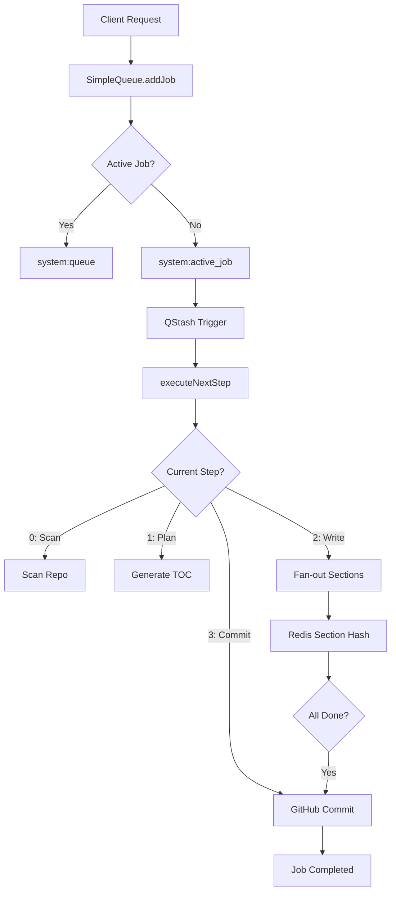

# Task Queue Orchestration

## Section A: System Role & Architectural Position

The Task Queue Orchestration layer provides a distributed, asynchronous execution framework designed to handle long-running repository analysis pipelines. Because LLM-driven documentation generation exceeds standard HTTP timeout limits (especially in serverless environments), GitDex decouples job submission from execution using a hybrid approach: a local Redis-backed state machine for job tracking and Upstash QStash for reliable, delayed, and distributed event triggering.

The orchestrator manages the lifecycle of a `JobData` object, transitioning it through discrete pipeline steps while enforcing concurrency limits and preventing duplicate processing of the same repository.

### Architectural Specifications

| Component | Technology | Responsibility | Key Configuration / Variable |
| :--- | :--- | :--- | :--- |
| **State Store** | Redis | Job metadata, locking, and queueing | `system:active_job`, `system:queue` |
| **Message Broker** | QStash | Asynchronous step triggering & retries | `QSTASH_TOKEN`, `BASE_URL` |
| **Security** | HMAC/Signing | Validating inbound QStash webhooks | `QSTASH_CURRENT_SIGNING_KEY` |
| **Concurrency** | Redis NX Locks | Preventing race conditions in fan-out | `PIPELINE_CONCURRENCY` |
| **Rate Limiting** | Cooldown Key | Preventing rapid re-indexing | `COOLDOWN_MS` (1 hour) |

---

## Section B: Core Execution & Data Flow Mechanics

The orchestration follows a "Fan-out/Fan-in" pattern. A single job is initiated, then split into multiple concurrent worker tasks (writing sections), and finally consolidated before the final commit.

### Pipeline Execution Flow



### Key Execution Invariants
*   **Mutual Exclusion**: Only one job can be marked as `system:active_job` at a time to preserve system resources.
*   **Step-Level Locking**: In Step 2 (Writing Sections), `acquireStepLock` uses Redis `SET NX` to ensure that a specific section index is not processed by multiple QStash retries simultaneously.
*   **State Persistence**: All pipeline data (`PipelineData`) is serialized to JSON and stored in a Redis Hash (`job:{owner}/{repo}`), allowing the pipeline to resume across different serverless execution contexts.
*   **Local Development Fallback**: The `qstashService` detects `localhost` targets and bypasses the external QStash API, using direct `fetch` calls to simulate asynchronous triggers.

---

## Section C: Implementation Deep Dive & Code Snippets

### 1. Distributed Triggering with QStash
The `triggerNextStep` function acts as the bridge between the internal state machine and the external execution trigger. It supports delayed execution to prevent LLM rate-limiting.

```typescript title="server/src/services/qstashService.ts"
export async function triggerNextStep(jobId: string, sectionIndex?: number, delay?: number): Promise<void> {
  const baseUrl = getBaseUrl();
  const targetUrl = `${baseUrl.replace(/\/$/, '')}/api/pipeline/step`;

  // ... local dev check omitted ...

  await qstash.publishJSON({
    url: targetUrl,
    body: { jobId, sectionIndex },
    delay: delay ? delay : undefined,
  });
}
```
**Mechanics**:
- **`publishJSON`**: Dispatches a POST request to the `/api/pipeline/step` endpoint.
- **`delay`**: Implements a staggered start for concurrent workers (e.g., `i * stepDelaySec`) to smooth out burst traffic to AI providers.
- **`sectionIndex`**: Passed as part of the payload to identify which specific part of the TOC is being generated.

### 2. Job State Management & Cooldowns
The `SimpleQueue` class manages the transition of jobs and implements a cooldown mechanism to prevent API abuse.

```typescript title="server/src/services/queueService.ts"
const lockKey = this.getLockKey(owner, repo);
const COOLDOWN_MS = 60 * 60 * 1000;

const lastIndexed = await redis.get<string>(lockKey);
if (lastIndexed && !force) {
    const timePassed = Date.now() - parseInt(lastIndexed);
    if (timePassed < COOLDOWN_MS) {
        throw new Error(`Repository is in cooldown...`);
    }
}
```
**Mechanics**:
- **Cooldown Check**: Uses a Redis key `lock:{owner}/{repo}` to store the timestamp of the last successful index.
- **`nx: true`**: When adding a job, a temporary `lock:add:...` key is used to prevent "double-submit" race conditions during the initial request.
- **Active Job Pointer**: `system:active_job` acts as a mutex for the primary pipeline execution.

### 3. Signature Verification Middleware
To prevent unauthorized triggerings of the pipeline, the `verifyQstashSignature` middleware ensures that only requests signed by Upstash are processed.

```typescript title="server/src/middleware/verifyQstash.ts"
export const verifyQstashSignature = async (req: RequestWithRawBody, res: Response, next: NextFunction) => {
  const signature = req.headers['upstash-signature'];
  const body = req.rawBody || JSON.stringify(req.body);
  
  const isValid = await qstashReceiver.verify({
    signature: headerSig,
    body,
  });

  if (!isValid) return res.status(401).json({ error: 'Invalid QStash signature' });
  next();
};
```
**Mechanics**:
- **`rawBody`**: Requires the exact raw string body for HMAC verification, as `JSON.stringify(req.body)` may alter spacing and invalidate the signature.
- **`qstashReceiver`**: Utilizes `currentSigningKey` and `nextSigningKey` to support zero-downtime key rotation.

---

## Section D: Method / State Reference & Error Recovery

### Redis Data Structure Reference

| Key Pattern | Type | Purpose | TTL |
| :--- | :--- | :--- | :--- |
| `job:{owner}/{repo}` | Hash | Stores `JobData` (state, currentStep, data) | 24 Hours |
| `lock:{owner}/{repo}` | String | Cooldown timestamp for the repository | 1 Hour |
| `lock:step:{jobId}:{idx}` | String | Mutex for concurrent section writing | 60 Seconds |
| `system:active_job` | String | Pointer to the currently executing Job ID | N/A |
| `system:queue` | List | FIFO queue of Job IDs waiting for execution | N/A |

### Job State Transition Matrix

| State | Transition Trigger | Next State | Condition |
| :--- | :--- | :--- | :--- |
| `queued` | `triggerNextJob()` | `processing` | `system:active_job` is empty |
| `processing` | `completeJob()` | `completed` | All pipeline steps $\in [0, 3]$ finish |
| `processing` | `failJob()` | `failed` | Uncaught exception or timeout |
| `failed` | `requeueJob()` | `queued` | Manual or automated retry |

### Error Recovery & Self-Healing
The system implements three layers of fault tolerance:
1.  **The Stuck Job Monitor (`healStuckJobs`)**: A cron-like function that checks if `system:active_job` has not been updated for > 15 minutes. If detected, it calls `failJob()` to clear the mutex and allow the queue to progress.
2.  **Step-Level Retries**: QStash automatically retries failed HTTP 5xx responses. The `acquireStepLock` ensures that these retries do not create duplicate content in Redis.
3.  **Critical Trigger Recovery**: If `triggerNextStep` fails during a job transition, `requeueJob()` is called to push the job back to the front of the `system:queue`, resetting the `currentStep` to 0 to ensure a clean state.