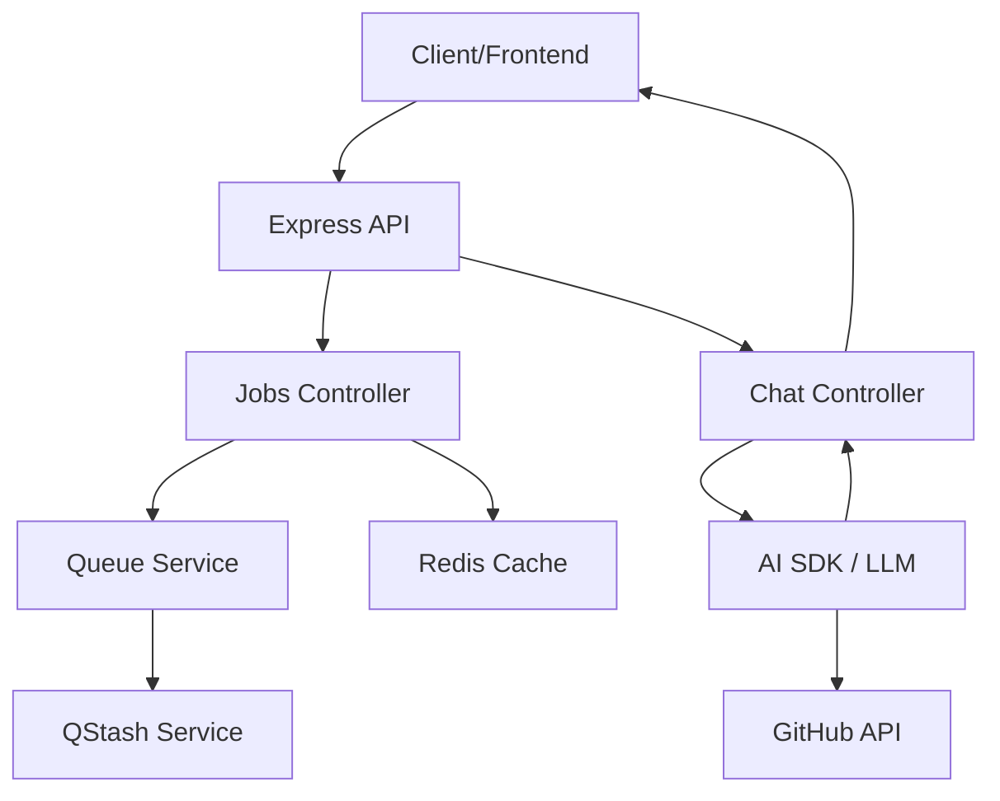

# Server API Layer

## System Role & Architectural Position

The Server API Layer serves as the primary ingress point for the GitDex ecosystem, facilitating communication between the Next.js frontend, external webhook providers (QStash), and the internal Backend Core Engine. It abstracts the complexity of asynchronous job orchestration and LLM tool-calling into a set of RESTful endpoints.

This layer is implemented using Express.js and is responsible for request validation, identity extraction (owner/repo context), and the streaming of AI-generated responses. It acts as a gateway that translates HTTP requests into service-layer calls to the `queueService`, `pipelineService`, and `githubService`.

### Technical Specifications

| Component | Technology | Primary Responsibility | Key Dependency |
| :--- | :--- | :--- | :--- |
| **Request Controllers** | Express / TypeScript | Route logic & request orchestration | `zod`, `ai` (AI SDK) |
| **Routing Layer** | `express.Router` | Endpoint definition & middleware chaining | `verifyQstashSignature` |
| **AI Integration** | Vercel AI SDK / Google | Tool-augmented LLM streaming | `@ai-sdk/google` |
| **External API Client** | Octokit | GitHub REST API interactions | `octokit` |
| **State Cache** | Redis | Indexing status and job tracking | `ioredis` |

## Core Execution & Data Flow Mechanics

The API layer manages two distinct operational flows: the **Indexing Lifecycle** (Asynchronous/Stateful) and the **AI Interaction Flow** (Synchronous/Streaming).

### Interaction Workflow



### Indexing Flow Logic
1. **Job Initiation**: `createJob` validates the GitHub URL and verifies repository existence via `githubService`.
2. **Queue Insertion**: The job is added to the internal queue. If `newlyStarted` is true, the controller triggers the first execution step via `triggerNextStep` (QStash).
3. **State Verification**: `getStatusByName` implements a multi-tier check for indexing status:
    *   **Tier 1**: Check for active `processing` or `queued` jobs in the queue.
    *   **Tier 2**: Check Redis for the `last_indexed:${owner}/${repo}` key.
    *   **Tier 3**: Fallback to GitHub API to check for the existence of `docs/${owner}/${repo}/meta.json` in the documentation repository.

### AI Chat Flow Logic
1. **Context Extraction**: The controller extracts `owner` and `repo` from `x-github-owner`/`x-github-repo` headers or parses the `Referer` header.
2. **Environment Probing**: To ensure high availability, the system iterates through `CHAT_MODELS` (comma-separated env var), performing a "probe" call to verify model availability before initializing the stream.
3. **Tool Orchestration**: The LLM is provided with a set of Zod-defined tools (`listFiles`, `readFiles`, `searchCode`) that execute real-time GitHub API calls to ground the AI's responses in the actual codebase.

## Implementation Deep Dive

### AI Tool Integration and Streaming
The `handleChat` controller implements a sophisticated tool-calling loop. It restricts the LLM to a specific repository scope via a strict system prompt and limits tool execution to 20 steps to prevent infinite loops or token exhaustion.

```typescript title="server/src/controllers/chatController.ts"
streamText({
  model: google(selectedModel as Parameters<typeof google>[0]),
  system: systemPrompt,
  messages: await convertToModelMessages(messages as Parameters<typeof convertToModelMessages>[0]),
  maxRetries: 5,
  tools: {
    readFiles: tool({
      description: 'Read the content of one or more files in the repository (up to 5 files at once)',
      inputSchema: z.object({
        paths: z.array(z.string()).describe('List of file paths to read'),
      }),
      execute: async ({ paths }) => {
        try {
          const results = await Promise.all(
            paths.slice(0, 5).map(async (path) => {
              const { data } = await octokit.rest.repos.getContent({ owner, repo, path });
              if ('content' in data && data.encoding === 'base64') {
                const content = Buffer.from(data.content, 'base64').toString('utf-8');
                return {
                  path,
                  content: content.slice(0, 10000) + (content.length > 10000 ? '\n...[truncated]' : ''),
                };
              }
              return { path, error: 'File not found or is binary.' };
            })
          );
          return { files: results };
        } catch (e: unknown) {
          return { error: (e as Error).message };
        }
      },
    }),
    // ... other tools (listFiles, searchCode)
  },
  stopWhen: stepCountIs(20),
}).pipeUIMessageStreamToResponse(res);
```
**Technical Mechanics:**
*   **`convertToModelMessages`**: Normalizes frontend message formats to AI SDK requirements.
*   **`paths.slice(0, 5)`**: Implements a hard limit on concurrent file reads to prevent API rate limiting.
*   **`content.slice(0, 10000)`**: Truncates large files to preserve the LLM context window.
*   **`pipeUIMessageStreamToResponse`**: Pipes the LLM stream directly to the Express response object for real-time UI updates.

### Job Orchestration and State Management
The `jobsController` manages the transition of repositories from "unindexed" to "indexed" by coordinating between Redis and the QStash-backed pipeline.

```typescript title="server/src/controllers/jobsController.ts"
export const getStatusByName = async (req: Request, res: Response) => {
  const { owner, repo } = req.query as { owner?: string; repo?: string };
  // ... validation ...

  const job = await queue.getJobByRepo(owner, repo);
  const lastIndexedKey = `last_indexed:${owner}/${repo}`;

  if (job && (job.state === 'processing' || job.state === 'queued')) {
    const cached = await redis.get<string>(lastIndexedKey);
    return res.json({
      indexed: false,
      job: safeJob,
      lastIndexed: cached ? parseInt(cached) : null,
    });
  }

  let lastIndexed: number | null = null;
  const cached = await redis.get<string>(lastIndexedKey);
  if (cached) {
    lastIndexed = parseInt(cached);
  } else {
    // Fallback: check documentation repository via Octokit
    try {
      const commits = await octokit.rest.repos.listCommits({
        owner: docsRepoOwner,
        repo: docsRepo,
        path: `docs/${owner}/${repo}/meta.json`,
        per_page: 1,
      });
      const commitDate = commits.data[0]?.commit.committer?.date;
      if (commitDate) {
        lastIndexed = new Date(commitDate).getTime();
        await redis.set(lastIndexedKey, lastIndexed.toString());
      }
    } catch { /* 404 = not indexed */ }
  }
  // ... response logic ...
};
```
**Technical Mechanics:**
*   **`last_indexed` Redis Key**: Acts as a high-speed cache to avoid repeated GitHub API calls for indexing timestamps.
*   **Doc Repo Fallback**: Ensures that even if Redis is flushed, the system can recover the index state by querying the commit history of the `meta.json` file in the `gitdex-docs` repository.

## Method / State Reference & Error Recovery

### API Endpoint Contracts

| Endpoint | Method | Auth/Middleware | Key Input | Description |
| :--- | :--- | :--- | :--- | :--- |
| `/index` | `POST` | None | `repoUrl`, `force` | Initiates a new indexing job. |
| `/status/:jobId` | `GET` | None | `jobId` (param) | Fetches specific job state and metadata. |
| `/status` | `GET` | None | `owner`, `repo` (query) | Checks if a repo is currently indexed. |
| `/chat` | `POST` | None | `messages` (body) | Streams AI responses via tool-calling. |
| `/pipeline/step` | `POST` | `verifyQstashSignature` | `jobId`, `sectionIndex` | Executes a pipeline stage (Webhook). |
| `/pipeline/cron-heal` | `POST` | `verifyQstashSignature` | None | Triggers recovery of stuck jobs. |

### Error Recovery & Failure Modes

| HTTP Status | Condition | Recovery Mechanism |
| :--- | :--- | :--- |
| `400 Bad Request` | Missing `owner`/`repo` or invalid `repoUrl`. | Client must provide valid GitHub identifiers. |
| `404 Not Found` | Repository not found on GitHub or `jobId` invalid. | Verification failure; indexing cannot proceed. |
| `429 Too Many Requests` | Queue cooldown limit reached. | Client must implement exponential backoff. |
| `500 Internal Error` | QStash publish failure or LLM probe failure. | Logged via `requestLogger`; `cronHeal` may resolve stuck pipeline states. |

### Request Logging Middleware
All requests are wrapped by the `requestLogger` to monitor latency and status codes, providing critical telemetry for the asynchronous pipeline.

```typescript title="server/src/middleware/requestLogger.ts"
export const requestLogger = (req: Request, res: Response, next: NextFunction) => {
  const start = Date.now();
  res.on('finish', () => {
    const duration = Date.now() - start;
    console.log(`[HTTP] ${req.method} ${req.originalUrl} ${res.statusCode} - ${duration}ms`);
  });
  next();
};