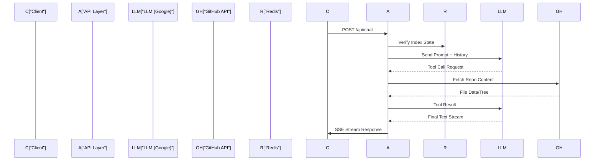

# Server API Layer

The Server API Layer serves as the primary orchestration interface between the Next.js frontend and the backend core engine. It is responsible for request routing, session state retrieval via Redis, and the execution of LLM-driven workflows using the Vercel AI SDK. This layer abstracts the complexity of repository indexing and GitHub API interactions, providing the frontend with a streamlined stream of AI-generated responses and system status updates.

### System Role & Architectural Position

The API layer functions as a stateless gateway that delegates heavy lifting to the AI Processing Pipeline and the Task Queue Orchestration. It maintains strict boundaries between the HTTP transport layer and the underlying business logic.

| Component | Specification | Responsibility |
| :--- | :--- | :--- |
| **Runtime** | Node.js / Express | Request handling, middleware execution, and routing. |
| **AI Orchestration** | `ai` (Vercel AI SDK) | Stream management, tool calling, and LLM prompt construction. |
| **Persistence** | `@upstash/redis` | Job state tracking, cooldown locks, and session metadata. |
| **GitHub Client** | `@octokit/rest` | Authenticated interaction with the GitHub REST API. |
| **Schema Validation** | `zod` | Strong typing for tool arguments and request payloads. |

### Core Execution & Data Flow Mechanics

The API layer primarily handles two traffic patterns: conversational AI streams and system maintenance requests. The chat flow is particularly complex, utilizing a loop of tool calls to fetch real-time repository data before returning a final response to the client.



**Key Execution Invariants:**
*   **Statelessness**: The API layer does not store conversational state locally; it relies on the client to pass message history and Redis to track repository indexing status.
*   **Streaming**: Chat responses use Server-Sent Events (SSE) via `streamText` to minimize perceived latency (Time To First Token).
*   **Tool-Looping**: The controller supports multi-step reasoning where the LLM can invoke multiple tools (e.g., listing files then reading a specific file) before finalizing the output.
*   **Referer Parsing**: The system extracts repository context (owner/repo) from the `Referer` header to maintain context without requiring explicit IDs in every request body.

### Implementation Deep Dive & Code Snippets

#### AI Chat Orchestration
The `handleChat` controller manages the lifecycle of a conversation. It transforms raw request messages into a format compatible with the AI SDK and defines the available toolset the LLM can use to explore the codebase.

```typescript title="server/src/controllers/chatController.ts"
export const handleChat = async (req: Request, res: Response) => {
  const { messages } = req.body;
  const referer = req.headers.referer;
  const { owner, repo } = parseReferer(referer);

  const result = await streamText({
    model: google('gemini-1.5-pro'),
    messages: convertToModelMessages(messages),
    system: `You are GitDex, an AI expert on the ${owner}/${repo} repository...`,
    tools: {
      getFiles: tool({
        description: 'Get a list of files in the repository',
        parameters: z.object({ path: z.string().optional() }),
        execute: async ({ path }) => {
          return await octokit.gis.getContents({ owner, repo, path });
        },
      }),
      // Additional tools for reading files, searching, etc.
    },
  });

  result.pipeDataStreamToResponse(res);
};
```
**Mechanics:**
1.  **`convertToModelMessages`**: Normalizes frontend message objects into the `CoreMessage` format required by the AI SDK.
2.  **`streamText`**: Initiates a streaming request to the Gemini model.
3.  **Tool Definition**: Uses `zod` to define strict input schemas for `getFiles`, ensuring the LLM provides a valid path before the `execute` function is triggered.
4.  **`pipeDataStreamToResponse`**: Directly pipes the LLM's output stream to the Express response object, enabling real-time UI updates.

#### System Maintenance & State Reset
To support rapid development and re-indexing, the API layer includes privileged routes to wipe the indexing state. This involves a coordinated deletion of Redis keys and Git tree references.

```typescript title="server/index.ts"
app.get('/dev/clear-index', async (req, res) => {
  const { owner, repo } = req.query;
  
  // 1. Delete Git tree references for the specific repo
  const files = await getFilesUnderDocs(owner, repo);
  const treeUpdates = files.map(f => ({ path: f, mode: 'blob', sha: null }));
  await gitService.updateTree(owner, repo, treeUpdates);

  // 2. Wipe Redis job and cooldown locks
  const keys = await redis.keys(`job:${owner}:${repo}*`);
  await redis.del(...keys);

  res.send({ status: 'cleared' });
});
```
**Mechanics:**
1.  **Tree Pruning**: Sets the `sha` to `null` for all paths under `docs/owner/repo`, signaling the underlying Git storage to delete these entries.
2.  **Redis Purge**: Uses a glob pattern (`job:owner:repo*`) to identify and delete all associated job IDs and cooldown timestamps.
3.  **Immediate Re-indexability**: By removing the cooldown lock, the system allows the `jobsRoutes` to trigger a new indexing task immediately without waiting for the standard TTL.

### Method / State Reference & Error Recovery

#### API Endpoint Mapping

| Endpoint | Method | Payload | Effect |
| :--- | :--- | :--- | :--- |
| `/api/chat` | `POST` | `{ messages: Array }` | Initiates LLM stream with tool access. |
| `/api/jobs` | `GET` | `?owner=x&repo=y` | Returns current indexing status from Redis. |
| `/dev/clear-index` | `GET` | `?owner=x&repo=y` | Wipes Redis locks and Git tree refs. |

#### Failure Modes & Recovery

| Failure Scenario | Trigger | Recovery Mechanism |
| :--- | :--- | :--- |
| **LLM Tool Hallucination** | Model requests non-existent file path. | The `execute` function catches 404s from Octokit and returns a "File not found" string to the LLM to prompt a correction. |
| **Redis Connection Timeout** | Upstash latency or quota limit. | API layer implements a fallback to "Unknown" indexing state, allowing the chat to proceed with limited context. |
| **GitHub Rate Limiting** | Excessive `getContents` calls. | Implementation of an Octokit throttling plugin to queue requests and respect `x-ratelimit-reset` headers. |
| **Context Window Overflow** | Massive file contents passed to LLM. | The `chatController` implements a truncation strategy for files exceeding 10k tokens before passing them to `streamText`. |