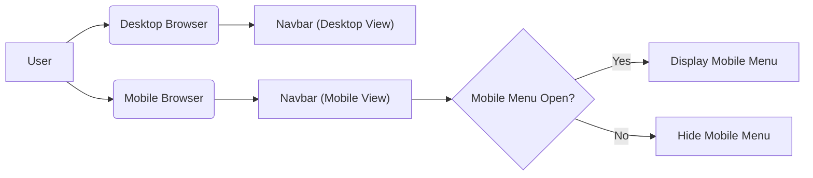
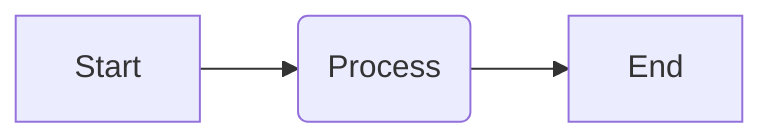
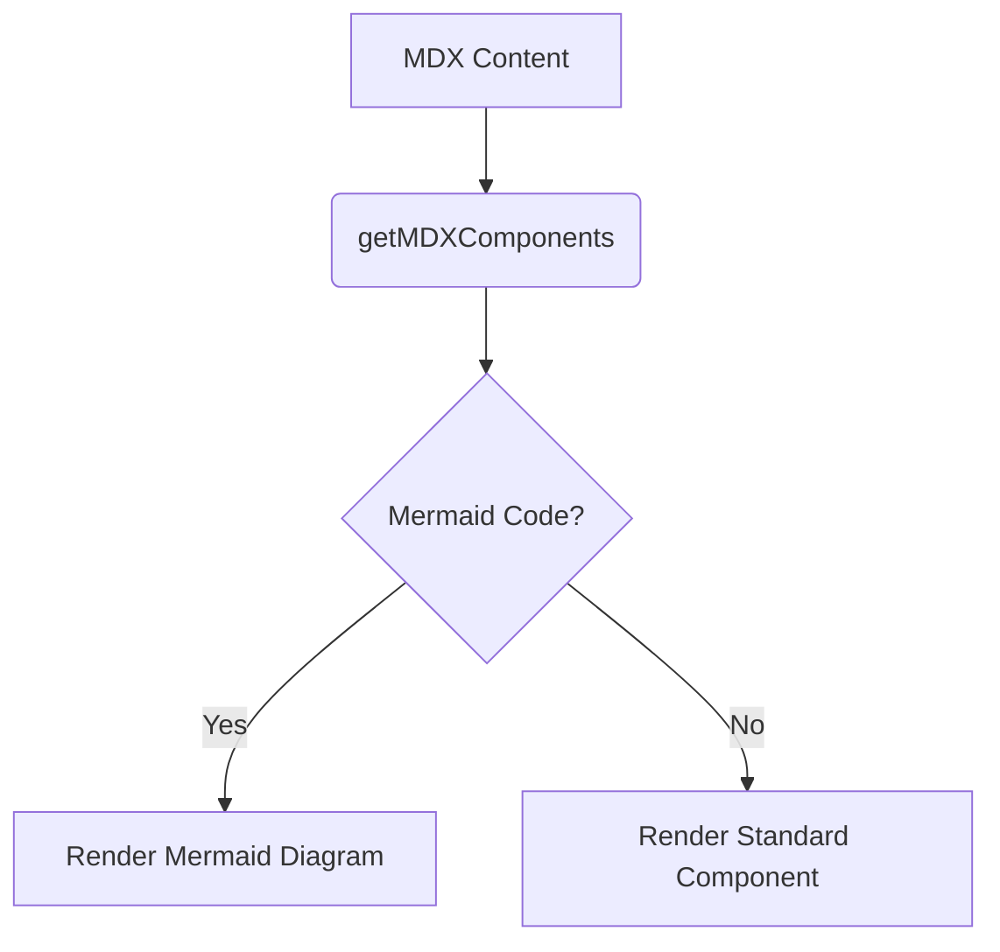

# UI Components

This section details the reusable UI components used within the GitDex application, focusing on their structure, functionality, and customization options. These components, built with React and styled using `class-variance-authority` (cva) and `tailwind`, provide a consistent and modern user interface.

## Button Component

The `Button` component is a fundamental UI element used throughout GitDex. It's built using Radix UI's `Slot` component for flexibility and `class-variance-authority` for managing styles based on different variants and sizes.

### Features

-   **Variants:** Supports different visual styles like `default`, `destructive`, `outline`, `secondary`, `ghost`, and `link`.
-   **Sizes:** Offers various sizes including `default`, `sm`, `lg`, and `icon`.
-   **Customizable:**  Accepts standard HTML button attributes and can be rendered as a different element using the `asChild` prop.

```typescript
import * as React from "react"
import { Slot } from "@radix-ui/react-slot"
import { cva, type VariantProps } from "class-variance-authority"

import { cn } from "@/lib/utils"

const buttonVariants = cva(
  "inline-flex items-center justify-center whitespace-nowrap rounded-md text-sm font-medium ring-offset-background transition-colors focus-visible:outline-none focus-visible:ring-2 focus-visible:ring-ring focus-visible:ring-offset-2 disabled:pointer-events-none disabled:opacity-50",
  {
    variants: {
      variant: {
        default: "bg-primary text-primary-foreground hover:bg-primary/90",
        destructive:
          "bg-destructive text-destructive-foreground hover:bg-destructive/90",
        outline:
          "border border-input bg-background hover:bg-accent hover:text-accent-foreground",
        secondary:
          "bg-secondary text-secondary-foreground hover:bg-secondary/80",
        ghost: "hover:bg-accent hover:text-accent-foreground",
        link: "text-primary underline-offset-4 hover:underline",
      },
      size: {
        default: "h-10 px-4 py-2",
        sm: "h-9 rounded-md px-3",
        lg: "h-11 rounded-md px-8",
        icon: "h-10 w-10",
      },
    },
    defaultVariants: {
      variant: "default",
      size: "default",
    },
  }
)

export interface ButtonProps
  extends React.ButtonHTMLAttributes<HTMLButtonElement>,
    VariantProps<typeof buttonVariants> {
  asChild?: boolean
}

const Button = React.forwardRef<HTMLButtonElement, ButtonProps>(
  ({ className, variant, size, asChild = false, ...props }, ref) => {
    const Comp = asChild ? Slot : "button"
    return (
      <Comp
        className={cn(buttonVariants({ variant, size, className }))}
        ref={ref}
        {...props}
      />
    )
  }
)
Button.displayName = "Button"

export { Button, buttonVariants }
```

[View on GitHub](https://github.com/shinymack/gitdex/blob/main/client/src/components/ui/button.tsx)

### Usage Example

```typescript
import { Button } from "@/src/components/ui/button";

function Example() {
  return (
    <>
      <Button variant="default">Primary Button</Button>
      <Button variant="outline">Outline Button</Button>
      <Button variant="ghost">Ghost Button</Button>
    </>
  );
}
```

## Card Component

The `Card` component provides a container for grouping related content.  It consists of several sub-components: `CardHeader`, `CardTitle`, `CardDescription`, `CardContent`, and `CardFooter`.

### Features

-   **Modular Structure:** Sub-components allow for structured content organization.
-   **Consistent Styling:** Provides a consistent visual appearance for grouped information.
-   **Customizable:**  Accepts standard HTML attributes for each sub-component, allowing for flexibility in content and styling.

```typescript
import * as React from "react"

import { cn } from "@/lib/utils"

const Card = React.forwardRef<
  HTMLDivElement,
  React.HTMLAttributes<HTMLDivElement>
>(({ className, ...props }, ref) => (
  <div
    ref={ref}
    className={cn(
      "rounded-lg border bg-card text-card-foreground shadow-sm",
      className
    )}
    {...props}
  />
))
Card.displayName = "Card"

const CardHeader = React.forwardRef<
  HTMLDivElement,
  React.HTMLAttributes<HTMLDivElement>
>(({ className, ...props }, ref) => (
  <div
    ref={ref}
    className={cn("flex flex-col space-y-1.5 p-6", className)}
    {...props}
  />
))
CardHeader.displayName = "CardHeader"

const CardTitle = React.forwardRef<
  HTMLParagraphElement,
  React.HTMLAttributes<HTMLHeadingElement>
>(({ className, ...props }, ref) => (
  <h3
    ref={ref}
    className={cn(
      "text-2xl font-semibold leading-none tracking-tight",
      className
    )}
    {...props}
  />
))
CardTitle.displayName = "CardTitle"

const CardDescription = React.forwardRef<
  HTMLParagraphElement,
  React.HTMLAttributes<HTMLParagraphElement>
>(({ className, ...props }, ref) => (
  <p
    ref={ref}
    className={cn("text-sm text-muted-foreground", className)}
    {...props}
  />
))
CardDescription.displayName = "CardDescription"

const CardContent = React.forwardRef<
  HTMLDivElement,
  React.HTMLAttributes<HTMLDivElement>
>(({ className, ...props }, ref) => (
  <div ref={ref} className={cn("p-6 pt-0", className)} {...props} />
))
CardContent.displayName = "CardContent"

const CardFooter = React.forwardRef<
  HTMLDivElement,
  React.HTMLAttributes<HTMLDivElement>
>(({ className, ...props }, ref) => (
  <div
    ref={ref}
    className={cn("flex items-center p-6 pt-0", className)}
    {...props}
  />
))
CardFooter.displayName = "CardFooter"

export { Card, CardHeader, CardFooter, CardTitle, CardDescription, CardContent }
```

[View on GitHub](https://github.com/shinymack/gitdex/blob/main/client/src/components/ui/card.tsx)

### Usage Example

```typescript
import { Card, CardHeader, CardTitle, CardDescription, CardContent, CardFooter } from "@/src/components/ui/card";

function ExampleCard() {
  return (
    <Card>
      <CardHeader>
        <CardTitle>Card Title</CardTitle>
        <CardDescription>Card Description</CardDescription>
      </CardHeader>
      <CardContent>
        {/* Card Content */}
      </CardContent>
      <CardFooter>
        {/* Card Footer */}
      </CardFooter>
    </Card>
  );
}
```

## Navbar Component

The `FloatingNav` component provides the navigation bar for the GitDex application. It handles both desktop and mobile views and includes links to the GitHub repository.

### Features

-   **Responsive Design:** Adapts to different screen sizes with a mobile menu.
-   **GitHub Integration:** Provides a direct link to the GitDex GitHub repository.
-   **Dynamic Rendering:** Uses `useEffect` to ensure proper rendering on the client-side.

```typescript
'use client';

import { useState, useEffect } from 'react';
import { Github, BookOpen, Menu, X } from 'lucide-react';
import Link from 'next/link';
import { Button } from '@/src/components/ui/button';

export function FloatingNav() {
  const [mounted, setMounted] = useState(false);
  const [mobileMenuOpen, setMobileMenuOpen] = useState(false);

  useEffect(() => {
    setMounted(true);
  }, []);

  if (!mounted) return null;

  return (
    <nav
      className={`
        fixed top-4 left-1/2 -translate-x-1/2 z-50
        w-[90%] md:w-[80%] lg:w-[70%]
        rounded-2xl border border-border/40
        bg-background/50 backdrop-blur-[5px]
        shadow-md
        transition-all duration-300
      `}
    >
      <div className="px-4 py-3 flex items-center justify-between">
        <Link href="/" className="flex items-center gap-2">
          <span className="text-xl">GitDex</span>
        </Link>

        <div className="flex items-center gap-4">
          {/* Desktop Navigation */}
          <div className="hidden md:flex items-center gap-4">
            {/* <Link href="/docs">
              <Button variant="ghost" size="sm" className="gap-2">
                <BookOpen className="w-4 h-4" />
                <span>Docs</span>
              </Button>
            </Link> */}

            <a
              href="https://github.com/shinymack/gitdex"
              target="_blank"
              rel="noopener noreferrer"
            >
              <Button variant="ghost" size="sm">
                <Github className="w-4 h-4" />
              </Button>
            </a>

            {/* <Button
              variant="ghost"
              size="sm"
              onClick={() => setTheme(theme === 'dark' ? 'light' : 'dark')}
            >
              {theme === 'dark' ? <Sun className="w-4 h-4" /> : <Moon className="w-4 h-4" />}
            </Button> */}
          </div>

          {/* Mobile Menu Button */}
          <Button
            variant="ghost"
            size="sm"
            className="md:hidden"
            onClick={() => setMobileMenuOpen(!mobileMenuOpen)}
          >
            {mobileMenuOpen ? <X className="w-5 h-5" /> : <Menu className="w-5 h-5" />}
          </Button>
        </div>
      </div>

      {/* Mobile Menu */}
      {mobileMenuOpen && (
        <div className="md:hidden border-t border-border/40 bg-background/80 backdrop-blur-lg rounded-b-2xl">
          <div className="px-4 py-3 flex flex-col gap-3">
            {/* <Link href="/docs" onClick={() => setMobileMenuOpen(false)}>
              <Button variant="ghost" size="sm" className="w-full justify-start gap-2">
                <BookOpen className="w-4 h-4" />
                <span>Docs</span>
              </Button>
            </Link> */}

            {/* <Button
              variant="ghost"
              size="sm"
              onClick={() => {
                setTheme(theme === 'dark' ? 'light' : 'dark');
                setMobileMenuOpen(false);
              }}
              className="w-full justify-start gap-2"
            >
              {theme === 'dark' ? <Sun className="w-4 h-4" /> : <Moon className="w-4 h-4" />}
              <span>{theme === 'dark' ? 'Light' : 'Dark'}</span>
            </Button> */}

            <a
              href="https://github.com/shinymack/gitdex"
              target="_blank"
              rel="noopener noreferrer"
              onClick={() => setMobileMenuOpen(false)}
            >
              <Button variant="ghost" size="sm" className="w-full justify-start gap-2">
                <Github className="w-4 h-4" />
                <span>GitHub</span>
              </Button>
            </a>
          </div>
        </div>
      )}
    </nav>
  );
}
```

[View on GitHub](https://github.com/shinymack/gitdex/blob/main/client/src/components/navbar.tsx)

### Usage Example

```typescript
import { FloatingNav } from "@/src/components/navbar";

function AppLayout() {
  return (
    <>
      <FloatingNav />
      {/* Rest of your application */}
    </>
  );
}
```





## MDX Components

The `mdx-components.tsx` file is responsible for customizing the default MDX components used in the application.  This allows for enhanced functionality and styling of MDX content, such as adding syntax highlighting and custom components like `Mermaid`.

### Features

-   **Custom Component Overrides:**  Allows overriding default MDX components with custom implementations.
-   **Mermaid Diagram Support:** Integrates the `Mermaid` component for rendering Mermaid diagrams within MDX content.
-   **Code Block Enhancements:** Enhances code blocks with syntax highlighting and background styling via `fumadocs-ui`.

```typescript
import { CodeBlock, Pre } from 'fumadocs-ui/components/codeblock';
import defaultMdxComponents from 'fumadocs-ui/mdx'
import type { MDXComponents } from 'mdx/types';
import { Mermaid } from '@/src/components/mermaid'

export function getMDXComponents(components: MDXComponents): MDXComponents {
  return {
    ...defaultMdxComponents,
    Mermaid,
    pre: ({ ref: _ref, ...props }) => (
      <CodeBlock {...props}>
        <Pre>{props.children}</Pre>
      </CodeBlock>
    ),
    ...components
  };
}
```

[View on GitHub](https://github.com/shinymack/gitdex/blob/main/client/mdx-components.tsx)

### Usage Example

To use Mermaid diagrams within your MDX content, simply wrap your Mermaid code in a code block with the `mermaid` language identifier:

```markdown
 




## Key Integration Points

-   **Button Usage:** The `Button` component is used extensively throughout the application for actions such as submitting forms, navigating between pages, and triggering events.  Its consistent styling and customizable variants ensure a unified user experience.
-   **Card Component for Content Grouping:** The `Card` component is used to group related pieces of information together, making it easier for users to understand and navigate the content.
-   **Navbar for Navigation:** The `FloatingNav` component provides a clear and consistent navigation experience, allowing users to easily access different sections of the application and external resources like the GitHub repository.
-   **MDX Customization:** The `mdx-components.tsx` file allows developers to extend the functionality of MDX content, enabling features like Mermaid diagram support and enhanced code block styling.





```
```