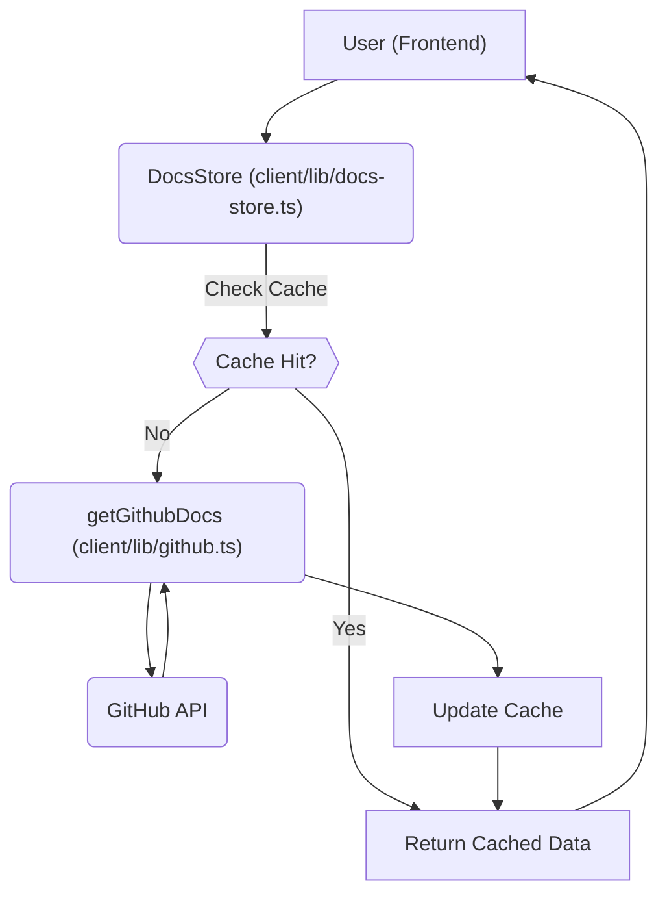

# Data Fetching and Management

This section details how the GitDex frontend retrieves and manages data from the backend, ensuring a smooth user experience. The key components involved are `client/lib/github.ts`, `client/src/app/api/index/route.ts`, `client/lib/docs-store.ts`, and `client/lib/types.ts`.

## Features

-   **Data Caching:** Implemented using `zustand` and `zustand/middleware` for persistent caching of documentation data.
-   **GitHub API Integration:** Fetches documentation files and metadata directly from GitHub repositories.
-   **API Route for Indexing:** Provides an API endpoint to trigger the indexing process for a specified repository.
-   **Type Safety:** Uses TypeScript interfaces to define the structure of documentation data and API responses.

## Components

-   **`client/lib/docs-store.ts`:** Manages the caching and retrieval of documentation data.
-   **`client/lib/github.ts`:** Handles the interaction with the GitHub API to fetch documentation files.
-   **`client/src/app/api/index/route.ts`:** Defines the API endpoint for initiating the indexing process.
-   **`client/lib/types.ts`:** Defines TypeScript interfaces for data structures used throughout the application.

## Data Fetching Flow

The following Mermaid diagram illustrates the data fetching process:





## Code Snippets and Explanations

### 1. `docs-store.ts`: Zustand Store for Caching

This snippet shows how `zustand` is used to create a store for caching documentation data. The `persist` middleware ensures that the cache is persisted across sessions.

```typescript
import { create } from 'zustand';
import { persist } from 'zustand/middleware';
import { getGithubDocs, type DocsStructure } from './github';

interface DocsCache {
  [key: string]: {
    data: DocsStructure;
    timestamp: number;
  };
}

interface DocsStore {
  cache: DocsCache;
  getDocs: (owner: string, repo: string) => Promise<DocsStructure>;
  clearCache: () => void;
  clearCacheFor: (owner: string, repo: string) => void;
}

const CACHE_TTL = 10 * 60 * 1000; // 10 minutes

export const useDocsStore = create<DocsStore>()(
  persist(
    (set, get) => ({
      cache: {},
      
      getDocs: async (owner: string, repo: string) => {
            const key = `${owner}/${repo}`;
            const now = Date.now();

            // On the server, always fetch fresh data (do not rely on persisted localStorage)
            if (typeof window === 'undefined') {
              const data = await getGithubDocs(owner, repo);
              set((state) => ({
                cache: {
                  ...state.cache,
                  [key]: { data, timestamp: now },
                },
              }));
              return data;
            }

            const cached = get().cache[key];
            if (cached && now - cached.timestamp < CACHE_TTL) {
              return cached.data;
            }

            // Always fetch fresh if not cached or cache expired
            const data = await getGithubDocs(owner, repo);
            set((state) => ({
              cache: {
                ...state.cache,
                [key]: { data, timestamp: now },
              },
            }));
            return data;
      },
      
      clearCache: () => set({ cache: {} }),
      clearCacheFor: (owner: string, repo: string) =>
        set((state) => {
          const key = `${owner}/${repo}`;
          const next = { ...state.cache };
          delete next[key];
          return { cache: next };
        }),
    }),
    {
      name: 'docs-cache',
    }
  )
);
```

[View on GitHub](https://github.com/shinymack/gitdex/blob/main/client/lib/docs-store.ts)

### 2. `github.ts`: Fetching Data from GitHub

This function fetches the documentation structure, including the `meta.json` file and all files within the specified documentation path.

```typescript
import { Octokit } from '@octokit/rest';

const octokit = new Octokit({ 
  auth: process.env.GITHUB_TOKEN 
});

export interface DocFile {
  path: string;
  content: string;
}

export interface DocsStructure {
  index: string;
  meta: any;
  files: DocFile[];
}

export async function getGithubDocs(owner: string, repo: string): Promise<DocsStructure> {
  try {
    const docsRepo = 'gitdex-docs';
    const docsPath = `docs/${owner}/${repo}`;
    
    console.log(`Fetching docs for ${owner}/${repo} from ${docsRepo}/${docsPath}`);
    
    // Fetch the meta.json file
    console.log(`Fetching meta file from ${docsPath}/meta.json`);
    const { data: metaData } = await octokit.rest.repos.getContent({
      owner: process.env.GITHUB_USERNAME || 'your-github-username',
      repo: docsRepo,
      path: `${docsPath}/meta.json`,
    });
    
    // Handle meta content
    let metaContent = {};
    if ('content' in metaData && typeof metaData.content === 'string') {
      try {
        metaContent = JSON.parse(Buffer.from(metaData.content, 'base64').toString());
      } catch (e) {
        console.error('Error parsing meta JSON:', e);
      }
    } else if ('title' in metaData || 'description' in metaData) {
      // This is the direct JSON object
      metaContent = metaData;
    }
    
    // console.log('=== META CONTENT ===');
    // console.log(JSON.stringify(metaContent, null, 2));
    // console.log('=== END META CONTENT ===');
    
    // Fetch all files in the directory recursively
    console.log(`Fetching tree data for ${docsRepo}`);
    const { data: treeData } = await octokit.rest.git.getTree({
      owner: process.env.GITHUB_USERNAME || 'your-github-username',
      repo: docsRepo,
      tree_sha: 'main',
      recursive: "true",
    });
    
    console.log(`Found ${treeData.tree.length} total files in repository`);
    
    // Filter files in our docs path
    const docsFiles = treeData.tree.filter(
      item => item.path.startsWith(`${docsPath}/`) && item.type === 'blob'
    );
    
    console.log(`Found ${docsFiles.length} files in docs path: ${docsPath}`);
    console.log('Files:', docsFiles.map(f => f.path));
    
    // Fetch content for each file
    const filesContent = await Promise.all(
      docsFiles.map(async file => {
        console.log(`Fetching content for ${file.path}`);
        
        // Don't use raw format to get consistent response
        const { data } = await octokit.rest.repos.getContent({
          owner: process.env.GITHUB_USERNAME || 'your-github-username',
          repo: docsRepo,
          path: file.path,
        });
        
        let content = '';
        
        // All responses should have 'content' property when not using raw format
        if ('content' in data && typeof data.content === 'string') {
          content = Buffer.from(data.content, 'base64').toString();
          
        //   console.log(`=== CONTENT PREVIEW for ${file.path} ===`);
        //   console.log(content.substring(0, 200));
        //   if (content.length > 200) {
        //     console.log('... (truncated)');
        //   }
        //   console.log('=== END CONTENT PREVIEW ===');
        } else {
          console.log(`No content found for ${file.path}`);
        }
        
        return {
          path: file.path.replace(`${docsPath}/`, ''),
          content,
        };
      })
    );
    
    console.log(`Successfully fetched ${filesContent.length} files`);
    
    return {
      index: '', // No index file in the new structure
      meta: metaContent,
      files: filesContent,
    };
  } catch (error) {
    console.error('Error fetching GitHub docs:', error);
    return {
      index: '',
      meta: {},
      files: [],
    };
  }
}
```

[View on GitHub](https://github.com/shinymack/gitdex/blob/main/client/lib/github.ts)

### 3. `github.ts`: Octokit Instance

This shows how to create an Octokit instance for interacting with the GitHub API.  It retrieves the GitHub token from the environment variables.

```typescript
import { Octokit } from '@octokit/rest';

const octokit = new Octokit({ 
  auth: process.env.GITHUB_TOKEN 
});
```

[View on GitHub](https://github.com/shinymack/gitdex/blob/main/client/lib/github.ts)

### 4. `api/index/route.ts`: API Route for Indexing

This API route receives a repository URL, and forwards the request to the backend to initiate the indexing process.

```typescript
// client/src/app/api/index/route.ts
import { NextResponse } from 'next/server';

export async function POST(request: Request) {
  try {
    const body = await request.json();
    const { repoUrl } = body;
    
    if (!repoUrl) {
      return NextResponse.json({ error: 'Repo URL is required' }, { status: 400 });
    }
    
    // Forward the request to your backend
    const response = await fetch(`${process.env.NEXT_PUBLIC_API_URL}/api/index`, {
      method: 'POST',
      headers: {
        'Content-Type': 'application/json',
      },
      body: JSON.stringify({ repoUrl }),
    });
    
    const data = await response.json();
    
    if (!response.ok) {
      return NextResponse.json(data, { status: response.status });
    }
    
    return NextResponse.json(data);
  } catch (error) {
    console.error('Error in API route:', error);
    return NextResponse.json({ error: 'Internal server error' }, { status: 500 });
  }
}
```

[View on GitHub](https://github.com/shinymack/gitdex/blob/main/client/src/app/api/index/route.ts)

### 5. `types.ts`: DocFile Interface

This interface defines the structure of a documentation file, including its path and content.

```typescript
export interface DocFile {
  path: string;
  content: string;
}
```

[View on GitHub](https://github.com/shinymack/gitdex/blob/main/client/lib/types.ts)

### 6. `docs-store.ts`: Cache TTL

This constant defines the time-to-live (TTL) for cached documentation data, set to 10 minutes.

```typescript
const CACHE_TTL = 10 * 60 * 1000; // 10 minutes
```

[View on GitHub](https://github.com/shinymack/gitdex/blob/main/client/lib/docs-store.ts)

## Data Structures

The data structures are defined in `client/lib/types.ts`.  Key structures include `DocPage`, `FolderMeta`, `GitHubFile`, and `DocTreeItem`. These interfaces ensure type safety and clarity when handling documentation data.

## Key Integration Points

-   **Frontend and Backend Communication:** The frontend communicates with the backend via API calls to initiate indexing and retrieve documentation data.
-   **GitHub API:** The `getGithubDocs` function in `client/lib/github.ts` directly interacts with the GitHub API to fetch files and metadata.  It is crucial to handle authentication and rate limiting correctly.
-   **Zustand Store:**  The `useDocsStore` provides a centralized state management solution for caching and accessing documentation data.  This improves performance by reducing the number of API calls.

## Best Practices

-   **Caching Strategy:** Implement an effective caching strategy using `zustand` to minimize API calls and improve performance.
-   **Error Handling:** Handle potential errors from the GitHub API, such as rate limiting and invalid repository URLs.
-   **Asynchronous Operations:** Use `async/await` to manage asynchronous operations and ensure that data is fetched correctly.
```