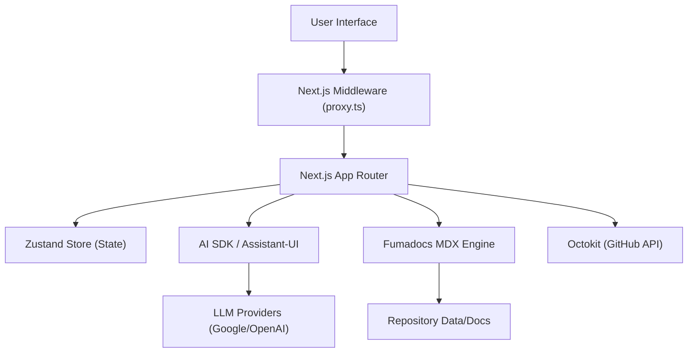

# Project Architecture

GitDex is built as a high-performance client designed to bridge the gap between repository data, AI-driven analysis, and interactive documentation. The architecture leverages a modern Next.js 16 stack with a heavy emphasis on extensible MDX rendering and AI-integrated user interfaces.

## High-Level System Flow

The client operates as a coordinated layer between the end-user and multiple data providers (GitHub API and AI LLMs). The following diagram illustrates the request and data flow:

## Core Component Pillars

### 1. The AI Interface Layer
GitDex utilizes a sophisticated AI integration strategy to provide an interactive assistant experience. 
- **Engine**: Powered by the `ai` SDK and `@ai-sdk/react`, supporting both Google and OpenAI-compatible providers.
- **UI Framework**: `@assistant-ui` provides the structural components for the chat interface, ensuring a seamless transition between prompt input and AI response.
- **Rendering**: AI responses are processed through `@assistant-ui/react-markdown`, allowing the assistant to render rich technical content.

### 2. Documentation & Content Pipeline
The project employs a robust MDX pipeline for rendering technical documentation and repository insights.
- **Fumadocs**: The core documentation framework (`fumadocs`, `fumadocs-ui`) handles the routing and layout of MDX content.
- **Parsing Pipeline**: 
  - **Remark**: Handles the Markdown AST, including `remark-gfm` for GitHub Flavored Markdown and `remark-math` for mathematical notations.
  - **Rehype**: Manages the HTML AST, utilizing `rehype-katex` for rendering LaTeX.
- **Custom Extensions**: `source.config.ts` integrates `remarkMdxMermaid`, enabling the rendering of complex architectural diagrams directly from MDX source files.

### 3. Request Orchestration (Proxy)
To maintain context and handle routing efficiently, GitDex implements a middleware proxy in `proxy.ts`.

The proxy intercepts incoming requests to inject critical metadata into the headers before they reach the application logic:
- **Pathname Injection**: It captures `request.nextUrl.pathname` and sets it as the `x-pathname` header.
- **Selective Routing**: The `config.matcher` ensures the proxy ignores static assets (`_next/static`), images, and API routes to optimize performance.

### 4. State and Visualization
For complex repository visualizations and global state:
- **State Management**: `zustand` is used for lightweight, scalable client-side state management.
- **3D & 2D Visualization**: 
  - **Three.js**: Used for high-dimensional repository mapping.
  - **SVG Pan-Zoom**: Integrated via `react-svg-pan-zoom` and `panzoom` to allow users to navigate large repository dependency graphs.
- **Search**: `flexsearch` and `fuse.js` provide fast, client-side indexing and fuzzy search capabilities across the documentation.

## Configuration Summary

| Feature | Implementation | Purpose |
| :--- | :--- | :--- |
| **Framework** | Next.js 16 + React 19 | Core application structure |
| **Styling** | Tailwind CSS 4.0 + Radix UI | Responsive, accessible design |
| **AI Integration** | Vercel AI SDK | LLM orchestration |
| **MDX Config** | `fumadocs-mdx` | Technical content rendering |
| **API Client** | `@octokit/rest` | GitHub repository interaction |