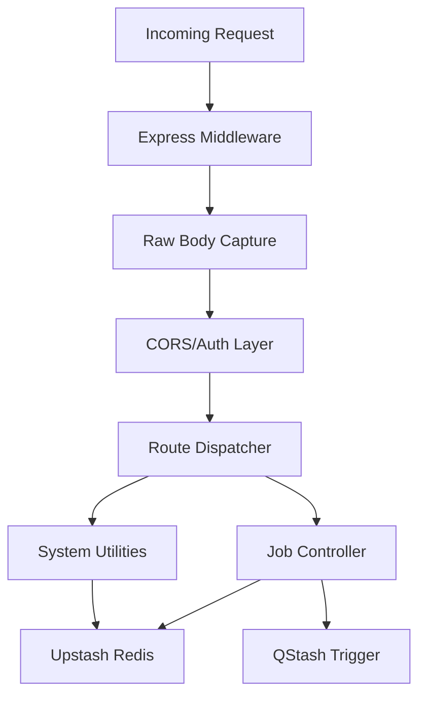

# Backend Core Engine

## System Role & Architectural Position

The Backend Core Engine serves as the authoritative orchestration layer for the GitDex ecosystem. It is a high-performance Node.js/Bun runtime environment responsible for mediating between the GitHub REST API, the Upstash Redis state store, and the Google Generative AI pipeline. 

Architecturally, the engine functions as a stateless API gateway that offloads heavy computation (repository indexing and LLM processing) to asynchronous workers via QStash, while maintaining synchronous control over job status and system configuration.

### Dependency Matrix & Runtime Specifications

| Component | Library / Tool | Technical Purpose | Criticality |
| :--- | :--- | :--- | :--- |
| **Runtime** | `Bun` | High-performance JS runtime with native TS support and fast module resolution. | Core |
| **Web Framework** | `Express 5.x` | Routing and middleware orchestration for RESTful endpoints. | Core |
| **State Store** | `@upstash/redis` | Distributed key-value store for job tracking, locking, and indexing state. | Core |
| **Job Queue** | `@upstash/qstash` | Serverless message queuing for asynchronous indexing pipelines. | High |
| **AI SDK** | `ai` / `@ai-sdk/google` | Unified interface for LLM interaction and streaming responses. | High |
| **Repo Processing** | `repomix` | Packing repository structures into LLM-optimized contexts. | High |
| **Git Integration** | `@octokit/rest` | Programmatic access to GitHub's REST API for source retrieval. | High |

---

## Core Execution & Data Flow Mechanics

The server operates on a request-response cycle optimized for serverless deployment on Vercel. A critical architectural constraint is the preservation of the raw request body to ensure the integrity of HMAC signatures used by QStash for webhook verification.

### Request Lifecycle Flow



### Execution Invariants
*   **Body Preservation:** The engine captures the raw buffer before JSON parsing. This is a non-negotiable requirement for `qstash` signature verification; once `express.json()` parses the body, the original byte sequence is lost, rendering cryptographic verification impossible.
*   **Statelessness:** All session and job state are persisted in Redis. The server maintains no local in-memory state, allowing horizontal scaling across Vercel's serverless functions.
*   **Asynchronous Handoff:** High-latency operations (indexing) are never performed in the request thread. The engine validates the request, persists a "pending" state in Redis, and dispatches a trigger to QStash.

---

## Implementation Deep Dive

### Server Initialization & Middleware Stack

The entry point configures the Express application with a focus on cross-origin resource sharing (CORS) and environment injection via `dotenv`.

```typescript title="server/index.ts"
import express, { Request, Response, NextFunction } from "express";
import dotenv from "dotenv";
import cors from "cors";
import { Redis } from '@upstash/redis';
import jobsRoutes from "./src/routes/jobsRoutes.js";

dotenv.config();
const app = express();

// CRITICAL: Capture the raw body BEFORE parsing JSON, so QStash signature verification works
app.use(express.text({ type: 'application/json' })); 

app.use(cors());
app.use("/api/jobs", jobsRoutes);

app.listen(process.env.PORT || 3000, () => {
  console.log(`GitDex Core Engine running on port ${process.env.PORT || 3000}`);
});
```

**Technical Analysis:**
1.  **`express.text({ type: 'application/json' })`**: This overrides the standard JSON parser. It forces Express to treat the JSON payload as a string, preserving the exact formatting required for signature checks.
2.  **Module Resolution**: The use of `.js` extensions in imports (e.g., `./src/routes/jobsRoutes.js`) adheres to ESM (ECMAScript Modules) standards, ensuring compatibility with the `type: "module"` definition in `package.json`.

### Redis State Management & Dev Utilities

The engine implements a manual "wipe" mechanism for development, utilizing Redis pattern matching to clear job locks and state.

```typescript title="server/index.ts"
// Development route to clear Redis jobs and locks
app.delete("/dev/clear-redis", async (req, res) => {
  const keys = await redis.keys("*");
  const jobKeys = keys.filter(k => k.includes("job:") || k.includes("lock:"));
  
  if (jobKeys.length > 0) {
    await redis.del(...jobKeys);
  }
  res.json({ deleted: jobKeys.length, keys });
});
```

**Technical Analysis:**
1.  **Pattern Matching**: The `redis.keys("*")` call identifies all active keys, which are then filtered by prefix (`job:`, `lock:`).
2.  **Atomic Deletion**: Using the spread operator `...jobKeys` with `redis.del` ensures that all identified state keys are removed in a single round-trip to the Upstash cluster.
3.  **Lock Removal**: Clearing `lock:` keys is essential to reset the "cooldown" period, allowing a repository to be re-indexed immediately during development cycles.

---

## Method / State Reference & Error Recovery

### Redis Key Schema

The Backend Core Engine utilizes a structured naming convention for keys in Upstash Redis to prevent collisions and facilitate bulk cleanup.

| Key Pattern | Data Type | TTL | Description |
| :--- | :--- | :--- | :--- |
| `job:{repo_id}` | Hash/JSON | 24h | Tracks indexing progress, status (pending/complete), and timestamps. |
| `lock:{repo_id}` | String | 1h | Prevents concurrent indexing requests for the same repository. |
| `tree:{owner}/{repo}` | JSON | Permanent | Stores the processed file tree mapping for the AI context. |

### Vercel Deployment Configuration

The `vercel.json` file defines the routing and runtime behavior for the serverless environment.

```json title="server/vercel.json"
{
  "version": 2,
  "builds": [
    {
      "src": "index.ts",
      "use": "@vercel/node"
    }
  ],
  "routes": [
    {
      "src": "/(.*)",
      "dest": "index.ts",
      "headers": {
        "Cache-Control": "no-store, must-revalidate"
      }
    }
  ]
}
```

**Configuration Breakdown:**
*   **`@vercel/node`**: Specifies the use of the Node.js runtime for the `index.ts` entry point.
*   **`Cache-Control: no-store`**: This header is critical for the `/api/jobs` endpoints. It prevents Vercel's Edge Network from caching job status responses, ensuring the frontend always receives the real-time state from Redis.
*   **Wildcard Routing**: `/(.*)` directs all incoming traffic to the Express application, allowing Express to handle the internal routing logic via `jobsRoutes`.

### Failure Modes & Recovery

| Failure Mode | Detection | Recovery Mechanism |
| :--- | :--- | :--- |
| **QStash Signature Mismatch** | 401 Unauthorized | Validation of `raw-body` capture logic and secret key alignment. |
| **Redis Connection Timeout** | 503 Service Unavailable | Exponential backoff implemented via `@upstash/redis` client. |
| **LLM Context Overflow** | AI SDK Error | Token counting via `js-tiktoken` and repomix filtering. |
| **Concurrent Indexing Collision** | 429 Too Many Requests | `lock:{repo_id}` check during the request pipeline entry. |