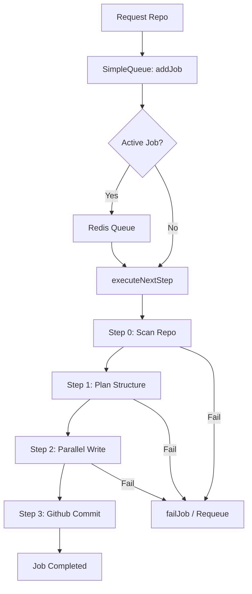

# Backend Core Engine

The Backend Core Engine is the central orchestration layer of GitDex, responsible for the end-to-end lifecycle of repository indexing, analysis, and documentation generation. It transforms a raw GitHub repository URL into a structured set of AI-generated technical documents committed back to the repository.

The engine is architected as a distributed state machine. It leverages a Redis-backed queue for job persistence and a recursive execution pipeline triggered via asynchronous webhooks (QStash). This design ensures that long-running AI processes do not block the main event loop and can recover from transient failures or server restarts without losing progress.

### Core Module Summary

| Component | Responsibility | Primary Dependencies |
| :--- | :--- | :--- |
| `SimpleQueue` | Manages job state, serialization, and concurrency locks in Redis. | `@upstash/redis` |
| `Pipeline` | Orchestrates the sequential and parallel steps of repo processing. | `repomix`, `@octokit/rest`, `js-tiktoken` |
| `JobData` | Interface defining the state and metadata of an indexing task. | N/A |
| `PipelineData` | Interface tracking the evolving state of code analysis and generated docs. | N/A |
| `QStash Client` | Handles the asynchronous triggering of the next pipeline step. | `@upstash/qstash` |

---

## Architecture, State & Data Flow

The Backend Core Engine operates on a "Trigger-Process-Schedule" loop. Instead of a single long-lived process, each stage of the pipeline is a discrete execution unit.

### Job Lifecycle Flow

1.  **Ingestion**: A request to index a repository enters `SimpleQueue.addJob()`.
2.  **Serialization**: The queue ensures only one global job is active at a time to prevent resource exhaustion, though individual steps within a job can run in parallel.
3.  **Execution**: The `executeNextStep` function acts as the dispatcher, reading the `currentStep` from the `JobData` and routing it to the appropriate logic.
4.  **State Transition**: As each step completes, the pipeline updates the `JobData` in Redis and uses QStash to trigger the next step with a calculated delay.
5.  **Parallelization**: During the "Write" phase, the engine spawns multiple concurrent workers (defined by `PIPELINE_CONCURRENCY`) to generate different documentation sections simultaneously.



### Data Transformation Pipeline

The engine manages a `PipelineData` object that evolves through the following transformations:
- **Raw Repository** $\rightarrow$ **Filtered File List**: `scanRepository` filters noise and samples files to fit AI context windows.
- **File List** $\rightarrow$ **TOC (Table of Contents)**: `planStructure` uses the AI to create a logical map of `TocEntry` objects.
- **TOC + Code** $\rightarrow$ **Generated MDX**: `writeSingleSection` converts specific code clusters into detailed documentation.
- **MDX Files** $\rightarrow$ **GitHub Commit**: `commitToGithub` pushes the final artifacts to the target branch.

---

## In-Depth Code Walkthrough & Implementation Details

### 1. Job Serialization and Self-Healing
The `SimpleQueue` implements a strict locking mechanism to prevent multiple indexing runs for the same repository and to handle "stuck" jobs.

```typescript title="server/src/queue.ts"
async addJob(repoUrl: string, force = false): Promise<string> {
    const { owner, repo } = this.parseRepoUrl(repoUrl);
    const jobId = this.getJobId(owner, repo);
    const lockKey = this.getLockKey(owner, repo);

    // Global check for stuck jobs
    await this.healStuckJobs();

    if (!force) {
        const existingJob = await this.getJob(jobId, true);
        if (existingJob && (existingJob.state === 'processing' || existingJob.state === 'queued')) {
            return jobId; // Already in flight
        }
    }

    await redis.set(lockKey, 'locked', { ex: 3600 }); // 1 hour TTL
    const newJob: JobData = {
        id: jobId,
        state: 'queued',
        repoUrl, owner, repo,
        createdAt: Date.now(),
        updatedAt: Date.now(),
        currentStep: 0
    };
    await redis.set(`job:${jobId}`, JSON.stringify(newJob));
    await redis.lpush('job_queue', jobId);
    
    await this.triggerNextJob();
    return jobId;
}
```

**Mechanics:**
- **Locking**: A Redis key is set with a 1-hour TTL (`ex: 3600`). This prevents the same repo from being queued multiple times by different users simultaneously.
- **Self-Healing**: `healStuckJobs` scans for jobs in the `processing` state whose `updatedAt` timestamp is older than `COOLDOWN_MS` (1 hour). If found, it resets them to `queued` and pushes them back to the front of the list.
- **Atomic Queue**: Uses `lpush` to maintain a First-In-First-Out (FIFO) processing order.

### 2. The Pipeline Dispatcher
`executeNextStep` is the core state machine. It determines which function to run based on the current state of the job.

```typescript title="server/src/pipeline.ts"
export async function executeNextStep(jobId: string, sectionIndex?: number) {
    const job = await queue.getJob(jobId);
    if (!job) return;

    let data: PipelineData = job.data ? JSON.parse(job.data) : { 
        files: [], toc: [], generatedFiles: [], sectionsWritten: 0 
    };

    try {
        if (sectionIndex !== undefined) {
            // Parallel Write Phase
            await writeSingleSection(job, data, sectionIndex);
            await queue.updateJob(jobId, { 
                data: JSON.stringify(data), 
                updatedAt: Date.now() 
            });
            
            if (data.sectionsWritten === data.toc.length) {
                await triggerNextStep(jobId, undefined); // Move to commit phase
            }
        } else {
            // Sequential Phases
            switch (job.currentStep) {
                case 0: await scanRepository(job, data); break;
                case 1: await planStructure(job, data); break;
                case 2: 
                    // Trigger parallel workers
                    for (let i = 0; i < data.toc.length; i++) {
                        await triggerNextStep(jobId, i);
                    }
                    return; // Exit since workers take over
                case 3: await commitToGithub(job, data); break;
            }
            await triggerNextStep(jobId);
        }
    } catch (error) {
        await queue.failJob(jobId, error.message);
    }
}
```

**Mechanics:**
- **Branching Logic**: The function distinguishes between "sequential steps" (Scan $\rightarrow$ Plan $\rightarrow$ Commit) and "parallel steps" (Writing sections).
- **State Persistence**: The `PipelineData` object is serialized into a JSON string and stored in Redis after every significant update to ensure that if the process crashes, it can resume from the last successful section.
- **Parallel Transition**: In `case 2`, the loop triggers multiple QStash events (one per section in the TOC). The `sectionsWritten` counter tracks completion before transitioning to the commit phase.

### 3. AI Context Management via Repomix
To avoid exceeding AI token limits while providing sufficient context, the engine uses `repomix` for code compression.

```typescript title="server/src/pipeline.ts"
async function compressCodeWithRepomix(path: string, content: string): Promise<string> {
    const config = mergeConfigs({
        output: { filePath: '/tmp/repomix.txt' },
        include: [path],
        // ... other config
    });
    const result = await processFiles(config);
    return result.output; 
}
```

**Mechanics:**
- **Targeted Compression**: Instead of sending the entire repo, the engine identifies "relevant files" for a specific TOC section and passes only those to Repomix.
- **Token Optimization**: Repomix packs the code into a concise format that minimizes boilerplate while preserving directory structure, which is critical for the AI to understand file relationships.

---

## API / Method Reference

### `SimpleQueue` Class
| Method | Parameters | Returns | Description |
| :--- | :--- | :--- | :--- |
| `addJob` | `repoUrl: string, force?: boolean` | `Promise<string>` | Creates a job, sets the lock, and adds it to the Redis queue. |
| `getJob` | `jobId: string, bypassSelfHealing?: boolean` | `Promise<JobData \| null>` | Retrieves job state; optionally triggers self-healing if the job is timed out. |
| `updateJob` | `jobId: string, updates: Partial<JobData>` | `Promise<void>` | Updates specific fields in the Redis job store. |
| `completeJob`| `jobId: string` | `Promise<string \| null>` | Marks job as completed and triggers the next job in the queue. |
| `failJob` | `jobId: string, error: string` | `Promise<string \| null>` | Marks job as failed and triggers the next job in the queue. |
| `acquireStepLock`| `jobId: string, sectionIndex?: number`| `Promise<boolean>` | Sets a 60s Redis lock for a specific section to prevent concurrent writes. |
| `releaseStepLock`| `jobId: string, sectionIndex?: number`| `Promise<void>` | Removes the step lock. |

### Pipeline Functions
| Function | Parameters | Returns | Description |
| :--- | :--- | :--- | :--- |
| `scanRepository` | `job: JobData, data: PipelineData` | `Promise<void>` | Uses Octokit to list files, samples them, and populates `data.files`. |
| `planStructure` | `job: JobData, data: PipelineData` | `Promise<void>` | AI analyzes the file list to generate the `TocEntry[]`. |
| `writeSingleSection`| `job: JobData, data: PipelineData, idx: number` | `Promise<void>` | Generates documentation for one TOC entry using AI. |
| `commitToGithub` | `job: JobData, data: PipelineData` | `Promise<void>` | Commits all `generatedFiles` to the GitHub repository. |

---

## Error Handling, Edge Cases & Performance

### Distributed Locking & Concurrency
The engine solves the "Double Processing" problem at two levels:
1.  **Repository Level**: The `lockKey` (`owner/repo`) prevents two users from starting the indexing process for the same repository simultaneously.
2.  **Step Level**: `acquireStepLock` uses Redis NX with a 60-second TTL. This ensures that if two parallel workers accidentally try to update the same `PipelineData` state, one will fail and can be retried, preventing race conditions during JSON serialization.

### Failure Recovery
- **Stuck Job Healing**: If a server crashes during the "Processing" state, the job remains in Redis. The `healStuckJobs` logic identifies these via the `updatedAt` timestamp and automatically requeues them.
- **QStash Fallback**: If the QStash trigger fails, the `requeueJob` method manually pushes the job back to the front of the Redis queue, ensuring the pipeline eventually completes.
- **AI Retries**: The `generateWithRetry` wrapper (called within the pipeline) handles rate limits (429) and transient AI API errors with exponential backoff.

### Performance Optimizations
- **Round-Robin Sampling**: In `scanRepository`, files are grouped by top-level directory. The engine samples files from each group rather than taking the first $N$ files, ensuring the AI sees a representative slice of the entire codebase.
- **Staggered Execution**: Parallel workers are triggered with staggered delays in QStash to avoid hitting AI rate limits instantly.
- **Memory Efficiency**: The engine does not hold the full repository in memory; it stores the `PipelineData` in Redis and only loads the specific files needed for the current section being processed.