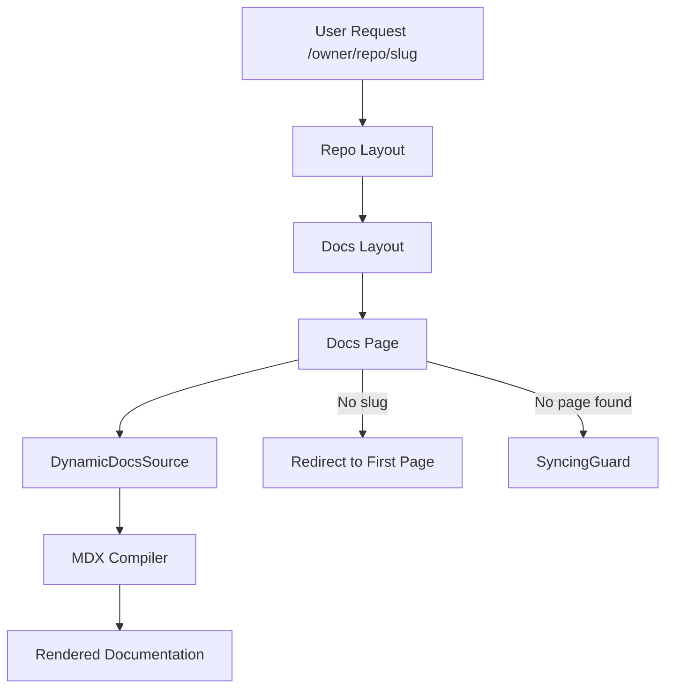

# Core Application Logic

GitDex employs a highly dynamic routing architecture powered by Next.js App Router to transform any GitHub repository into a structured documentation site on the fly. The core logic is distributed across nested layouts and a catch-all page segment.

## Routing Architecture

The application uses a deeply nested dynamic route structure: `/[owner]/[repo]/[[...slug]]`. This allows the platform to handle an arbitrary number of repositories and nested documentation paths without predefined routes.

## Layout Hierarchy

### 1. Repository Root Layout
The top-level layout (`/app/[owner]/[repo]/layout.tsx`) serves as the global wrapper for a specific repository's context. Its primary responsibilities are:
- **Visual Branding**: Applying a consistent serif font to the repository view.
- **Global Components**: Injecting the `AssistantModal`, which provides AI-powered context-aware help based on the current `owner` and `repo`.
- **Loading State**: Providing a fallback spinner while the child segments are resolving.

### 2. Documentation Layout
The nested layout (`/app/[owner]/[repo]/[[...slug]]/layout.tsx`) integrates with `fumadocs-ui` to provide the standard documentation interface.
- **Source Initialization**: It instantiates `DynamicDocsSource` to fetch and build the `pageTree`.
- **Sidebar Generation**: The `pageTree` is passed to the `DocsLayout`, enabling a dynamic sidebar that reflects the actual structure of the repository's indexed content.
- **Administrative Actions**: It embeds a `ReindexButton`, allowing users to trigger a refresh of the repository's documentation index.

## Page Resolution & Rendering

The catch-all page (`/app/[owner]/[repo]/[[...slug]]/page.tsx`) manages the lifecycle of a single documentation page.

### Dynamic Resolution Logic
1. **Root Redirect**: If the `slug` is empty, the system identifies the first available page via `source.getFirstPage()` and redirects the user to ensure they never land on an empty root.
2. **Content Retrieval**: It uses `DynamicDocsSource` to fetch the raw content associated with the current slug.
3. **Guard State**: If a page is not yet available (e.g., during an initial crawl), the `SyncingGuard` component is rendered to notify the user.

### The MDX Pipeline
To ensure stability and clean rendering, the content passes through a specialized pipeline:

- **Frontmatter Stripping**: The `stripFrontmatter` utility recursively removes YAML frontmatter blocks. This prevents the JSX parser from crashing when the AI-generated content contains redundant or malformed metadata blocks.
- **TOC Generation**: The `getTableOfContents` utility analyzes the stripped MDX to generate a navigational Table of Contents.
- **Compilation**: The `compiler.compile` method transforms raw MDX strings into executable React components.
- **Component Injection**: `getMDXComponents` is used to map standard MDX elements to custom, themed UI components.

## Performance and Caching
The system is configured for high volatility to support real-time updates:
- `export const dynamic = 'force-dynamic'`: Ensures that updates to the repository index are reflected immediately.
- `export const revalidate = 0`: Disables static caching for these routes, ensuring that `DynamicDocsSource` always fetches the latest state from the backend.