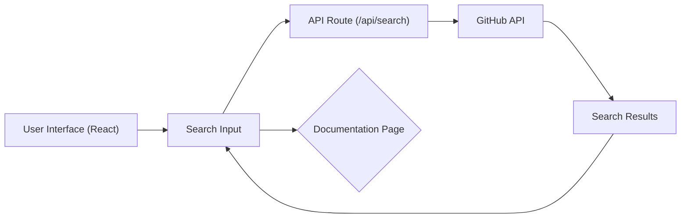

# Frontend Architecture

This document provides a detailed overview of the frontend architecture of GitDex, a tool designed to generate and explore documentation for GitHub repositories. It covers the key components, technologies used, and integration points that contribute to the application's functionality and user experience.

## Overview

The frontend is built using Next.js, a React framework that enables features like server-side rendering, static site generation, and API routes.  TypeScript is used for type safety and improved code maintainability. The UI components are styled with Tailwind CSS, a utility-first CSS framework, enhanced with custom themes. Fumadocs is used as a documentation theme, with added search functionality, and provides a clean, user-friendly interface for displaying generated documentation.

## Key Components

*   **Layout (client/src/app/layout.tsx):** The root layout component that wraps the entire application. It sets up the basic HTML structure, includes global styles, and initializes the theme provider.
*   **Home Page (client/src/app/page.tsx):** The main landing page, featuring a search input for GitHub repositories, suggestions, and featured documentation.
*   **UI Components (client/src/components/ui):** Reusable UI elements built with Radix UI and styled with Tailwind CSS. This includes buttons, inputs, cards, and other interactive elements.
*   **Background (client/src/components/bg/index.tsx):** An animated background element using a faulty terminal effect, implemented with custom WebGL shaders.

## Technologies Used

| Technology    | Purpose                                          |
| :------------ | :----------------------------------------------- |
| Next.js       | React framework for building web applications     |
| TypeScript    | Typed superset of JavaScript for code safety    |
| Tailwind CSS  | Utility-first CSS framework for styling          |
| Fumadocs      | Documentation theme, and component library       |
| Lucide React  | Icon library                                     |
| next-themes   | Theme provider for switching between light/dark modes |

## Core Files and Functionality

### 1. Root Layout (client/src/app/layout.tsx)

The `RootLayout` component serves as the entry point for the frontend application. It defines the basic structure of the HTML page, including metadata, fonts, and the theme provider.

```typescript
// client/src/app/layout.tsx
import type { Metadata } from 'next';
import './globals.css';
import { ThemeProvider } from 'next-themes';
import { RootProvider } from 'fumadocs-ui/provider';
import { MozillaHeadline, MozillaText } from './fonts';

export const metadata: Metadata = {
  title: 'GitDex - AI-Powered Documentation for GitHub Repositories',
  description: 'Transform any GitHub repository into beautiful, interactive documentation in seconds',
};

export default function RootLayout({
  children,
}: {
  children: React.ReactNode;
}) {
  return (
    <html lang="en" suppressHydrationWarning>
      <body className={` ${MozillaHeadline.variable} ${MozillaText.variable}`}>
        <ThemeProvider
          attribute="class"
          defaultTheme="system"
          enableSystem
          disableTransitionOnChange
        >
          <RootProvider
            search={{
              enabled: false,
            }}>
            {children}
          </RootProvider>
        </ThemeProvider>
      </body>
    </html>
  );
}
```

This component initializes the `ThemeProvider` from `next-themes` to enable dark mode support.  It also uses the `RootProvider` from `fumadocs-ui` which sets up the Fumadocs documentation theme.  The `metadata` object configures the title and description of the webpage.

[View on GitHub](https://github.com/shinymack/gitdex/blob/main/client/src/app/layout.tsx)

### 2. Home Page (client/src/app/page.tsx)

The `HomePage` component is the main entry point for users. It provides a search interface to find GitHub repositories and view their documentation.

```typescript
// client/src/app/page.tsx
'use client';

import { useState, useEffect, useCallback, useRef } from 'react';
import { Button } from '@/src/components/ui/button';
import { Input } from '@/src/components/ui/input';
import { Search, Zap, AlertCircle } from 'lucide-react';
import { validateGitHubUrl } from '@/lib/validation';

export default function HomePage() {
  const [query, setQuery] = useState('');
  const [isLoading, setIsLoading] = useState(false);
  const [error, setError] = useState('');

  const handleSubmit = async () => {
      setError('');
      const input = query;
      const fullUrl = input.includes('github.com') ? input : `https://github.com/${input}`;
      const validation = validateGitHubUrl(fullUrl);
      if (!validation.valid) {
          setError(validation.error || 'Invalid GitHub URL format');
          return;
      }

      setIsLoading(true);

      try {
          const urlParts = input.split('/');
          const owner = urlParts[urlParts.length - 2];
          const repo = urlParts[urlParts.length - 1].replace('.git', '');
          window.location.href = `/docs/${owner}/${repo}/status`;
      } catch (err) {
          setError(err instanceof Error ? err.message : 'Failed to check status');
      } finally {
          setIsLoading(false);
      }
  };

  return (
    <div>
      <Input
        placeholder="owner/repo"
        value={query}
        onChange={(e) => setQuery(e.target.value)}
        disabled={isLoading}
      />
      <Button onClick={handleSubmit} disabled={isLoading || !query.trim()}>
        {isLoading ? (
          <>
            <div className="w-4 h-4 animate-spin rounded-full border-2 border-current border-t-transparent"></div>
            Checking...
          </>
        ) : (
          <>
            <Zap className="w-4 h-4" />
            Go to Docs
          </>
        )}
      </Button>
      {error && (
        <div>
          <AlertCircle className="w-4 h-4" />
          {error}
        </div>
      )}
    </div>
  );
}
```

This component includes state management for the search query, loading state, and error messages. The `handleSubmit` function validates the input, extracts the owner and repository name, and redirects the user to the documentation page.

[View on GitHub](https://github.com/shinymack/gitdex/blob/main/client/src/app/page.tsx)

### 3. Tailwind CSS Configuration (client/tailwind.config.ts)

Tailwind CSS is configured to use custom colors, fonts, and breakpoints. The `tailwind.config.ts` file defines the theme and plugins used in the project.

```typescript
// client/tailwind.config.ts
import type { Config } from "tailwindcss"
import tailwindcssanimate from "tailwindcss-animate";

const config: Config = {
    darkMode: "class",
    content: [
        './pages/**/*.{ts,tsx}',
        './components/**/*.{ts,tsx}',
        './app/**/*.{ts,tsx}',
        './src/**/*.{ts,tsx}',
    ],
    prefix: "",
    theme: {
        extend: {
            fontFamily: {
                headline: ['var(--font-mzh)', 'sans-serif'],
                text: ['var(--font-mzt)', 'serif'],
            },
            colors: {
                border: "hsl(var(--border))",
                background: "hsl(var(--background))",
                foreground: "hsl(var(--foreground))",
                primary: {
                    DEFAULT: "hsl(var(--primary))",
                    foreground: "hsl(var(--primary-foreground))",
                },
                muted: {
                    DEFAULT: "hsl(var(--muted))",
                    foreground: "hsl(var(--muted-foreground))",
                },
                destructive: {
                    DEFAULT: "hsl(var(--destructive))",
                    foreground: "hsl(var(--destructive-foreground))",
                },
                accent: {
                    DEFAULT: "hsl(var(--accent))",
                    foreground: "hsl(var(--accent-foreground))",
                },
            },
        },
    },
    plugins: [tailwindcssanimate],
}

export default config;
```

This configuration file extends the default Tailwind CSS theme with custom fonts and colors, enabling a consistent and visually appealing design across the application. It also includes the `tailwindcss-animate` plugin for adding animations.

[View on GitHub](https://github.com/shinymack/gitdex/blob/main/client/tailwind.config.ts)

### 4. TypeScript Configuration (client/tsconfig.json)

The `tsconfig.json` file configures the TypeScript compiler options for the project.

```json
// client/tsconfig.json
{
  "compilerOptions": {
    "target": "ES2017",
    "lib": ["dom", "dom.iterable", "esnext"],
    "allowJs": true,
    "skipLibCheck": true,
    "strict": true,
    "noEmit": true,
    "esModuleInterop": true,
    "module": "esnext",
    "moduleResolution": "bundler",
    "resolveJsonModule": true,
    "isolatedModules": true,
    "jsx": "preserve",
    "incremental": true,
    "plugins": [
      {
        "name": "next"
      }
    ],
    "paths": {
      "@/*": ["./*"]
    }
  },
  "include": ["next-env.d.ts", "**/*.ts", "**/*.tsx", ".next/types/**/*.ts"],
  "exclude": ["node_modules"]
}
```

This file specifies the compiler options, such as the target ECMAScript version, included libraries, and module resolution strategy. It also configures path aliases for easier importing of modules.

[View on GitHub](https://github.com/shinymack/gitdex/blob/main/client/tsconfig.json)

### 5. GitHub Repository Search (client/src/app/page.tsx)

The `HomePage` component uses an API route to search for GitHub repositories. The `searchRepos` function fetches data from the `/api/search` endpoint, which proxies the GitHub API.

```typescript
// client/src/app/page.tsx
const searchRepos = useCallback(async (q: string) => {
  if (q.length < 1) {
    setSuggestions([]);
    return;
  }

  try {
    const res = await fetch(`/api/search?q=${encodeURIComponent(q)}`);
    if (!res.ok) throw new Error('Search failed');
    const data = await res.json();
    setSuggestions(data.items || []);
  } catch (err) {
    console.error('Search error:', err);
    setSuggestions([]);
  }
}, []);
```

This function debounces the search query to reduce the number of API calls. It updates the `suggestions` state with the search results.

[View on GitHub](https://github.com/shinymack/gitdex/blob/main/client/src/app/page.tsx)

### 6. Faulty Terminal Background (client/src/components/bg/index.tsx)

The `MemoizedFaultyTerminal` component generates an animated background using WebGL shaders, simulating a faulty terminal effect.

```typescript
// Placeholder - content for this file is extensive and primarily GLSL shader code
// Check the actual repo for details.
```

This component adds a visually appealing and unique background to the landing page, enhancing the user experience.

## Mermaid Diagrams

### Frontend Component Interaction





This diagram illustrates the flow of data when a user searches for a GitHub repository.

## Key Integration Points

*   **Next.js API Routes:** Used to create serverless functions for handling API requests, such as searching for repositories and checking documentation status.
*   **Fumadocs Theme:** Provides a consistent and customizable design system for displaying documentation.
*   **GitHub API:** Integrated via API routes to fetch repository information and documentation.

## Best Practices

*   **Component-Based Architecture:** Reusable UI components are used throughout the application to ensure consistency and maintainability.
*   **Type Safety:** TypeScript is used to catch errors early and improve code quality.
*   **Utility-First CSS:** Tailwind CSS enables rapid styling and ensures a consistent design language.
*   **Asynchronous Data Fetching:**  `async/await` syntax is used for asynchronous operations to improve readability and error handling.

This architecture provides a solid foundation for building a scalable and maintainable frontend application for GitDex.
```