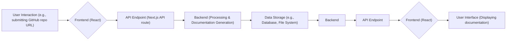

# Frontend Architecture

This document details the architecture of the client-side application for GitDex, focusing on its structure, key components, and integration points. GitDex uses a modern web development stack with Next.js, Tailwind CSS, and shadcn/ui to create a responsive and user-friendly interface for generating and exploring documentation for GitHub repositories.

## Overview

The frontend is built using React and Next.js, leveraging server-side rendering and static site generation capabilities for performance and SEO.  Tailwind CSS provides a utility-first approach to styling, ensuring consistency and maintainability.  shadcn/ui offers a set of pre-built, accessible UI components that accelerate development and ensure a polished user experience.

## Key Components and Structure

*   **Layout:** The `app/layout.tsx` file defines the root layout of the application, including global styles, themes, and providers.
*   **Components:** Reusable UI elements are organized within the `components` directory, leveraging shadcn/ui components.
*   **Styling:** Tailwind CSS configurations are managed in `tailwind.config.ts` and global styles are defined in `app/globals.css`.
*   **Utility Functions:**  Helper functions and utilities are located in the `lib` directory.

### `app/layout.tsx`: Root Layout

The `app/layout.tsx` file serves as the entry point for the application's UI. It defines the overall structure, incorporates global styles, and sets up providers for theming and other essential functionalities.

```typescript
// app/layout.tsx
import type { Metadata } from 'next';
import './globals.css';
import { ThemeProvider } from 'next-themes';
import { RootProvider } from 'fumadocs-ui/provider';
import { MozillaHeadline, MozillaText } from './fonts';

export const metadata: Metadata = {
  title: 'GitDex - AI-Powered Documentation for GitHub Repositories',
  description: 'Transform any GitHub repository into beautiful, interactive documentation in seconds',
};

export default function RootLayout({
  children,
}: {
  children: React.ReactNode;
}) {
  return (
    <html lang="en" suppressHydrationWarning>
      <body className={` ${MozillaHeadline.variable} ${MozillaText.variable}`}>
        <ThemeProvider
          attribute="class"
          defaultTheme="system"
          enableSystem
          disableTransitionOnChange
        >
          <RootProvider
            search={{
              enabled: false,
            }}>
            {children}
          </RootProvider>
        </ThemeProvider>
      </body>
    </html>
  );
}
```

This snippet shows the basic structure of the root layout. It imports necessary modules, defines metadata for SEO, and wraps the application's content with `ThemeProvider` for theming support and `RootProvider` (likely from `fumadocs-ui`) which may handle global state or configurations related to documentation rendering.  [View on GitHub](https://github.com/shinymack/gitdex/blob/main/client/src/app/layout.tsx)

### `components.json`: shadcn/ui Configuration

The `components.json` file configures the shadcn/ui component library. It specifies the style, rendering mode (RSC), and aliases for directories.

```json
{
  "$schema": "https://ui.shadcn.com/schema.json",
  "style": "new-york",
  "rsc": true,
  "tsx": true,
  "tailwind": {
    "config": "",
    "css": "src/app/globals.css",
    "baseColor": "neutral",
    "cssVariables": true,
    "prefix": ""
  },
  "iconLibrary": "lucide",
  "aliases": {
    "components": "@/components",
    "utils": "@/lib/utils",
    "ui": "@/components/ui",
    "lib": "@/lib",
    "hooks": "@/hooks"
  },
  "registries": {}
}
```

This configuration ensures that components are generated with the specified style ("new-york"), utilize React Server Components (RSC), and are written in TypeScript. The `aliases` section maps commonly used directories for cleaner imports. [View on GitHub](https://github.com/shinymack/gitdex/blob/main/client/components.json)

### `tailwind.config.ts`: Tailwind CSS Configuration

The `tailwind.config.ts` file configures Tailwind CSS, defining custom colors, fonts, and other styling options.

```typescript
import type { Config } from "tailwindcss"
import tailwindcssanimate from "tailwindcss-animate";
const config: Config = {
    darkMode: "class",
    content: [
        './pages/**/*.{ts,tsx}',
        './components/**/*.{ts,tsx}',
        './app/**/*.{ts,tsx}',
        './src/**/*.{ts,tsx}',
    ],
    prefix: "",
    theme: {
        container: {
            center: true,
            padding: "2rem",
            screens: {
                "2xl": "1400px",
            },
        },
        extend: {
            fontFamily: {
                headline: ['var(--font-mzh)', 'sans-serif'],
                text: ['var(--font-mzt)', 'serif'],
            },
            colors: {
                // ... color definitions ...
            },
            borderRadius: {
                lg: "var(--radius)",
                md: "calc(var(--radius) - 2px)",
                sm: "calc(var(--radius) - 4px)",
            },
            keyframes: {
                // ... keyframe animations ...
            },
            animation: {
                // ... animation definitions ...
            },
        },
    },
    plugins: [tailwindcssanimate],
}

export default config;
```

This configuration enables dark mode, specifies the files to scan for Tailwind classes, defines custom font families, and extends the default theme with custom colors and animations. The `tailwindcss-animate` plugin is also included for smooth animations. [View on GitHub](https://github.com/shinymack/gitdex/blob/main/client/tailwind.config.ts)

### Fonts Configuration

The application utilizes custom fonts, MozillaHeadline and MozillaText. This is configured in the `app/layout.tsx` and defined (presumably) in `./fonts.ts`. This helps establish a unique visual identity.

```typescript
import { MozillaHeadline, MozillaText } from './fonts';

// ... Inside RootLayout Component ...

<body className={` ${MozillaHeadline.variable} ${MozillaText.variable}`}>
  {/* ... Rest of the code ... */}
</body>
```

The font variables are applied to the body element, making them available throughout the application via CSS variables. [View on GitHub](https://github.com/shinymack/gitdex/blob/main/client/src/app/layout.tsx)

## Frontend Data Flow





This diagram illustrates the general flow of data in the GitDex application. User interactions on the frontend trigger API calls to the backend, which processes data, generates documentation, and stores it. The frontend then retrieves and displays the generated documentation.

## Key Integration Points

The frontend interacts with the backend through API endpoints. These endpoints handle requests for generating documentation, retrieving documentation, and other data-related operations.  The `source.ts` file likely contains API call definitions or data fetching logic (though the file is empty in provided details, the name implies it's relevant to data retrieval).

### API Interaction Example (Hypothetical)

While `client/source.ts` is empty, let's assume it contains a function to fetch documentation:

```typescript
// client/source.ts (Hypothetical)
export async function fetchDocumentation(repoUrl: string) {
  const response = await fetch(`/api/documentation?repo=${repoUrl}`);
  if (!response.ok) {
    throw new Error('Failed to fetch documentation');
  }
  return await response.json();
}
```

This function would be used within a React component to initiate the documentation generation process.  [View on GitHub](https://github.com/shinymack/gitdex/blob/main/client/source.ts) (This link points to an empty file; adjust when content is available.)

## Best Practices

*   **Component-Based Architecture:**  Breaking down the UI into reusable components promotes maintainability and testability.
*   **Utility-First Styling:** Using Tailwind CSS encourages consistency and reduces the need for custom CSS.
*   **Type Safety:**  Leveraging TypeScript helps prevent errors and improves code quality.
*   **Asynchronous Data Fetching:** Use asynchronous functions (async/await) for making API calls to avoid blocking the UI thread.
*   **Error Handling:** Implement proper error handling to gracefully handle unexpected issues during API calls or data processing.
```