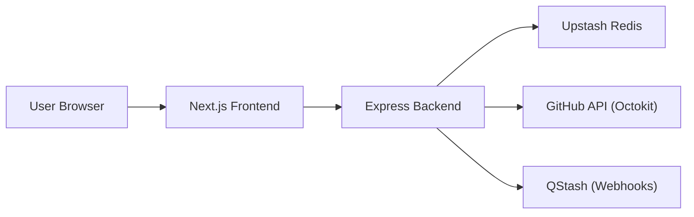

# High-Level Architecture

GitDex utilizes a decoupled architecture consisting of a Next.js frontend and a TypeScript-based Express backend. The system is designed for serverless deployment on Vercel, utilizing external managed services for state management (Redis) and data sourcing (GitHub API).

## System Interaction Overview

The architecture follows a client-server model where the Next.js frontend serves as the user interface and the Express backend acts as the orchestration layer for repository analysis and documentation generation.



## Frontend Architecture

The frontend is built with **Next.js**, employing the App Router for routing and layout management. The root of the application is defined in `client/src/app/layout.tsx`, which establishes the global context and styling for the entire platform.

### Core Providers and Wrappers
The application wraps its content in several critical providers to manage state and appearance:

| Provider | Source | Purpose |
| :--- | :--- | :--- |
| `ThemeProvider` | `next-themes` | Manages light/dark/system color modes. |
| `RootProvider` | `fumadocs-ui` | Provides the foundation for documentation rendering and search. |
| `Toaster` | `sonner` | Handles global notification alerts. |

### Global Layout Configuration
The layout incorporates custom fonts (`MozillaHeadline`, `MozillaText`) and integrates KaTeX for mathematical notation rendering.

```tsx
// Example from client/src/app/layout.tsx
<RootProvider search={{ enabled: false }}>
  {children}
  <Toaster />
</RootProvider>
```

## Backend Architecture

The backend is a TypeScript application powered by **Express**, structured to handle API requests, job orchestration, and external integrations.

### Middleware Pipeline
The server implements a specific middleware sequence to ensure security and observability:

1.  **Request Logging**: A custom middleware that tracks the start time of requests and logs the method, URL, status code, and duration upon completion.
2.  **CORS**: Configured to allow requests only from trusted `CLIENT_URLS` specified in the environment variables.
3.  **Raw Body Capture**: A critical JSON parsing configuration that preserves the `rawBody` buffer, enabling the verification of signatures for incoming QStash webhooks.

### API Structure
The backend organizes its surface area into functional route groups:

| Route Path | Description | Access |
| :--- | :--- | :--- |
| `/api` | Core jobs and processing routes (via `jobsRoutes`) | Public/Authenticated |
| `/health` | Simple health check returning `{ status: "ok" }` | Public |
| `/api/dev/clear` | Wipes Redis job, lock, and system keys | Development Only |
| `/api/dev/delete` | Deletes documentation files from GitHub and clears Redis keys | Development Only |

## Integration Layer

The backend interacts with two primary external services to maintain state and manage data:

### 1. Upstash Redis
Redis is used as a distributed lock and job state store. The backend manages several key patterns:
- `job:*`: Tracks the progress of repository indexing.
- `lock:*` and `lock:step:*`: Prevents concurrent processing of the same repository.
- `last_indexed:*`: Stores the timestamp of the last successful index.

### 2. GitHub API (Octokit)
The system uses `@octokit/rest` to programmatically manage documentation. In development mode, the server can perform complex Git operations, including:
- Fetching the repository tree (`getTree`).
- Creating new trees and commits to delete existing documentation paths.
- Updating repository references (`updateRef`) to commit changes to the `main` branch.

## Deployment Configuration

The project is configured for Vercel deployment using `server/vercel.json`. This ensures the TypeScript backend is handled by the `@vercel/node` runtime.

```json
{
  "version": 2,
  "builds": [
    {
      "src": "index.ts",
      "use": "@vercel/node"
    }
  ],
  "routes": [
    {
      "src": "/(.*)",
      "dest": "index.ts",
      "headers": {
        "Cache-Control": "no-store, must-revalidate"
      }
    }
  ]
}
```

This routing configuration forces all incoming requests to the backend to be handled by `index.ts` and disables caching to ensure that job status and health checks provide real-time data.