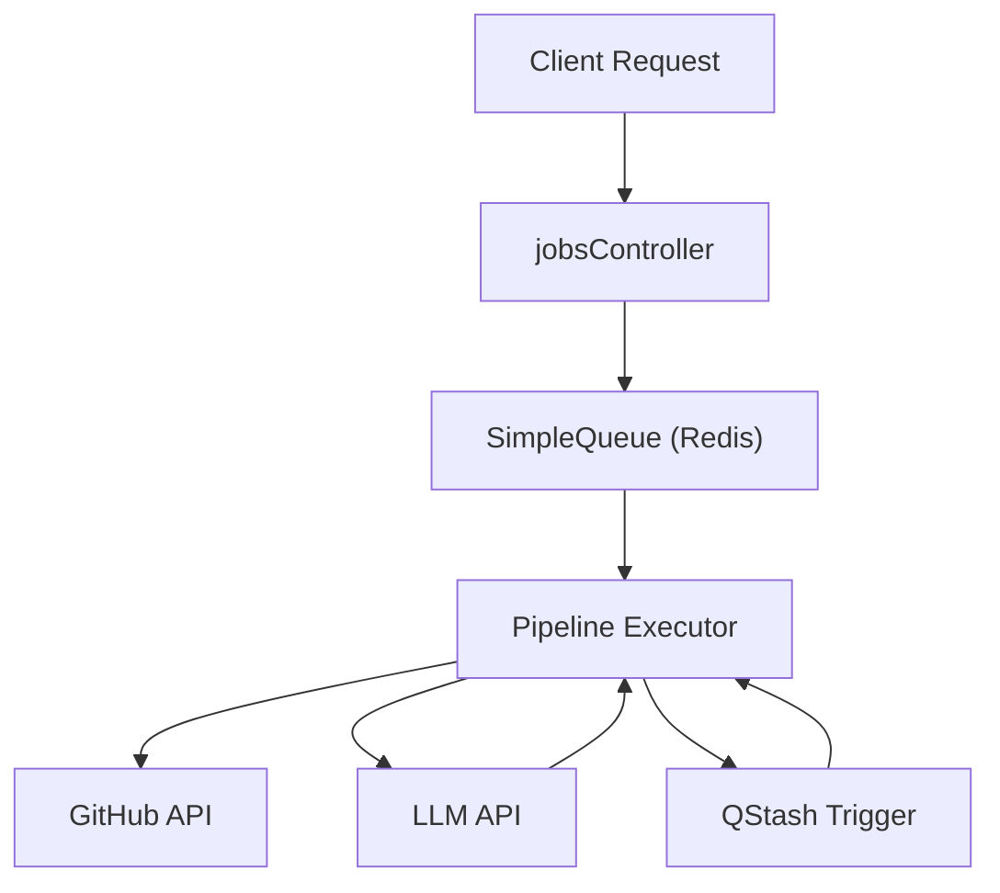

# Indexing Engine

The Indexing Engine is the core orchestration layer of GitDex. It transforms a raw GitHub repository into a structured documentation site by scanning the codebase, planning a documentation hierarchy, generating content via LLMs, and committing the resulting Markdown files back to the repository.

## Architectural Overview

The engine operates as an asynchronous pipeline managed by a Redis-backed queue. To prevent server timeouts and handle the long-running nature of AI generation, it utilizes a "step-trigger" pattern via Upstash QStash, where each stage of the pipeline triggers the next via an HTTP webhook.



## Job Queue & State Management

The `SimpleQueue` class ensures strict serialization of indexing jobs to prevent race conditions and API rate limiting. It uses Redis for both state persistence and distributed locking.

### Job Data Structure

All job metadata is stored in Redis using the `JobData` interface.

```typescript title="server/src/queue.ts"
export type JobState = 'queued' | 'processing' | 'completed' | 'failed';

export interface JobData {
    id: string;
    state: JobState;
    repoUrl: string;
    owner: string;
    repo: string;
    createdAt: number;
    updatedAt: number;
    error?: string | null;
    currentStep: number;
    data?: string | null;
}
```

### Concurrency and Locking

GitDex employs a multi-layer locking mechanism to handle job lifecycle and crashes:
1. **Redis Lock Key**: A key with a 1-hour TTL created at job initiation.
2. **Update Timestamp**: The `updatedAt` field is checked during `getJob` calls to detect "stuck" jobs (self-healing).
3. **Strict Serialization**: The `addJob` method uses the Redis `NX` (set-if-not-exists) command to ensure only one active pipeline runs globally.

```typescript title="server/src/queue.ts"
async addJob(repoUrl: string, force = false): Promise<string> {
    // ... validation and lock checks
    if (await this.isJobRunning()) {
        // A job is already running. Add to queue list and wait.
        await redis.lpush(`queue:waiting`, jobId);
        return jobId;
    }
    // No active job! Start immediately.
    await redis.set(`lock:active`, jobId, { ex: 3600 });
    // ...
}
```

## The Ingestion Pipeline

The pipeline is implemented as a state machine in `pipeline.ts`. The `executeNextStep` function determines the current phase of the job and routes it to the appropriate handler.

### Pipeline Workflow

| Step | Function | Description |
| :--- | :--- | :--- |
| 0 | `scanRepository` | Recursively lists files, filters noise, and groups by directory. |
| 1 | `planStructure` | LLM analyzes codebase to generate a Table of Contents (TOC). |
| 2 | `writeSingleSection` | Parallel workers generate content for each TOC entry. |
| 3 | `commitToGithub` | Aggregates all generated files and pushes a single commit to the repo. |

### Parallel Generation Logic

To optimize performance, GitDex does not generate documentation sequentially. Once the structure is planned, it triggers multiple parallel QStash workers based on the `PIPELINE_CONCURRENCY` setting.

```typescript title="server/src/pipeline.ts"
// Trigger initial parallel workers with staggered QStash delays
for (let i = 0; i < data.toc.length; i++) {
    const delay = i * 1000; // Stagger to avoid LLM bursts
    await triggerNextStep(job.id, i, delay);
}
```

### Code Compression with Repomix

To fit large repositories into LLM context windows, the engine uses `repomix` to pack relevant source files into a concise, AI-optimized format.

```typescript title="server/src/pipeline.ts"
async function compressCodeWithRepomix(path: string, content: string): Promise<string> {
    const { processFiles } = await import("repomix");
    // Compresses the filtered file list into a single structured string
    const result = await processFiles({
        files: content, 
        // configuration for ignoring patterns etc.
    });
    return result.output;
}
```

## GitHub Integration

The engine interacts with the GitHub REST API via `@octokit/rest`. It performs two primary operations:
1. **Read**: Scanning the repository tree to identify source files.
2. **Write**: Creating or updating files in the designated documentation path.

The `commitToGithub` function performs a "cleanup" pass, comparing the current repository tree with the newly generated documentation to delete stale files from previous indexing runs.

## API Endpoints

The following routes manage the indexing lifecycle:

| Endpoint | Method | Controller Function | Description |
| :--- | :--- | :--- | :--- |
| `/api/jobs/create` | `POST` | `createJob` | Validates repo and adds it to the queue. |
| `/api/jobs/status/:id`| `GET` | `getJobStatus` | Returns current state and progress. |
| `/api/jobs/heal` | `POST` | `cronHeal` | Triggers `healStuckJobs` to clear crashed locks. |
| `/api/jobs/execute` | `POST` | `executeNextStep` | QStash webhook entry point for pipeline transitions. |

### Error Handling and Recovery

If a step fails, the system invokes `failJob`, which marks the job as `failed` and immediately triggers the next job in the Redis `waiting` list to ensure the pipeline doesn't stall.

```typescript title="server/src/queue.ts"
async failJob(jobId: string, error: string): Promise<string | null> {
    await this.updateJob(jobId, { state: 'failed', error });
    if (await this.isActiveJob(jobId)) {
        // If the failing job was the active job, trigger the next one!
        return this.triggerNextJob();
    }
    return null;
}