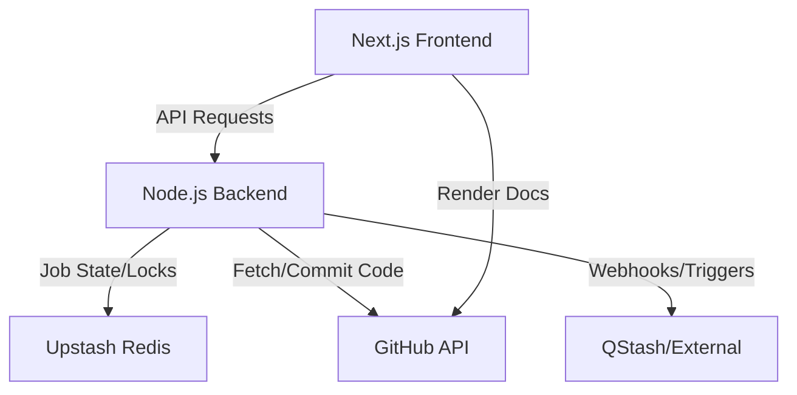
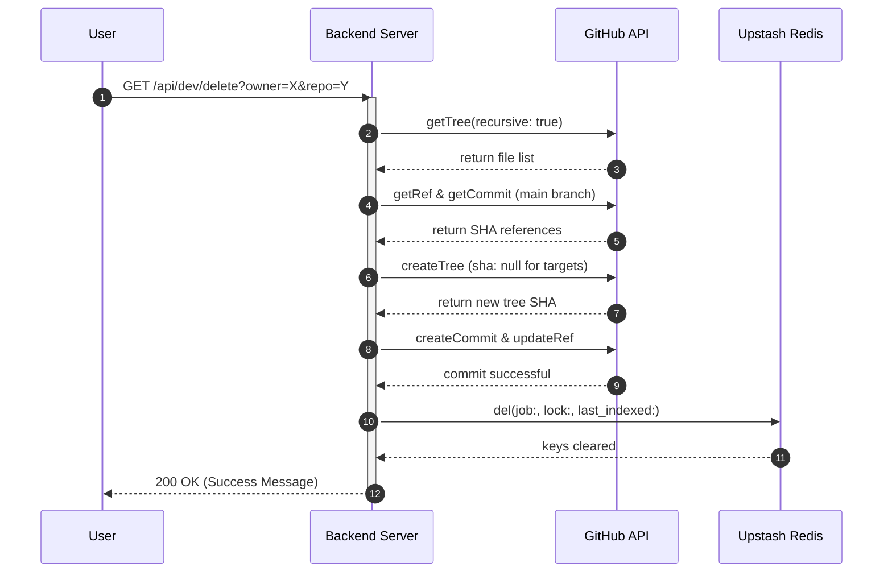

# System Architecture

GitDex is designed as a decoupled architecture consisting of a Next.js frontend and a Node.js backend. The system orchestrates the transformation of GitHub repositories into interactive documentation by integrating with the GitHub API for data retrieval and storage, and Upstash Redis for asynchronous job state management.

## High-Level Architecture

The system follows a client-server model where the frontend serves as the presentation layer and the backend acts as the orchestration engine for indexing and documentation management.



## Component Breakdown

### 1. Frontend (Next.js)
The frontend is built using the Next.js App Router, providing a highly responsive interface for users to interact with their repository documentation. It leverages `fumadocs-ui` for the documentation framework and `next-themes` for visual customization.

**Key Responsibilities:**
- Rendering the documentation shell via `RootProvider`.
- Managing global application state and themes.
- Communicating with the backend API to trigger or monitor indexing jobs.

### 2. Backend (Node.js/Express)
The backend is a TypeScript-based Express server deployed as a Vercel Function. It handles the business logic for repository analysis and manages the lifecycle of documentation generation.

**Key Technical Implementations:**
- **CORS Management:** Restricts access to specific authorized `CLIENT_URLS`.
- **Payload Verification:** Implements a custom `verify` function in `express.json` to capture the `rawBody`, ensuring secure signature verification for external triggers like QStash.
- **Developer Tooling:** Provides specialized endpoints (`/api/dev/clear`, `/api/dev/delete`) for cache invalidation and repository cleanup during development.

### 3. State & Coordination (Upstash Redis)
Redis is used as a distributed lock and state manager to prevent redundant processing of the same repository.

**Managed Data Types:**
- `job:*`: Tracks the progress and status of indexing tasks.
- `lock:*`: Ensures mutual exclusion during critical processing steps.
- `last_indexed:*`: Stores timestamps to manage indexing cooldowns.

### 4. External Integrations (GitHub API)
GitDex treats GitHub as both a data source and a storage layer. It uses the `@octokit/rest` library to programmatically manage the documentation repository.

**GitHub API Interactions:**
- **Tree Manipulation:** Fetches repository trees recursively to identify files for deletion or update.
- **Git Workflow:** Performs a full Git commit cycle (Create Tree $\rightarrow$ Create Commit $\rightarrow$ Update Ref) to push generated documentation directly to the `main` branch of the docs repository.

## Request Flow: Documentation Deletion

The following sequence depicts the process of removing documentation for a specific repository, highlighting the interaction between the server, GitHub, and Redis.



## Infrastructure & Deployment

The application is optimized for serverless deployment via Vercel, as defined in the `vercel.json` configuration.

### Deployment Specification

| Feature | Configuration | Purpose |
| :--- | :--- | :--- |
| **Runtime** | `@vercel/node` | Executes the TypeScript `index.ts` as a serverless function. |
| **Routing** | `/(.*) $\rightarrow$ index.ts` | Proxies all requests to the Express application. |
| **Caching** | `no-store, must-revalidate` | Ensures that API responses are fresh and not cached by the edge network. |
| **Environment** | `dotenv` | Manages secrets for `UPSTASH_REDIS_REST_TOKEN` and `GITHUB_TOKEN`. |

### Core Server Implementation Snippet
The entry point ensures that the server handles raw bodies for security and defines the primary API routing:

```typescript
// server/index.ts
app.use(express.json({
    verify: (req: any, res, buf) => {
        req.rawBody = buf.toString();
    }
}));

app.use("/api", jobsRoutes);