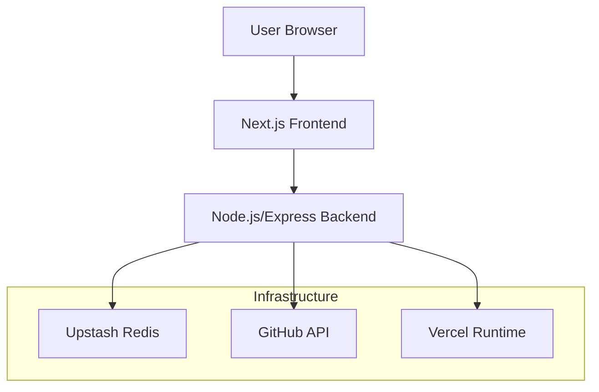
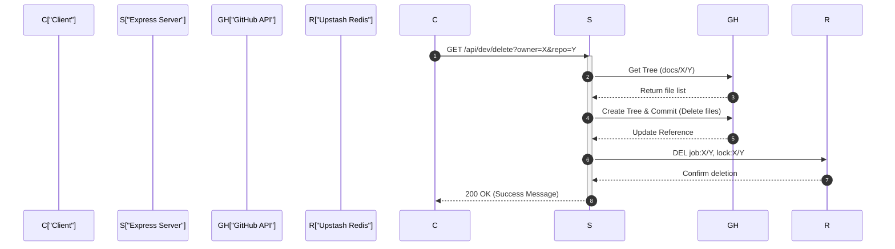

# System Architecture

GitDex is engineered as a full-stack monorepo consisting of a Next.js frontend and a Node.js backend. The architecture is designed to handle asynchronous indexing jobs and AI-powered documentation generation, leveraging a serverless-compatible backend deployed via Vercel.

## Architecture Overview

The system follows a decoupled client-server model where the frontend serves as the user interface for repository navigation and AI interaction, while the backend manages the heavy lifting of job orchestration, Redis-based state tracking, and GitHub API integrations.

## Backend Architecture

The backend is built using Express and is designed to run as a Vercel function. It handles API requests, manages indexing job lifecycles, and interacts with external data sources.

### Core Server Logic
The server utilizes `dotenv` for configuration and `cors` to restrict access to authorized client URLs Sources: [server/index.ts:1-17](). A critical architectural detail is the capture of the raw request body before JSON parsing to ensure that QStash signature verification can be performed Sources: [server/index.ts:19-23]().

### Deployment Configuration
The backend is configured for deployment on Vercel using a `vercel.json` file, which maps all incoming requests to the main `index.ts` entry point using the `@vercel/node` builder Sources: [server/vercel.json:2-16]().

### Integration Layer
The backend interacts with two primary external services:
1.  **Upstash Redis**: Used for storing job states, locks, and system keys (e.g., `job:*`, `lock:*`) Sources: [server/index.ts:31-48]().
2.  **GitHub API (Octokit)**: Used to manage repository trees, create commits, and delete generated documentation files within the `gitdex-docs` repository Sources: [server/index.ts:68-128]().

## Frontend Architecture

The frontend is a Next.js application utilizing the App Router for dynamic routing and page management.

### Layout and Provider Hierarchy
The application uses a root layout that wraps the entire UI in several providers to ensure consistent styling and functionality Sources: [client/src/app/layout.tsx:17-38]().

| Provider | Purpose | Source |
| :--- | :--- | :--- |
| `ThemeProvider` | Manages light/dark/system themes | [client/src/app/layout.tsx:23-27]() |
| `RootProvider` | Integration with `fumadocs-ui` for documentation structure | [client/src/app/layout.tsx:28-31]() |
| `Toaster` | Global notification management | [client/src/app/layout.tsx:32]() |

## Component Interaction Flow

The following sequence diagram illustrates the interaction between the client and server during a development-mode repository deletion request.

## API Route Summary

The server exposes several key endpoints for system management and health monitoring:

| Endpoint | Method | Description | Source |
| :--- | :--- | :--- | :--- |
| `/api` | Various | Routes handled by `jobsRoutes` | [server/index.ts:25]() |
| `/api/dev/clear` | GET | Clears all Redis job and lock keys (Dev only) | [server/index.ts:28-52]() |
| `/api/dev/delete` | GET | Deletes documentation files from GitHub and clears Redis keys (Dev only) | [server/index.ts:55-134]() |
| `/health` | GET | Simple health check returning `{"status": "ok"}` | [server/index.ts:136-138]() |